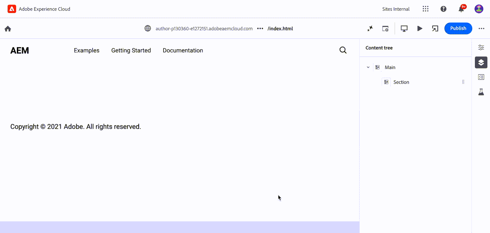

# Universal Editor Custom Asset Picker

This extension allows creating a configurable, custom asset picker for Universal Editor that is tailored to your need by simply providing a JSON configuration file. Relevant crosswalk project needs to follow certain guidelines.
It's useful in case where we want to enable authors to select assets of certain file types only from specified repositories etc.

## Extension Overview


This extension enhances [Universal Editor](../../../services/aem-universal-editor/) properties panel for media elements. It replaces standard asset picker with a custom version of asset picker, with provided configuration applied while selecting assets.

The extension will enable you to list the repositories your authors will be able to pick from.

Configuration also supports following types of filters:
- File type (Images, Video etc.)
- Repository type (author, delivery)

## Configuration in Edge Delivery Site

Adding a component for author in crosswalk site is like adding any other custom component, with some added fields. A sample custom component `Custom Image One` will have following code in files:

### Component Model in `component-models.json to leverage Dynamic Media Delivery`

```
[
...
	{
	    "id": "custom-asset-one",
	    "fields": [
	      {
	        "component": "custom-asset-namespace:custom-asset",
	        "name": "image",
	        "label": "Image",
	        "configUrl": "https://main--xwalk-test-gems--githubusername.hlx.page/tools/assets-selector/image.config.json",
	        "valueType": "string"
	      },
	      {
	        "component": "text",
	        "name": "imageTitle",
	        "label": "Alt Text",
	        "valueType": "string"
	      }
	    ]
	  }
]
```
### Component Model in `component-models.json to leverage Standard Edge Delivery`

```
[
...
	{
	    "id": "custom-asset-one",
	    "fields": [
	      {
	        "component": "custom-asset-namespace:custom-asset",
	        "name": "image",
	        "label": "Image",
	        "configUrl": "https://main--xwalk-test-gems--githubusername.hlx.page/tools/assets-selector/image.config.json",
	        "valueType": "string"
	      },
	      {
	        "component": "custom-asset-namespace:custom-asset-mimetype",
	        "valueType": "string",
	        "name": "imageMimeType"
	      },
	      {
	        "component": "text",
	        "name": "imageAlt",
	        "label": "Alt Text",
	        "valueType": "string"
	      }
	    ]
	  }
]
```
- `id`: can be any value.
- `Image component`: must have `custom-asset-namespace:custom-asset` value, because it has been overridden in the extension to display customized asset selector popup.
- `configUrl`: points to JSON configuration file, can be hosted anywhere you prefer. Must be accessible to the extension, which runs in author's web browser. It can be hosted on same AEM environment as well and relative path ( for example /content/dam/assets/asset-selector.json) can be used. Extension will fetch this JSON file and configure asset picker for this component accordingly.
- `imageMimeType component`: Optional `custom-asset-namespace:custom-asset-mimetype` value, it has been overridden in the extension to contain selected asset MIME Type. Please note that if mime type is set to image/* or for relative paths that resolve to an asset in AEM and is known to be an image, the asset is rendered using edge delivery services. In case you require the asset to be rendered using [Dynamic Media with OpenAPI capabilities](https://experienceleague.adobe.com/en/docs/experience-manager-cloud-service/content/assets/dynamicmedia/dynamic-media-open-apis/dynamic-media-open-apis-overview), select the asset from delivery repository and make sure the imageMimeType is not present in the model. If the mime type is missing, the generated markup will contain an anchor tag for Dynamic Media image path.
- `Alt-Text component`: Optional. For Dynamic Media delivery, since anchor tag is being generated in the markup, title property of the anchor tag can be leveraged to generate the alt text in the markup. For assets not using Dynamic Media with Open API delivery, the regular picture element property i.e `imageAlt` should be used.

This model is necessary for custom asset picker to show up when user clicks on its option it in properties panel.

### A New Definition in `component-definition.json`

```
{
  "groups": [
    …
    {
      "title": "Blocks",
      "id": "blocks",
      "components": [
       …
        {
          "title": "Custom Image One",
          "id": "custom-asset-one",
          "plugins": {
            "xwalk": {
              "page": {
                "resourceType": "core/franklin/components/block/v1/block",
                "template": {
                  "name": "Custom Image One",
                  "model": "custom-asset-one"
                }
              }
            }
          }
        }
      ]
    }
  ]
}
```

Note that the value of model is the id of model we created in `component-models.json`
- `title` will show up as component name in `➕` (add component) button menu present on right side panel of universal editor.

## Entry in `component-filters.json`

```
[
  …
  {
    "id": "section",
    "components": [
      "text",
      "image",
      "button",
      …
      "custom-asset-one"
    ]
  }
]
```
## Overriding name of component for using custom asset picker
in `component-models.json` file, the component property need to have component as `custom-asset-namespace:custom-asset` and `custom-asset-namespace:custom-asset-mimetype`. 
If desired, this can be overridden by following method: 
- [Adding a parameter in extension configuration](https://developer.adobe.com/uix/docs/extension-manager/feature-highlights/#configuring-extension-parameters) with key as `asset-namespace` and any desired value (e.g. `my-namespace`). 
- Use `my-namespace:custom-asset` and `my-namespace:custom-asset-mimetype` instead of above values in `component-models.json`.


## Configuration File
This is sample asset picker configuration file that allows filtering assets. Following are the fields that can be configured:
- `repoNames`: List of AEM environments from which assets can be picked. These will show up in the selector dropdown.
- `aemTierType`: It allows you to select whether you want to show assets from delivery tier, author tier, or both.
- `expiryOptions`: It allows you to select whether you want enable/disable expired assets to be selected in the asset selector.
- `filterSchema`: List of filters that can be applied when the asset selector is rendered.
- `filterSchemaMapping`: It allows to apply different filter schemas to different repositories.
- `rootPath`: It allows definining rootpath from where the assets would be shown. Its applicable for author view. If this config is unset then default is Assets ROOT i.e. content/dam
- `assetDomainMapping`: It allows mapping between repo name and its corresponding custom assets delivery domain.
- `alwaysUseDMDelivery`: If this configuration is set to true, the Delivery URL will be returned even when the Author repository is selected, provided that a corresponding Delivery repository is enabled for that Author repository.


```
{
    "repoNames": [
      "author-pxxxxxx-eyyyyyy.adobeaemcloud.com",
      "delivery-pxxxxxx-eyyyyyy.adobeaemcloud.com",
    ],
   "aemTierType": [
        "delivery",
        "author"
    ],
    "expiryOptions": {
        "allowSelectionAndDrag": false,
    },
    "filterSchema": [
        {
          "fields": [
            {
              "defaultValue": ["image/*"],
              "element": "checkbox",
              "name": "type",
              "options": [
                {
                  "label": "Image",
                  "readOnly": true,
                  "value": "image/*"
                }
              ]
            }
          ],
          "groupKey": "FileTypeGroup",
          "header": "File Type"
        },
        {
          "fields": [
            {
              "columns": 3,
              "defaultValue": ["arena"],
              "element": "taggroup",
              "name": "property=xcm:keywords.id=",
              "options": [
                {
                  "label": "Demo",
                  "value": "demo"
                }
              ]
            }
          ],
          "groupKey": "AssetTagsGroup",
          "header": "Assets Tags"
        }
      ],
    "filterSchemaMapping": {
      "author-pxxxxxx-eyyyyyy.adobeaemcloud.com": [
        {
          "fields": [
            {
              "defaultValue": ["image/*"],
              "element": "checkbox",
              "name": "type",
              "options": [
                {
                  "label": "Image",
                  "readOnly": true,
                  "value": "image/*"
                }
              ]
            }
          ],
          "groupKey": "FileTypeGroup",
          "header": "File Type"
        },
        {
          "fields": [
            {
              "defaultValue": ["dam:assetStatus==approved"],
              "element": "radiogroup",
              "name": "property",
              "options": [
                {
                  "label": "Approved",
                  "value": "dam:assetStatus==approved"
                }
              ],
              "readOnly": true
            }
          ],
          "groupKey": "StatusGroup",
          "header": "Approval Status"
        },
        {
          "fields": [
            {
              "columns": 3,
              "defaultValue": ["arena"],
              "element": "taggroup",
              "name": "property=xcm:keywords.id=",
              "options": [
                {
                  "label": "arena",
                  "value": "arena"
                }
              ]
            }
          ],
          "groupKey": "AssetTagsGroup",
          "header": "Assets Tags"
        }
      ],
      "author-pxxxxxx-eyyyyyy.adobeaemcloud.com": []
    },
    "alwaysUseDMDelivery": true,
    "assetDomainMapping": {
    	  "delivery-pxxxxxx-eyyyyyy.adobeaemcloud.com":"mediapreprod.store.testdomain.com",
        "delivery-pxxxxxx-eyyyyyy.adobeaemcloud.com": "media.store.testdomain.com",
        "delivery-pxxxxxx-eyyyyyy.adobeaemcloud.com": "mediauat.store.testdomain.com"
        "delivery-pxxxxxx-eyyyyyy.adobeaemcloud.com": "mediaqa.store.testdomain.com"
 	  },
    "rootPath": "/content/dam"
}
```
## Troubleshooting Tip: 
If the asset selector is not rendered as per the configuration, please check the console for any CORS issues while fetching the config file.

## Limitations
- This custom asset picker can only be opened by clicking on selector in its properties panel. Unlike default asset picker, we can't click the asset to open it.
