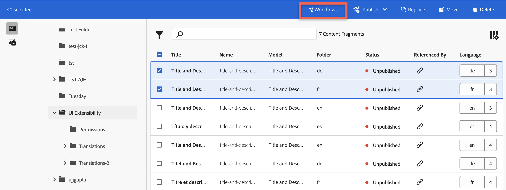
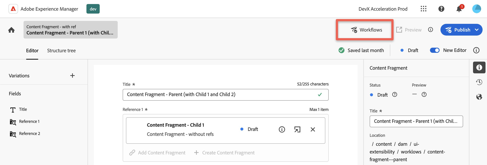
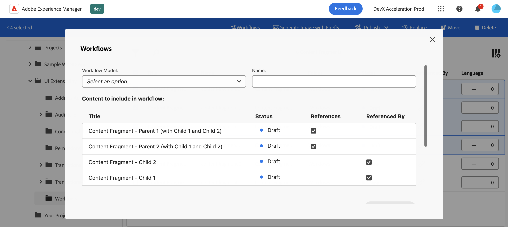
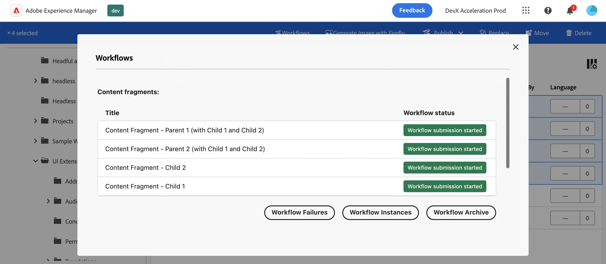

# Content Fragments workflows

This extension provides UI extensibility, allowing customers to initiate an AEM workflow for selected content fragments.

##  Extension overview

The extension enhances two AEM services: [AEM Content Fragments Console](../../../services/aem-cf-console-admin/) and [AEM Content Fragment Editor](../../../services/aem-cf-editor/). It adds a button to the `Action Bar` for the Content Fragments Console and a button to the `Header Menu` for the AEM Content Fragment Editor.

AEM Content Fragments Console:

AEM Content Fragment Editor:

When clicked, it opens a modal dialog through which you can initiate a workflow.

## Workflows modal and workflow launching

The modal dialog consists of several elements through which you can initiate a workflow:

- `Workflow Model` - a dropdown menu containing the workflows available to you within the organization.
- `Workflow Title` - a title input field of the workflow process, which will be displayed on the result page of launched workflows in AEM.
- `Content Fragments Grid` - a grid displaying a list of content fragments for which the workflow will be launched.
- `Start Workflow button` - when clicked, initiates the workflow initialization process. The workflow starts asynchronously in the background of the application.

To launch a workflow, you need to fill in all the required fields and click the `Start Workflow` button. This will initiate the workflow for each content fragment asynchronously. Each content fragment will have its own workflow process.

## Working with references

Within the grid listing the content fragments, there are two additional columns: `References` and `Referenced By` along with the ability to mark these options for each content fragment in the list using checkboxes.

- `References` - by selecting this checkbox, you indicate that a separate workflow process should be created for all children fragments (references) up to the maximum allowed depth. If no children fragments (references) exist for this content fragment, the checkbox will not be displayed.
- `Referenced By` - by selecting this checkbox, you indicate that a process will be created for its **direct** parent reference as well (not all parents in the "tree"). If the parent fragment's reference does not exist for this content fragment, the checkbox will not be displayed.

**Notice:** when selecting multiple content fragments and combining the selected options of `References` and `Referenced By`, workflows will be launched only once for each content fragment (the one selected and its children or parent reference, depending on the specified options).

For example, when selecting both parent and children content fragments and enabling the options `References` and `Referenced By` for them, only one workflow will be created for each content fragment, avoiding duplication of workflows and cyclic dependencies during workflows launching.

[Learn about using references in Content Fragments](https://experienceleague.adobe.com/docs/experience-manager-cloud-service/content/headless/journeys/author/references.html?lang=en)

## Result of running

After clicking the `Start Workflow` button, the initialization of starting the workflow with the selected parameters will begin. You will then see the result of the workflow process start and several links to AEM pages, where you can view the execution result of the launched workflow.

**Notice:** the status of the workflow start will be displayed, but not the result of its completion, which occurs asynchronously in the background. To find out the final result of the workflow execution, you need to follow the links that will be displayed below the result grid.

## Limitations

- `List of Workflows` - currently, by default, the dropdown displays a list of all workflows available for the organization. Limiting this list can be achieved through appropriate ACL configurations for the user.
