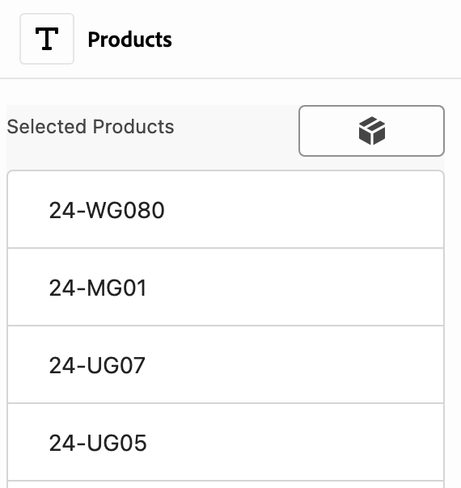
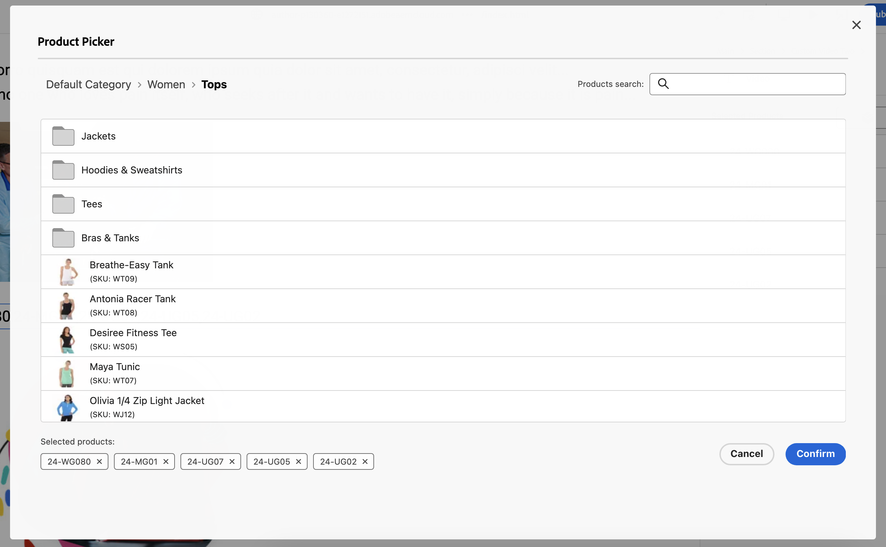
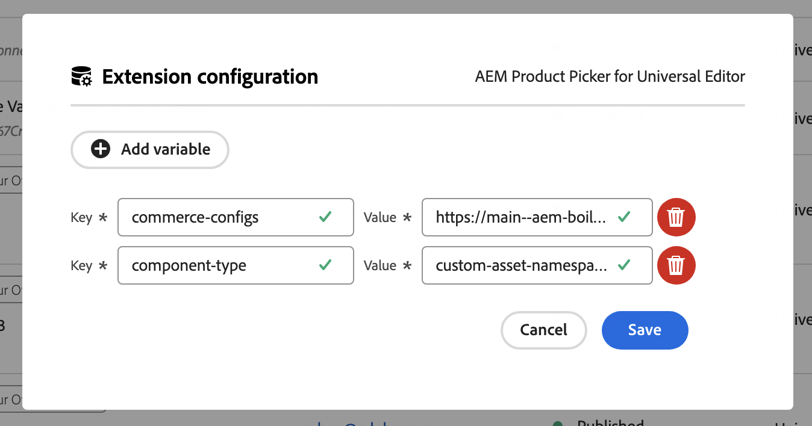
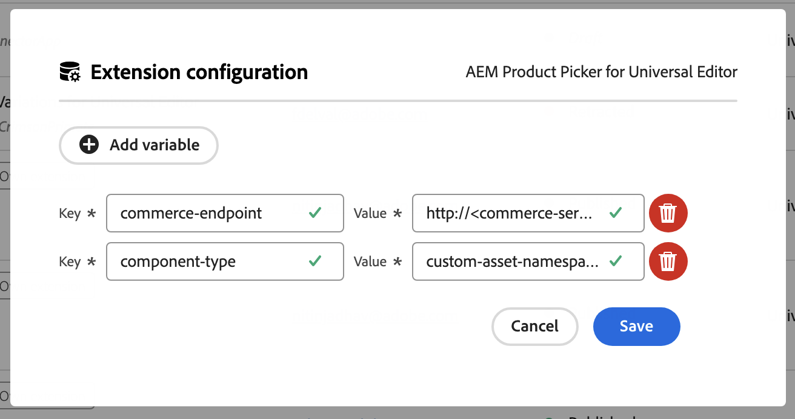

# AEM Product Picker for Universal Editor

This extension for [Universal Editor](https://experienceleague.adobe.com/en/docs/experience-manager-cloud-service/content/implementing/developing/universal-editor/introduction) integrates [Adobe Commerce](https://business.adobe.com/products/magento/magento-commerce.html) data into your project, allowing users to select or remove product data directly within the editor.

Functionality Overview:

- [Replaces the standard UI](https://developer.adobe.com/uix/docs/services/aem-universal-editor/api/item-types-renderers/) for any field type component in the properties rail with a new component UI.
- The new component features a list of selected products and includes a button to open the catalog for adding new products or removing selected ones.
- Clicking the button lets users navigate through categories, select products from any category, or use search functionality to find specific products.
- Users can sort selected products using drag and drop within the properties rail.
- Utilizes components from [Adobe React Spectrum](https://react-spectrum.adobe.com/react-spectrum/index.html).





## Configuration via Extension Manager

To access Extension Manager and understand the basic principles of working with extensions, refer to [Extension Manager in AEM Sites](https://developer.adobe.com/uix/docs/extension-manager/).

At this moment, the extension supports two ways to configure Commerce instances: using a configuration file of the Commerce instance or specifying a direct GraphQL endpoint.

### Configuration using Adobe Commerce configuration File

This file contains all the necessary information for making requests to the Adobe Commerce instance, including the GraphQL entry point, Store-View-Code, Customer-Group, and more for each environment (e.g., DEV, STAGE).

An example configuration file can be found at: [example of configs.json](https://main--aem-boilerplate-commerce--hlxsites.hlx.live/configs.json).

Parameters you can currently specify in the Extension Manager for using this approach:

| Field                | Required | Default          | Description                                                                                                                                                                |
|----------------------|----------|------------------|----------------------------------------------------------------------------------------------------------------------------------------------------------------------------|
| `commerce-configs`   | ✔️       |                  | The URL where the configuration for the Adobe Commerce instance is located. This may not necessarily be the same instance as Adobe Commerce. An example is provided above. |
| `commerce-env`       |          | `prod`           | Specifies the environment section in the configuration file, such as `dev`, `stage`, or `prod`. This parameter helps identify which environment settings are being used.   |
| `component-type`     | ✔️       | `product_picker` | Specifies the type of component to be replaced with the Product Picker widget, such as `text` or `product_list`.                                                           |
| `selection-mode`     |          | `multiple`       | `single`/`multiple`. This value allows you to specify whether to allow selecting a single product or multiple products. Changing the mode from `multiple` to `single` will not affect the current selection. |



### Direct GraphQL entry point

In some cases, you may not have a configuration file for Adobe Commerce. Instead, you might use a "facade" in the form of a GraphQL entry point for Adobe Commerce (e.g., using an API Mesh).

In this case, you can still use the Product Picker, but there are some limitations:

- Your GraphQL schema must be identical to the [GraphQL schema](https://developer.adobe.com/commerce/webapi/graphql/schema/) for the Adobe Commerce catalog.
- No additional HTTP headers will be passed to the instance. Instead, you must ensure that your GraphQL setup is configured for the specific [website or store view](https://experienceleague.adobe.com/en/docs/commerce-admin/start/setup/websites-stores-views) (as per Adobe Commerce terminology).

Parameters you can specify when using a direct GraphQL entry point:

| Field                       | Required | Default          | Description                                                                                                                                                                                                 |
|-----------------------------|----------|------------------|-------------------------------------------------------------------------------------------------------------------------------------------------------------------------------------------------------------|
| `сommerce-endpoint`         | ✔️       |                  | The URL entry point for sending requests, e.g., `http://<commerce-server>/graphql`.                                                                                                                           |
| `сommerce-root-category-id` |          | `2`              | You can specify a specific category for your root category. With Adobe Commerce configuration (the first described method), this is done directly in the configuration file.                                |
| `component-type`            | ✔️       | `product_picker` | Specifies the type of component to be replaced with the Product Picker widget, such as `text` or `product_list`.                                                                                            |
| `selection-mode`            |          | `multiple`       | `single`/`multiple`. This value allows you to specify whether to allow selecting a single product or multiple products. Changing the mode from `multiple` to `single` will not affect the current selection. |



## Local setup

For demonstration or testing of custom features, it is also possible to specify the values of the variables described above locally:

- You can define the variables described above in the file `https://github.com/adobe/aem-uix-examples/tree/main/universal-editor-product-picker/src/universal-editor-ui-1/web-src/src/components/useConfig.js`.
- The component type you want to override is specified in the file `https://github.com/adobe/aem-uix-examples/tree/main/universal-editor-product-picker/src/universal-editor-ui-1/web-src/src/components/ExtensionRegistration.js`. These settings are separated because the extension registration process only requires the component type for overriding, not the full configuration.
- To add custom HTTP headers to requests sent to Adobe Commerce (or your proxy), you can modify the file `https://github.com/adobe/aem-uix-examples/tree/main/universal-editor-product-picker/src/universal-editor-ui-1/actions/host.js`.
- To output debug messages for the [UIX SDK](https://github.com/adobe/uix-sdk) during [extension registration](https://developer.adobe.com/uix/docs/services/aem-universal-editor/api/commons/#extension-registration), you can set the `debug: true` parameter. 

An alternative method for specifying configuration variables, if more appropriate, is to add the values as a serialized array in the .env file:

```
CATALOG_SERVICE_CONFIG="{"commerce-endpoint":"http://<commerce-server>/graphql"}"
```

#### Support

For any feature requests, use-case validation, or bug reports, feel free to email us at uix@adobe.com.
