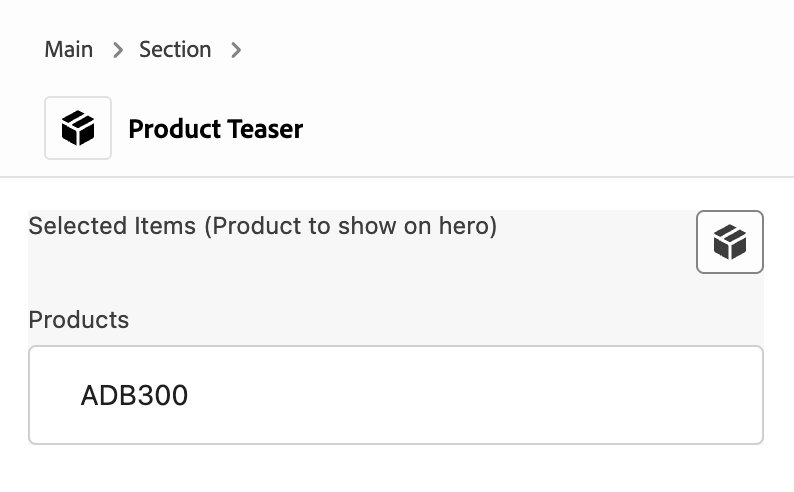
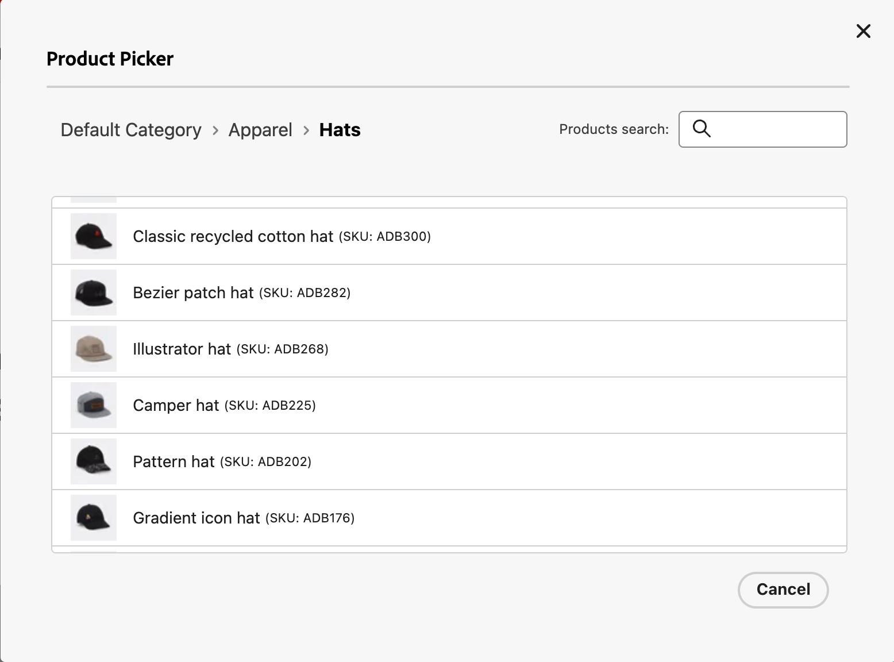

# AEM Product Picker for the Universal Editor

This extension for the [Universal Editor](https://experienceleague.adobe.com/en/docs/experience-manager-cloud-service/content/implementing/developing/universal-editor/introduction) integrates [Adobe Commerce](https://business.adobe.com/products/magento/magento-commerce.html) data into your project, allowing users to select or remove product data directly within the editor.

## Functionality Overview:

- The extension replaces [the standard UI](https://developer.adobe.com/uix/docs/services/aem-universal-editor/api/item-types-renderers/) for any product field type component in the properties rail with a new component UI.
- The product picker extension adds a button to the [properties panel of the Universal Editor](https://experienceleague.adobe.com/en/docs/experience-manager-cloud-service/content/sites/authoring/universal-editor/navigation#properties-rail) to open the catalog for adding new products or changing selected items.
- Clicking the button lets users navigate through categories, select products from any category, or use search functionality to find specific products.
- Utilizes components from [Adobe React Spectrum](https://react-spectrum.adobe.com/react-spectrum/index.html).





## Installing the Product Picker

The extension needs to be installed using the Extension Manager. This document assumes familiarity with the Extension Manager. For details on how to access Extension Manager and understand the basic principles of working with extensions, please refer to the document [Extension Manager in AEM Sites.](https://developer.adobe.com/uix/docs/extension-manager/)

Once you install the extension, you can configure it.

## Configuring the Product Picker

1. In the Extension Manager, in the left column under **Services** select **Universal Editor**.
1. In the right column, scroll to the bottom of the list and you can see your newly-installed extension.
1. Click on **Configure the extension** on the right side of the row (the gear icon).
1. In the **Extension configuration** dialog, click the **Add variable** button.
1. Enter the following values in the fields that appear.
   * **Key**: `config-base-url`
   * **Value**: Set to your project URL such as `https://main--aem-boilerplate-commerce--hlxsites.aem.live`
1. Click the **Add variable** button again.
1. Enter the following values in the fields that appear.
   * **Key**: `config-path`
   * **Value**: Set this to your project configuration file such as `/config.json`, following the structure of [https://github.com/hlxsites/aem-boilerplate-commerce/blob/main/demo-config.json](https://github.com/hlxsites/aem-boilerplate-commerce/blob/main/demo-config.json).

The extension is installed and configured to know where your project is and where to find its configuration. Now you need to define what categories the picker should browse.

## Configure Picker Categories

1. In your project, edit the `config.json` file you specified when configuring the extension in the previous step.
1. Add the following configuration in the `config.json` file, following the example at [https://github.com/hlxsites/aem-boilerplate-commerce/blob/main/demo-config.json#L30C7-L34C8](https://github.com/hlxsites/aem-boilerplate-commerce/blob/main/demo-config.json#L30C7-L34C8), replacing the root category with the value you require.

   ```json
   "plugins": {
       "picker": {
          "rootCategory": “2”
        }
     }
   ```

With the extension configured, you will finally need to configure your blocks to use the extension in the component models file.

## Configuring Blocks to Use the Extension

1. In your project, edit the `component-models.json` file.
1. Find a block (component) that contains a field that should show the picker.
1. To the `fields` array of the selected block, add a new object with the following configuration:

   ```json
   "fields": [
     {
       "component": "commerce-picker:picker",
       "name": "hero-sku",
       "label": "Product to show on hero",
       "valueType": "string",
       "commerce-picker": {
         "selection-mode": "single",
         "selection-type": "item"
       }
     }
   ]
   ```

1. Set the following values:
   * **`component`**: This must be set to exactly `commerce-picker:picker`.
   * **`valueType`**: This must be set to `string`.
   * **`name` and `label`**: These can be any descriptive value.
   * **`commerce-picker` object**:
     **`selection-mode`**: This can be `single` or `multiple` to determine the number of items that can be selected in the picker.
     **`selection-type`**: This can be `item` to allow selecting only products, `folder` to allow selecting only categories, or `any` to allow selecting both.
1. Repeat this configuration for all fields of all blocks that require the picker to be enabled.
