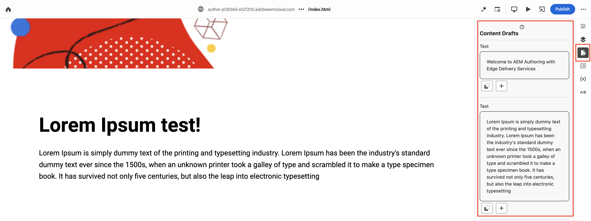

# Universal Editor Content Drafts

This extension expands functionality in the [AEM Universal Editor](../../../services/aem-universal-editor/) by providing users with capabilities to create, edit, and manage multiple drafts of their content directly within the editor.

##  Extension overview

The extension enhances the [AEM Universal Editor service](../../../services/aem-universal-editor/) capabilities. It adds a button to the `Rails Bar`.

When clicked, it shows the content fragments of type reach text located in the page.

For each content, users could create drafts and manage them.

AEM Universal Editor rails:

## Features of the extension

- `Content Editing`: The extension provides the possibility of editing content fragments of type `reachtext`.
- `Draft Management`: Users can create multiple content drafts. Each draft is saved separately, allowing users to easily switch between different versions of their content.
- `Draft Actions`: For each draft, users can perform several actions, including editing it, adding a new draft, applying it, and deleting it.

## How it works

- Start by clicking the button Create draft from content text or button to create an empty draft.

- In the draft text editor make the changes you want and select the option you need (save draft, apply the draft or cancel the creation of the draft).

- After saving a draft, you can manage it by clicking in it. Options available are save the edition, apply the draft, or delete the draft.

- After applying a draft, the content fragment will be updated with the draft content and any draft related to the content will be deleted.
- By default, you will see three drafts. If you have more, click 'Show all' to see all the rest.

**Notice:** The minimum length of a draft is `50` characters.

## Limitations

- `Local persistance` - currently, the drafts are persisted on the browser. If you clear the cache, you will lose them.

## Extension source

- [GitHub](https://github.com/adobe/aem-uix-examples/tree/main/universal-editor-richtext-draft)
