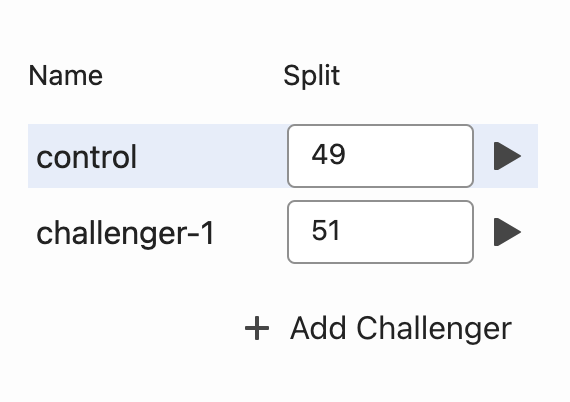

# Universal Editor Experimentation for AEM Crosswalk

Make your AEM Crosswalk site more effective by changing content, compare the results and pick the improvements that have measurable effect. 

## Extension overview

Experimentation is the practice of making your site more effective by changing content or functionality, comparing the results with the prior version, and picking the improvements that have measurable effect. 

There are a few terms that you will find used repeatedly:
- Control: the experience prior to running the experiment. Any experiment tries to prove an improvement over the control experience.
- Challenger: an experience that differs from the control experience and that may or may not have better results such as conversions
- Variants: control and challenger are all variants of an experiment

## Features of the extension
- View, modify, or delete existing experiment for a page on an AEM Crosswalk site.
- If no existing experiment, set up new experiment and automatically create variant pages

## How it works
- Sign into your instance and make sure it's running AEM Crosswalk and has an accompanying EDS site.
- The extension adds an (x) icon to the right-hand rail in Universal Editor. Click this to open the extension panel.
- The extension panel will check the page's metadata to see if the current page is part of an existing experiment. If it is, whether as the control page or a challenger, it will load the experiment's parameters in the panel and the status light will be green.
- The control page path defaults to the path of the current page. However, if there's a currently running experiment, and the current page is a challenger, then the control page path points to the page the experiment is trying to improve on.
- The experiment parameters are its unique identifier (name), start and end date, audiences, and variants (control + challengers). Only the name is mandatory, and there is always at least 1 variant (the control). For more information about these parameters, check out this [resource](https://github.com/adobe/aem-experimentation/blob/main/documentation/experiments.md) and this [resource](https://www.aem.live/docs/experimentation).
- If there is no existing experiment, a unique identifier will be generated automatically in the Name field, and the optional parameters will be blank. The status light will show "inactive". The last section will only show 1 variant, the control, with a default split of 100.
- You can set/change the experiment name, start date, and end date.
- You can restrict the experiment to specific audiences. Define audiences in the project codebase following this [setup](https://github.com/felix-test-org/xwalk-playground/blob/main/plugins/experimentation/documentation/audiences.md). Then, in the extension panel under "Audience", add audience labels by entering a value in the text field, and remove audience labels by clicking the "x" in the tag. 

- The last section with the table that has the columns "Name" and "Split" show the experiment variants and their splits. The control is the page that is instrumented, and each challenger is a content variation. By default, the variants are split evenly. You can change the split percentage of any variant, but the total of all the variants must add up to 100.

- The row of the variant that the current page corresponds to is highlighted in blue.
- Each existing variant will have a "play" button at the end of the row. Clicking this will reload Universal Editor and go to the variant page.
- You can add new content variations by pressing "+ Add Challenger" at the bottom. Word of caution, this will reset the split percentages to the new even split. However, this change won't be applied until you save the experiment. The save icon near the top of the extension panel will only be enabled when some extension parameter has been edited and is different from the current experiment's.
- Once you are done editing the parameters, you can click the save icon to save changes and create pages for the new challengers.
- If there is no existing experiment, then clicking the save icon will create the experiment by saving the experiment parameters to the page's metadata. 
- Finally, you can delete a currently running experiment by clicking the trash icon next to the save button.
