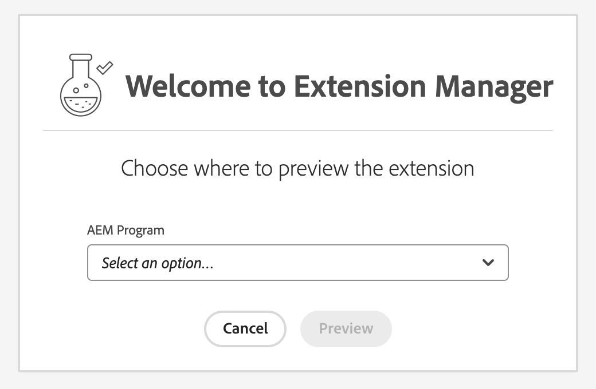

# Extension Manager Feature Highlights

## Navigate Extensions
[Extension Manager](https://experience.adobe.com/aem/extension-manager) provides a centralized listing of extensions, accessible when you select a specific program and environment. This listing gives a comprehensive view of all available extensions for your organization, complete with their statuses, such as `Published` or `Draft`.


## Enabling/Disabling Extensions
[Extension Manager](https://experience.adobe.com/aem/extension-manager) gives the ability to enable or disable extensions on a per-instance basis. This means you can easily turn extensions on or off for specific AEM instances, granting you the flexibility to adapt features as needed. The process is straightforward – just toggle a switch in the extensions view. 


## Access Experimental Features
[Extension Manager](https://experience.adobe.com/aem/extension-manager) opens the door for developers to access AEM innovations through 1st-party extensions crafted by Adobe. These extensions bear the distinct label `Developed by Adobe`. 

This means you can confidently explore and experiment with the latest features and enhancements, ensuring you stay at the forefront of AEM's capabilities without compromising the core releases.

## Configuring Extension Parameters
[Extension Manager](https://experience.adobe.com/aem/extension-manager) simplifies the process of adjusting extension configurations, specifically web parameters, without the need for repetitive extension deployments. Here's how to configure extension parameters:

1. Click `Gears` icon in the `Action` column
   
3. Click `Add variable` button
4. Define the `Key` and corresponding `Value` for your parameter.
   
5. With your parameters configured, you can now access these values using the [UIX SDK](https://github.com/adobe/uix-sdk) within your extension.

Code sample on how to use the configuration within your Extension via `register` method:
```js
function ExtensionRegistration() {
  const init = async () => {
    const guestConnection = await register({
      id: extensionId,
      methods: {
        headerMenu: {
          getButtons() {
            return [
              {
                id: `${extensionId}-button`,
                label: 'Click me!',
                icon: 'OpenIn',
                onClick() {
                  const modalURL = `/index.html#/${extensionId}-modal`;
                  console.log("ExtensionRegistration: register => guestConnection.configuration", guestConnection.configuration);

                  guestConnection.host.modal.showUrl({
                    title: "UI Extension Demo",
                    url: modalURL,
                  });
                },
              },
            ];
          },
        },
      },
    });
  };
  init().catch(console.error);
```
Code sample for `attach` method:
```js
export default function ModalHeaderMenuButtonModal () {
  const [guestConnection, setGuestConnection] = useState()
  const [count, setCount] = useState(0)

  useEffect(() => {
    (async () => {
      const guestConnection = await attach({ id: extensionId })
      console.log("Modal: attach => guestConnection.configuration:", guestConnection.configuration);
      setGuestConnection(guestConnection)
    })()
  }, [])

  const onCloseHandler = () => {
    guestConnection.host.modal.close()
  }

  return (
    <Provider theme={defaultTheme} colorScheme='light'>
      <Content width="100%">
        <Text>Your modal content goes here</Text>
        <View marginTop="size-325">
          <Heading level={3}>Extension Configuration:</Heading>
          <Well>{guestConnection && JSON.stringify(guestConnection.configuration)}</Well>
          <Heading level={3}>Shared Context available for your UI extension:</Heading>
          {guestConnection &&
            <ul>
              <li><Heading level={4}>AEM Host:</Heading><Well>{JSON.stringify(guestConnection.sharedContext.get('aemHost'), null, 4)}</Well></li>
              <li><Heading level={4}>Authentication:</Heading><Well>{JSON.stringify(guestConnection.sharedContext.get('auth'), null, 4)}</Well></li>
              <li><Heading level={4}>Theme:</Heading><Well>{JSON.stringify(guestConnection.sharedContext.get('theme'), null, 4)}</Well></li>
              <li><Heading level={4}>Locale:</Heading><Well>{JSON.stringify(guestConnection.sharedContext.get('locale'), null, 4)}</Well></li>
            </ul>
          }
        </View>
        <Flex width="100%" justifyContent="end" alignItems="center" marginTop="size-400">
          <ButtonGroup align="end">
            <Button variant="primary" onClick={onCloseHandler}>Close</Button>
          </ButtonGroup>
        </Flex>
      </Content>
    </Provider>
  )
}
```

This process allows you to fine-tune your extension settings without the hassle of repeated deployments, putting control and customization in your hands.

## Extension Preview and Sharing
[Extension Manager](https://experience.adobe.com/aem/extension-manager) provides a safe playground to preview extensions before enabling them for the entire environment and the ability to easily share these previews.

### Preview Extensions
To preview extensions without installing them, simply click the preview icon found in the `Action` column. This action will open the Content Fragment Console, allowing you to explore the extension within the selected environment.


### Share with Teammates
You can easily share these previews with your team by selecting `Copy shareable link` from the `Action` column. 


When your teammates open the link, they'll be prompted to choose a program and environment for previewing the selected extension. 


This collaborative feature ensures that your team can collectively evaluate and experiment with extensions before making them fully operational.

## BYO (Bring Your Own) Extensions
With [Extension Manager](https://experience.adobe.com/aem/extension-manager), you can register your extensions into the system and start using them, regardless of where they were initially deployed. Here's how to bring your own extensions into [Extension Manager](https://experience.adobe.com/aem/extension-manager):

1. Open [Extension Manager home page](https://experience.adobe.com/aem/extension-manager). From there, click on the `Bring Your Own Extension` option.
2. Fill out the required fields, with a particular focus on providing the `Extension URL`.


An important note to keep in mind: Your extension can be hosted anywhere, as long as it utilizes the [UIX SDK Guest library](https://github.com/adobe/uix-sdk#usage---guests). 

This flexibility ensures that you can seamlessly incorporate your own extensions into the AEM environment, enhancing your experience with your unique tools and features.
