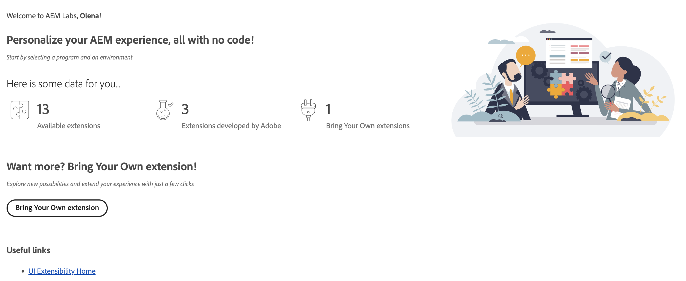

# Extension Manager in AEM Experience Manager
Extension Manager in AEM Experience Manager is a surface, designed for practitioners and developers seeking creative freedom within AEM. Within Extension Manager, you can enable or disable extensions on a per-instance basis, access Adobe's first-party extensions, and much more.

This guide will walk you through the initial steps to get started with Extension Manager. You will learn how to access the Extension Manager page and understand the role-based permissions to ensure a smooth start.

## Accessing Extension Manager in AEM Experience Manager
To access Extension Manager, follow these steps:

1. **URL**: Open your web browser and navigate to the https://experience.adobe.com/aem/extension-manager 

2. **Login**: Use your organization's login credentials to sign in. If you do not have login credentials, contact your system administrator to obtain the necessary access.

3. **Home Page**: After successfully logging in, you will be directed to the Extension Manager home page. Here, you'll find some useful information and extension statistics for your organization.

## Role-Based Permissions
Extension Manager utilizes role-based permissions to control access to various features and functionalities. Here are the defined roles and their associated permissions:

- **Customer**: An enterprise customer who discovers AEM extensions.

- **Developer**: A user in a customer organization who develops and tests AEM extensions.

- **System Administrator**: An enterprise admin who manages the enterprise org and can install extensions on production environments.

## Permissions Matrix
### Production Environments

| Action | Customer | Developer | System Administrator| 
|---|---|---|---|
| Can see the list of available extensions | ✅ | ✅ | ✅ |
| Can enable/disable extensions | ❌ | ❌ | ✅ |
| Can configure extensions | ❌ | ❌ | ✅ |
| Can preview extensions | ✅ | ✅ | ✅ |
| Can add BYO extensions | ❌ | ✅ | ✅ |

### Non-production Environments
By non-production we mean `dev`, `stage` and `rde` environments.

| Action | Customer | Developer | System Administrator| 
|---|---|---|---|
| Can see the list of available extensions | ✅ | ✅ | ✅ |
| Can enable/disable extensions | ❌ | ✅  | ✅ |
| Can configure extensions | ❌ | ✅  | ✅ |
| Can preview extensions | ✅ | ✅ | ✅ |
| Can add BYO extensions | ❌ | ✅ | ✅ |

## Extensions Listing
Once you're on the [Extension Manager](https://experience.adobe.com/aem/extension-manager) home page, you can explore the list of AEM programs and environments available for your organization. Go ahead and select a program and an environment to display the available extensions.

For a deep dive into the Extension Manager's capabilities, head to the [Feature Highlights](feature-highlights) section.

## Contact and Support

If you encounter issues, need assistance, or want to provide feedback, please use `Beta Feedback` button, located in the top bar on the [Extension Manager's home page](https://experience.adobe.com/aem/extension-manager) or email us at uix@adobe.com.
