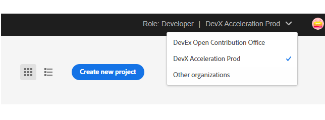

# Create a project in Adobe Developer Console

UI Extensions, as any App Builder application, are represented as projects in [Adobe Developer Console](https://developer.adobe.com/developer-console/docs/guides/).

<InlineAlert slots="text" />

If you don't have access to the Adobe Developer Console, refer to the [How to Get Access](../../../guides/get-access) guide for instructions.

To begin, we need to create a new Project that will provide us with the necessary configuration and resources.

1. Sign in to [Adobe Developer Console](https://developer.adobe.com/console) with your Adobe ID.

2. Choose your account.

3. Choose your profile or organization.

3. Make sure you are in a proper organization (a switcher in the right top corner).

4. Click "Create new project" -> "Project from template":

And choose "App Builder":

5. Fill the project data.

- `Project Title` is used to identify your project within [Adobe Developer Console](https://developer.adobe.com/console) and in [CLI](https://github.com/adobe/aio-cli).
- `App Name` will be used as a unique identifier for your application and this value cannot be changed after project creating.

After creating, you should see a new project generated with 2 default Workspaces.
Each App Builder project has two default workspaces: `Production` and `Stage`. You can add more workspaces as needed.
The `Production` workspace is special, as it is used for the submission and distribution flow.

