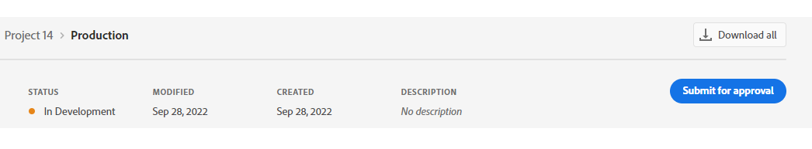

# UI Extensions Development Flow

The document provide high level overview for developers what to expect when creating UI Extension. For detailed instructions please refer to [step-by-step guide](../../services/aem-cf-console-admin/extension-development/).

## Get access

To start writing UI Extensions you will need the:

1. Access to service that we are about to extend, e.g. [Content Fragment Console](../../services/aem-cf-console-admin) available as part of Adobe Experience Manager (AEM) as a Cloud Service.
2. Access to App Builder, which we will use to create an extension.
3. Assign developer roles to these IMS organization members who will create UI Extensions.
4. Ensure that users who should be able to [publish](../publication/) UI Extensions have a `system admin` role.

For more details, please refer to [How to Get Access](../overview/get-access/).

## Create a new project in Adobe Developer Console

UI Extensions, as any App Builder application, are represented as projects in [Adobe Developer Console](https://developer.adobe.com/developer-console/docs/guides/).

Adobe Developer Console gives you access to APIs, SDKs and developer tools to integrate, and extend Adobe products.

Each App Builder project has two default workspaces: `Production` and `Stage` which you may use during different life cycles of your project. You can add more workspaces for feature development as needed.
The `Production` workspace is special, as it is used for the submission and distribution flow.

## Initialize our application using the CLI for local development

Once your project is set up in [Adobe Developer Console](https://developer.adobe.com/console), we need to initialize our app in a local environment.
There are several ways how to do it.

We will initialize the UI Extension Project using [AIO CLI](https://github.com/adobe/aio-cli).
You may find detailed guide at [Initialize the UI Extension Project using AIO CLI](../../services/aem-cf-console-admin/code-generation#launch-code-generation-during-project-initialization).

If necessary, you can find other options in [Bootstrapping new App using the CLI](https://developer.adobe.com/app-builder/docs/getting_started/first_app/#4-bootstrapping-new-app-using-the-cli).

Once you complete, you should see the build process with necessary npm dependencies are getting installed.

Also, [base project structure](https://developer.adobe.com/app-builder/docs/getting_started/first_app/#5-anatomy-of-an-app-builder-application) will be generated.

```shell
Sample code files have been generated.
    
Next steps:
1) Populate your local environment variables in the ".env" file
2) You can use `aio app run` or `aio app deploy` to see the sample code files in action

✔ Finished running template @adobe/aem-cf-admin-ui-ext-tpl
✔ Installed template @adobe/aem-cf-admin-ui-ext-tpl
Project initialized for Workspace Stage, you can run 'aio app use -w <workspace>' to switch workspace.
✔ App initialization finished!
 > Tip: you can add more actions, web-assets and events to your project via the 'aio app add' commands
```

During project initialization, you will be able to select a specific template for UI Extension that will generate boilerplate code for you so you will be ready to start business logic implementation right away.

## Implement logic of application

As the next step, we need to implement a logic which will use existing [Extension Points](../../services/aem-cf-console-admin/api) and provide necessary functionality.
UI Extensions has default structure and preselected technology stack such as [React Spectrum](https://developer.adobe.com/app-builder/docs/resources/spectrum-intro/lesson3/) but developers are free to choose tools that they prefer to. The only requirements to make a proper UI Extension:

1. Supply configuration file that will declare application as an [extension](https://developer.adobe.com/app-builder/docs/guides/extensions/).
2. Use `@adobe/uix-guest` library for proper UI Extension initialization and interaction with Adobe service.

## Verify your application

After development is done you may check yor application locally (`aio app run`) or at `Stage` or any other workspace at Adobe I/O (`aio app deploy`).

Once you've started or deployed application  AIO CLI will return you an extension endpoint URL that you may use to embed UI Extension into production Adobe Service. As it is not always suitable to test extensions with production data, extensible service as well provide configuration parameters that allows to change data source. For example, AEM Content Fragments Console [allows to target development environment](../../services/aem-cf-console-admin/debug/).

## Deploy on Production

After the application has been completed, tested locally or on `Stage`, we are ready to deploy it to `Production`.

The process is the same as for deploying to `Stage`, but first you need to switch the workgroup to `Production`.

Please type command in our project folder:

```shell
$ aio app use -w Production

You are currently in:
1. Org: Sites Internal
2. Project: 562TurquoiseShrimp
3. Workspace: Stage
? The file aem-headless-ui-ext-example/.env already exists: Merge
? The file aem-headless-ui-ext-examples/.aio already exists: Overwrite

✔ Successfully imported configuration for:
1. Org: Sites Internal
2. Project: 562TurquoiseShrimp
3. Workspace: Production.
```

**Note:**
We chose the `Merge` option for the `.env` file so that we don't lose our environment variables.

After workgroup switching, we can make building and deploying with the command:

```
$ aio app deploy

√ Built 3 action(s) for 'aem/cf-console-admin/1'
√ Building web assets for 'aem/cf-console-admin/1'
√ Deployed 3 action(s) for 'aem/cf-console-admin/1'
√ Deploying web assets for 'aem/cf-console-admin/1'
Your deployed actions:
web actions:
  -> https://245265-562turquoiseshrimp.adobeio-static.net/api/v1/web/aem-headless-ui-ext-examples/get-language-copies
  -> https://245265-562turquoiseshrimp.adobeio-static.net/api/v1/web/aem-headless-ui-ext-examples/quick-publish-language-copies
  -> https://245265-562turquoiseshrimp.adobeio-static.net/api/v1/web/aem-headless-ui-ext-examples/unpublish-language-copies
To view your deployed application:
  -> https://245265-562turquoiseshrimp.adobeio-static.net/index.html
To view your deployed application in the Experience Cloud shell:
  -> https://experience.adobe.com/?devMode=true#/custom-apps/?localDevUrl=https://245265-562turquoiseshrimp.adobeio-static.net/index.html
New Extension Point(s) in Workspace 'Production': 'aem/cf-console-admin/1'
Successful deployment 🏄
```

## Create approval request

When you’re ready to publish your app, you will submit it for an approval from the Production workspace.


After the approval, your app will be available at [Adobe Experience Cloud](https://experience.adobe.com/).

Also, data about your extension will be added to *Adobe App Registry* and will be reachable for Adobe Products.

This means, that the new functionality will be available, for example, in the AEM admin panel for your organization.


These steps are described in more detail in [UI Extensions Management](../publication).

## Additional resources

- [Step-by-step Extension Development Guide](../../services/aem-cf-console-admin/extension-development/)
- [UI Extensibility Overview](../../)
- [FAQ](../../overview/faq/)
