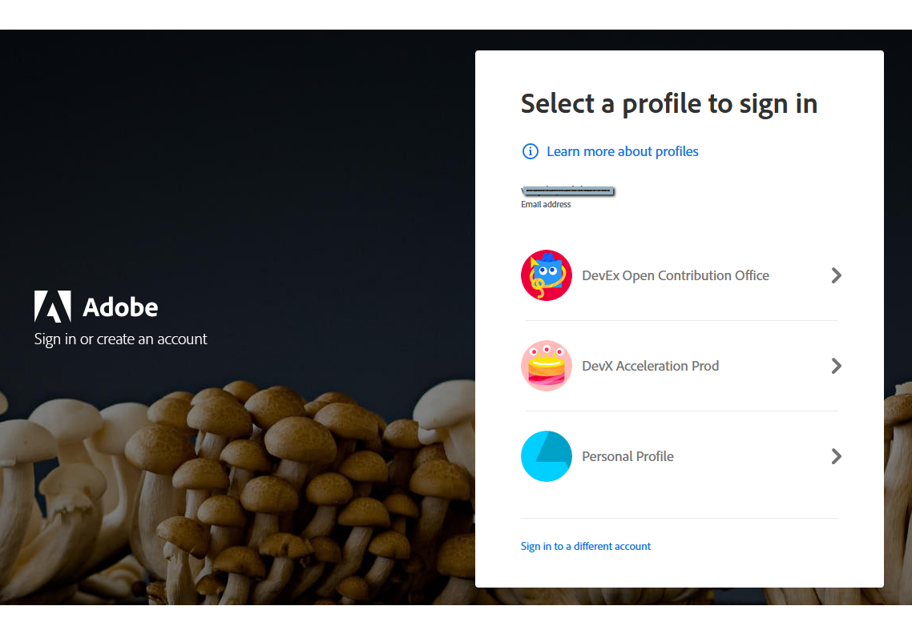

# UI Extensions Development Flow

The document helps you understand how to setup, implement and deploy your own [UI Extension](pages/dx-devex-acceleration/uix-docs/overview/) with [Adobe App Builder](https://developer.adobe.com/app-builder/docs/overview/)

## 1. Get Access to App Builder

Requesting access is a simple two-step process:
1. Complete the [request form](https://developer.adobe.com/app-builder/trial/). As a result, you will retrieve your Organization ID and name.


2. Login with your Adobe ID to [Adobe Developer Console](https://developer.adobe.com/console) and accept agreement.


For more details, please refer to [How to Get Access](pages/dx-devex-acceleration/uix-docs/overview/requirements/) page.

## 2. Create a new project in Adobe Developer Console

> Adobe Developer Console gives you access to APIs, SDKs and developer tools to integrate, and extend Adobe products. 
In App Builder, you need access to Adobe I/O Runtime credentials used for deploying your application, 
and access to API credentials if you want to access Adobe APIs in your application.

1. Sign in to [Adobe Developer Console](https://developer.adobe.com/console) with your Adobe ID


2. Choose your account


3. Choose your profile or organizzation


3. Make sure you are in a proper organization (a switcher in the right top corner).


4. Click "Create new project" -> "Project from template" 

and choose "App Builder"


5. Fill the project data

- `Project Title` is used to identify your project within [Adobe Developer Console](https://developer.adobe.com/console) and in [CLI](https://github.com/adobe/aio-cli).
- `App Name` will be used as a unique identifier for your application and this value cannot be changed after project creating.

After creating, you should see a new project generated with 2 default Workspaces.
Each App Builder project has two default workspaces: `Production` and `Stage`. You can add more workspaces as needed. 
The `Production` workspace is special, as it is used for the submission and distribution flow.


## 3. Initialize our Application using the CLI for local development

Once your project is set up in [Adobe Developer Console](https://developer.adobe.com/console), we need to initialize our app in a local environment.
There are several ways how to do it. We will follow [Initializing your project with Extension Points](https://developer.adobe.com/app-builder/docs/getting_started/first_app/#411-initializing-your-project-with-extension-points) option.
If necessary, you can find other options in [Bootstrapping new App using the CLI](https://developer.adobe.com/app-builder/docs/getting_started/first_app/#4-bootstrapping-new-app-using-the-cli).

Firstly, you need to [Signing in from CLI](https://developer.adobe.com/app-builder/docs/getting_started/first_app/#3-signing-in-from-cli):
1. In your Terminal type the following command:`aio login`.
A browser window and prompt should open, asking you to sign in with your Adobe ID. If the window does not automatically open,
you can also copy/paste the URL printed in your browser to log in. 

2. After logging in, you can close the browser window and return to the Terminal. You will see your user token printed in the Terminal. 
It is automatically stored in the [CLI](https://github.com/adobe/aio-cli) configuration, which allows the [CLI](https://github.com/adobe/aio-cli) to use the token to interact with the [Adobe Developer Console](https://developer.adobe.com/console).

After that, you can [bootstrap your project](https://developer.adobe.com/app-builder/docs/getting_started/first_app/#4-bootstrapping-new-app-using-the-cli):
1. Create a new project folder on your local machine and navigate to it in the Terminal.
2. Type `aio app init <app_name>`, where *<app_name>* is a name of your app in [Adobe Developer Console](https://developer.adobe.com/console). You will be prompted with a few questions about your `Organization`, `Project` and bootstrapping configuration.
3. Choose your `Organization` and `Project` (if you have a lot of projects, you can also start typing to shorten the list).

4. Select which extension point(s) do you with to implement.

<InlineAlert variant="warning" slots="text" />

Currently `cf-console-admin` extension point is not available in `Production`. You need to choose `DX Experience Cloud SPA v1`.

Once you complete, you should see the build process with necessary npm dependencies are getting installed.


Also, [base project structure](https://developer.adobe.com/app-builder/docs/getting_started/first_app/#5-anatomy-of-an-app-builder-application) will be generated.

## 4. Implement logic of Application 

At this step, we need to create a source code of App Builder Application which will implement existing [AEM UI Extension Points](pages/dx-devex-acceleration/uix-docs/services/aem-cf-console-admin/api/).
A general approach is described in [Introduction to Extensions](https://developer.adobe.com/app-builder/docs/guides/extensions/).

The process of creating an application is described in [Step-by-step Extension Development](pages/dx-devex-acceleration/uix-docs/services/aem-cf-console-admin/guides/hello-world/) guide.


## 5. Test and Deploy on Stage
Once the application is finished, it can be fully deployed to your development workspace (in our case to `Stage`) for testing. 

This command makes building and deploying of declared actions and frontend files/assets:
```console
aio app deploy
```


Now your application is reachable by URL, printed in Terminal.
You can use this URL for end-to-end testing.

To learn more about deployment, please refer to [Deploying the Application](https://developer.adobe.com/app-builder/docs/getting_started/first_app/#7-deploying-the-application) 
and [Deployment Overview](https://developer.adobe.com/app-builder/docs/guides/deployment/).

## 6. Deploy on Production
After deploying to `Stage` workgroup and testing, we are ready to deploy our application to `Production`.

The process is the same as for deploying to `Stage`, but first you need to switch the workgroup to `Production`.
Please type command `aio app use -w Production` in our project folder.


After workgroup switching, we can make building and deploying with `aio app deploy` command.


## 7. Publish the Application
When you’re ready to publish your app, you will submit it for an approval from the Production workspace.


After the approval, your app will be available at [Adobe Experience Cloud](https://experience.adobe.com/).

Also, data about your extension will be added to *Adobe App Registry* and will be reachable for Adobe Products.

This means, that the new functionality will be available, for example, in the AEM admin panel for your organization.


More details about publishing are described in [UI Extensions Management](pages/dx-devex-acceleration/uix-docs/guides/publication/)
and [Additional Resources](https://developer.adobe.com/app-builder/docs/getting_started/publish_app/).

### Additional Resources
- [UI Extensibility overview](pages/dx-devex-acceleration/uix-docs/overview/)
- [Troubleshooting](pages/dx-devex-acceleration/uix-docs/services/aem-cf-console-admin/guides/debug/)
- [FAQ](pages/dx-devex-acceleration/uix-docs/overview/faq/)
