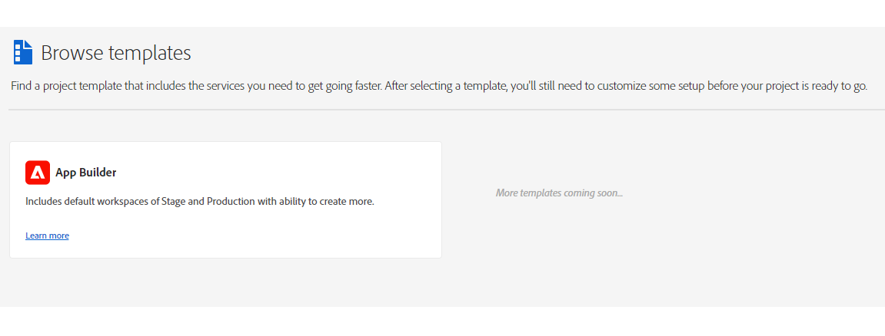
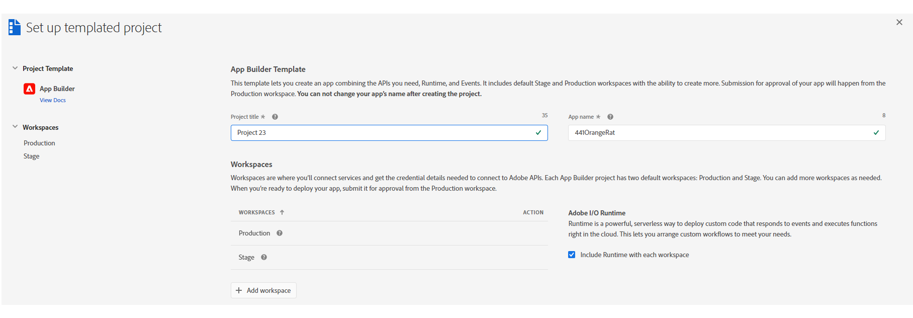
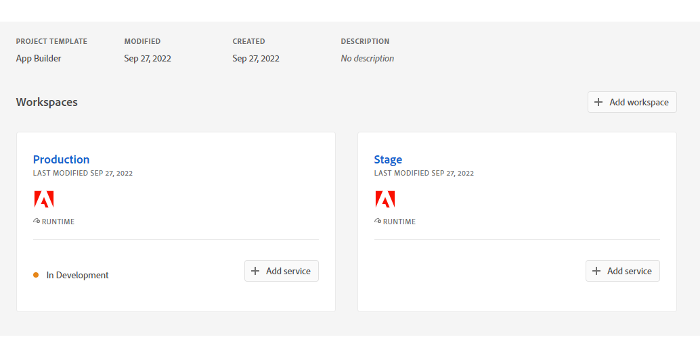

# UI Extensions Development Flow

The document helps you understand how to setup, implement and deploy your own [UI Extension](pages/dx-devex-acceleration/uix-docs/overview/) with [Adobe App Builder](https://developer.adobe.com/app-builder/docs/overview/)

## Get Access 

To start writing UI Extensions you will need:
1. Access to Experience Cloud service. In our example, we will create an extension for Adobe Experience Manager (AEM).
2. Access to App Builder, which we will use to create an extension.

To do this, you need to fill out the request forms to gain access to these services.

For more details, please refer to [How to Get Access](pages/dx-devex-acceleration/uix-docs/overview/requirements/) .

## Create a new project in Adobe Developer Console

> Adobe Developer Console gives you access to APIs, SDKs and developer tools to integrate, and extend Adobe products. 
In App Builder, you need access to Adobe I/O Runtime credentials used for deploying your application, 
and access to API credentials if you want to access Adobe APIs in your application.

1. Sign in to [Adobe Developer Console](https://developer.adobe.com/console) with your Adobe ID.


2. Choose your account.


3. Choose your profile or organizzation.


3. Make sure you are in a proper organization (a switcher in the right top corner).


4. Click "Create new project" -> "Project from template".

and choose "App Builder"


5. Fill the project data.

- `Project Title` is used to identify your project within [Adobe Developer Console](https://developer.adobe.com/console) and in [CLI](https://github.com/adobe/aio-cli).
- `App Name` will be used as a unique identifier for your application and this value cannot be changed after project creating.

After creating, you should see a new project generated with 2 default Workspaces.
Each App Builder project has two default workspaces: `Production` and `Stage`. You can add more workspaces as needed. 
The `Production` workspace is special, as it is used for the submission and distribution flow.


## Initialize our Application using the CLI for local development

Once your project is set up in [Adobe Developer Console](https://developer.adobe.com/console), we need to initialize our app in a local environment.
There are several ways how to do it.

We will initialize the UI Extension Project using [AIO CLI](https://github.com/adobe/aio-cli).
The document [Initialize the UI Extension Project using AIO CLI](/pages/dx-devex-acceleration/uix-docs/services/aem-cf-console-admin/guides/#initialize-the-ui-extension-project-using-aio-cli) describes in detail all the steps that you need to follow.

If necessary, you can find other options in [Bootstrapping new App using the CLI](https://developer.adobe.com/app-builder/docs/getting_started/first_app/#4-bootstrapping-new-app-using-the-cli).

Once you complete, you should see the build process with necessary npm dependencies are getting installed.

Also, [base project structure](https://developer.adobe.com/app-builder/docs/getting_started/first_app/#5-anatomy-of-an-app-builder-application) will be generated.
    
```shell
Sample code files have been generated.
    
Next steps:
1) Populate your local environment variables in the ".env" file
2) You can use `aio app run` or `aio app deploy` to see the sample code files in action
    
    
✔ Finished running template @adobe/aem-cf-admin-ui-ext-tpl
✔ Installed template @adobe/aem-cf-admin-ui-ext-tpl
Project initialized for Workspace Stage, you can run 'aio app use -w <workspace>' to switch workspace.
✔ App initialization finished!
 > Tip: you can add more actions, web-assets and events to your project via the 'aio app add' commands
```

## Implement logic of Application 

At this step, we need to implement a logic of App Builder Application which will use existing [AEM UI Extension Points](pages/dx-devex-acceleration/uix-docs/services/aem-cf-console-admin/api/).
A general approach is described in [App Builder and UI Extensibility](/pages/dx-devex-acceleration/uix-docs/overview/app-builder/).

The process of creating an application is described in [Step-by-step Extension Development](pages/dx-devex-acceleration/uix-docs/services/aem-cf-console-admin/guides/hello-world/) guide.


## Deploy on Production
After the application has been completed, tested locally and on `Stage`, we are ready to deploy it to `Production`.

The process is the same as for deploying to `Stage`, but first you need to switch the workgroup to `Production`.

Please type command in our project folder:

```shell
$ aio app use -w Production

You are currently in:
1. Org: Sites Internal
2. Project: 562TurquoiseShrimp
3. Workspace: Stage
? The file aem-headless-ui-ext-example/.env already exists: Merge
? The file aem-headless-ui-ext-examples/.aio already exists: Overwrite

✔ Successfully imported configuration for:
1. Org: Sites Internal
2. Project: 562TurquoiseShrimp
3. Workspace: Production.
```
**Note:** 
We chose the `Merge` option for the `.env` file so that we don't lose our environment variables.

After workgroup switching, we can make building and deploying with the command:
```
$ aio app deploy

√ Built 3 action(s) for 'aem/cf-console-admin/1'
√ Building web assets for 'aem/cf-console-admin/1'
√ Deployed 3 action(s) for 'aem/cf-console-admin/1'
√ Deploying web assets for 'aem/cf-console-admin/1'
Your deployed actions:
web actions:
  -> https://245265-562turquoiseshrimp.adobeio-static.net/api/v1/web/aem-headless-ui-ext-examples/get-language-copies
  -> https://245265-562turquoiseshrimp.adobeio-static.net/api/v1/web/aem-headless-ui-ext-examples/quick-publish-language-copies
  -> https://245265-562turquoiseshrimp.adobeio-static.net/api/v1/web/aem-headless-ui-ext-examples/unpublish-language-copies
To view your deployed application:
  -> https://245265-562turquoiseshrimp.adobeio-static.net/index.html
To view your deployed application in the Experience Cloud shell:
  -> https://experience.adobe.com/?devMode=true#/custom-apps/?localDevUrl=https://245265-562turquoiseshrimp.adobeio-static.net/index.html
New Extension Point(s) in Workspace 'Production': 'aem/cf-console-admin/1'
Successful deployment 🏄
```

## Create Approval Request
When you’re ready to publish your app, you will submit it for an approval from the Production workspace.


After the approval, your app will be available at [Adobe Experience Cloud](https://experience.adobe.com/).

Also, data about your extension will be added to *Adobe App Registry* and will be reachable for Adobe Products.

This means, that the new functionality will be available, for example, in the AEM admin panel for your organization.


These steps are described in more detail in [UI Extensions Management](pages/dx-devex-acceleration/uix-docs/guides/publication/).

### Additional Resources
- [UI Extensibility overview](pages/dx-devex-acceleration/uix-docs/overview/)
- [Troubleshooting](pages/dx-devex-acceleration/uix-docs/services/aem-cf-console-admin/guides/debug/)
- [FAQ](pages/dx-devex-acceleration/uix-docs/overview/faq/)
