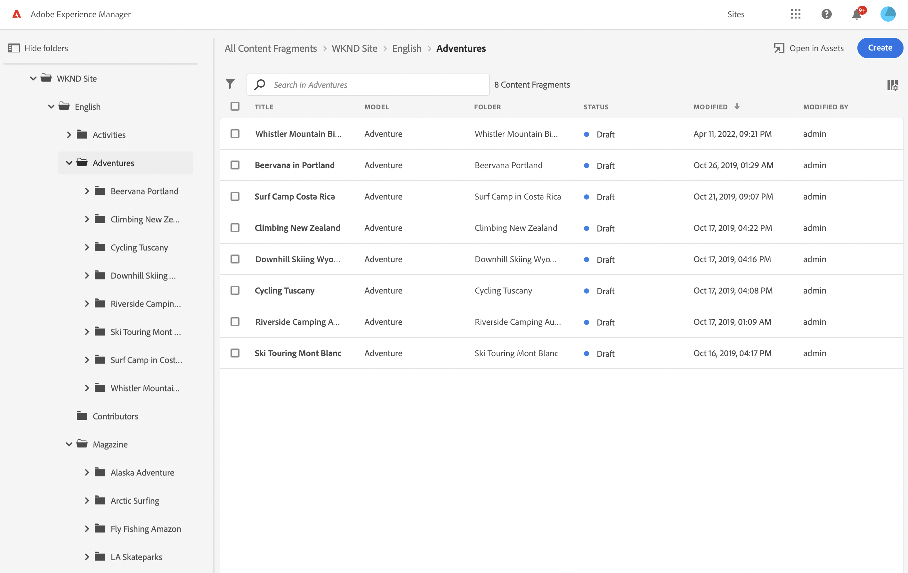

#  Local Preview of UI the Extensions

During development, it's important to preview your extension to ensure it meets all requirements and doesn't have any errors. To do so, make sure you meet the following conditions:

1. Access to an [Adobe Experience Manager (AEM)](https://experienceleague.adobe.com/docs/experience-manager.html) instance. For instructions on how to obtain access, refer to [How to Get Access](../get-access).
2. You should have an implemented or partially implemented UI extension. Details on how to do it can be found in [Step-by-step Extension Development](../../services/aem-cf-console-admin/extension-development).

## Running UI Extension locally

From the extension project directory, begin by running the following command:

```shell
aio app run
```

This will deploy the actions to Adobe I/O Runtime, while running the UI part on the local machine.

```shell
➜  demo-extension-project % aio app run
  create .vscode/launch.json

No change to package.json was detected. No package manager install will be executed.

To view your local application:
  -> https://localhost:9080
To view your deployed application in the Experience Cloud shell:
  -> https://experience.adobe.com/?devMode=true#/custom-apps/?localDevUrl=https://localhost:9080
press CTRL+C to terminate dev environment
```

#### Accepting the certificate (First time users)

If you are using this application for the first time, you will see a message similar to

```shell
success: generated certificate
A self signed development certificate has been generated, you will need to accept it in your browser in order to use it.
Waiting for the certificate to be accepted.... timed out
```

This message pops up because we use a development SSL certificate for secure communication. Understand more about the purpose of this certificate [here](https://letsencrypt.org/docs/certificates-for-localhost/).

If you see this message, please navigate to `https://localhost:9080`, you should see a screen similar to this.


Click on `Advanced`, the nex screen may vary from browser to browser, but you should see a screen like this, where you can click on `Proceed to localhost (unsafe)` to accept the certificate.


## Previewing UI Extension with additional parameters in URL

As mentioned before, you should have access to an AEM instance. For example, your URL should be structured like this:

```termminal
https://experience.adobe.com/?repo=<CURTOMER_AEM_HOST>#/@<CUSTOMER_IMS_ORG>/aem/cf/admin/
```

- repo (host name of AEM instance): `repo=<CURTOMER_AEM_HOST>`



For previewing and testing, you don't need to [publish the extension](../publication). Instead, you can add extra parameters in the URL:

- ext (extension): `ext=https://localhost:9080`
- devMode (development mode): `devMode=true` (required to allow access to resources on `production` env from localhost)

The final URL for local preview will look like:

```terminal
https://experience.adobe.com/?ext=https://localhost:9080&repo=<CURTOMER_AEM_HOST>#/@<CUSTOMER_IMS_ORG>/aem/cf/admin/
```

The system will process these parameters, making it work as if the extension was published.

<InlineAlert variant="info" slots="text" />

Similarly, you can preview any UI Extension that has been [deployed on the stage environment](../../services/aem-cf-console-admin/extension-development/#run-on-stage), and you can also share a link to the result.

For example, if your extension has implemented additional logic for the [Action Bar](../../services/aem-cf-console-admin/api/#action-bar) in [AEM Content Fragments Console](../../services/aem-cf-console-admin), you should be able to see the result:


## Retrieving logs for the UI Extension

To view the logs for your application, you can use the CLI command:

```terminal
aio app logs
```

By default, only the logs from the most recent runs are retrieved. If you need to access a larger set of logs, you can utilize the `--limit` flag to specify the number of recent runs to fetch.

### Additional resources

- [UI Extensibility Overview](../../)
- [UI Extensions Development Flow](../../guides/development-flow)
- [FAQ](../../overview/faq/)