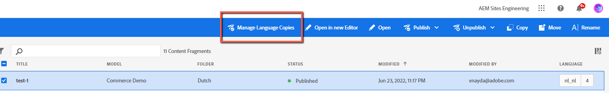

# UI Extensions Management


After you've completed [developing](https://git.corp.adobe.com/pages/dx-devex-acceleration/uix-docs/services/aem-cf-console-admin/guides/hello-world/) and [testing](https://git.corp.adobe.com/pages/dx-devex-acceleration/uix-docs/services/aem-cf-console-admin/guides/hello-world/) your application, you're ready to deploy to production and publish it.

## Deploy on Production (CLI)

The process is the same as for deploying to `Stage`, but first you need to switch the workgroup to `Production` in the CLI.
Type this command in the project folder:
```shell script
aio app use -w Production
```


After workgroup switching, we can make building and deploying with command:
```shell script
aio app deploy
```


You can also undeploy your app with 
```shell script
aio app undeploy
``` 

To learn more about deployment, please refer to [Deploying the Application](https://developer.adobe.com/app-builder/docs/getting_started/first_app/#7-deploying-the-application) 
and [Deployment Overview](https://developer.adobe.com/app-builder/docs/guides/deployment/). 

## Create request for Approval (Adobe Developer Console)
To begin the approval process, navigate in [Adobe Developer Console](https://developer.adobe.com/console) to the `Production workspace` and select **Submit for approval** in the top-right corner of the screen or select **Approval** in the left navigation.


The next step is to fill out the **App Submission Details** form.
This information will be visible to people using your app and administrators viewing your app.


After submitting the form You will be returned to the Approval screen, where the Status of your application should now be **In Review**.


Once reviewed by your organization's administrator, your app will either be approved and published or rejected.


## Administrator review (MyExchange)

Once the application is submitted for approval, organization's administrator will see the app in 
```
My Exchange -> Experience Cloud Apps -> Pending Review
```


The reviewer could review this app, either approve it or reject it.


Once an app is approved, administrator will see it under **Approved**. 
The reviewer may revoke this application to unpublish it. The application owner can resubmit the application for review.


> Once an application is published, you will not be able to re-deploy it to `Production`. To do this, you will need to revoke and create a new approval request.

## Check your published app at Experience Cloud

After the approval, your app will be available at [Adobe Experience Cloud](https://experience.adobe.com/) in App Builder Apps section.

Also, data about your extension will be added to *Adobe App Registry* and will be reachable for Adobe Products.

This means, that the new functionality will be available, for example, in the AEM admin panel for **your organization**.

More details about publishing are described in [Publishing Your First App Builder Application](https://developer.adobe.com/app-builder/docs/getting_started/publish_app/).

### Additional Resources
- [UI Extensions Development Flow](pages/dx-devex-acceleration/uix-docs/guides/development/)
- [UI Extensibility overview](pages/dx-devex-acceleration/uix-docs/overview/)
- [Troubleshooting](pages/dx-devex-acceleration/uix-docs/services/aem-cf-console-admin/guides/debug/)
- [FAQ](pages/dx-devex-acceleration/uix-docs/overview/faq/)
