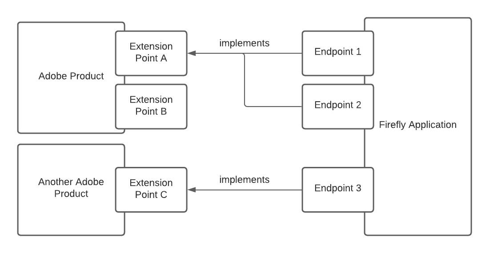
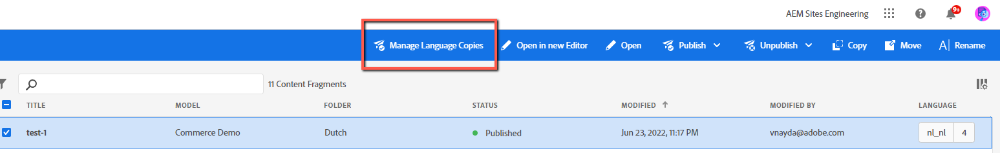

# App Builder and UI Extensibility

UI Extensions are specific types of applications created with Adobe App Builder. All information available for App Builder is valid for UI Extensions as well. 

## What is App Builder
[App Builder](https://developer.adobe.com/app-builder/docs/overview/) is a framework that enables developers to build custom web applications, deploy and run it on Adobe infrastructure.

[App Builder](https://developer.adobe.com/app-builder/docs/overview/) supports a few types of use cases:
- Single Page Applications (SPAs) that can be accessed in [Experience Cloud UI](https://experience.adobe.com/).
- Standalone Headless Applications.
- Extensions - App Builder applications that allows developers to create and extend certain Adobe products in an integrated way within Adobe ecosystem.

It uses modern technologies (JAM stack, serverless computing, Node, and React) and provides best practices when building applications (event-driven architecture, microservices, continuous integration, and delivery).

## Introduction to Extensions
Adobe products, like [AEM Content Fragments Console](../../services/aem-cf-console-admin), can define how they'd like customers to extend the product through App Builder Applications (what operations are allowed, what data format is expected, etc).
From the developer's point of view, the developer will be able to build applications using these `Extension Points` that match the requirements of the product.

In other words, we can say that this is a contract between an Adobe product and an App Builder application.

**Available Extension Points:**

- [Experience Cloud UI Extension Point](https://developer.adobe.com/app-builder/docs/guides/extensions/#experience-cloud-ui-extension-point)
- [AEM Asset Microservices Extension Point](https://developer.adobe.com/app-builder/docs/guides/extensions/#aem-asset-microservices-extension-point)
- [AEM Content Fragments Console Extension Point](../../services/aem-cf-console-admin/api)

## UI Extensibility

As stated above, UI extensions are a special case of App Builder applications.

As an example, using the [AEM Content Fragments Console Extension Point](../../services/aem-cf-console-admin/api), we can customize navigation, add our own actions on the [Content Fragments Console](../../services/aem-cf-console-admin) and implement custom UI via Modals, etc.

More details are described in [AEM Content Fragments Console Extension Points](../../services/aem-cf-console-admin/api).
     
### Additional resources
- [UI Extensions Development Flow](../../guides/development-flow)
- [UI Extensions Management](../../guides/publication)
- [FAQ](../faq)
- [Introduction to Extensions](https://developer.adobe.com/app-builder/docs/guides/extensions/)
