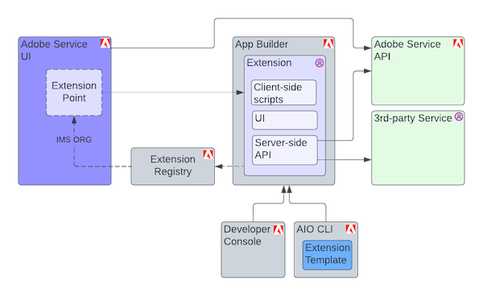

# How It Works

App Builder application implemented as a UI extension is bound to an associated Adobe Service UI for an IMS organization that owns the application and is automatically loaded for all users within that IMS organization.

In order to provide UI Extensibility Adobe Service UI defines extension points - API that may be used by extension to interact with Adobe Service UI and requirements to API that extension must implement to be correctly invoked.

UI Extension with help of UI Extensibility SDK `@adobe/uix-guest` declares what extension points are implemented so Adobe Service UI knows how to integrate and when to invoke extension. Once UI extension is [deployed](https://developer.adobe.com/app-builder/docs/getting_started/first_app/#7-deploying-the-application) with help of [AIO CLI](https://github.com/adobe/aio-cli) tool it is registered in Extension Registry service and became available for all users within IMS organization which was used during aio for App Builder application.

When user loads Adobe Service UI the list of published UI Extensions is loaded from Extension Registry and transparently added to the UI.

UI Extensions always are loaded inside `iframe` HTML elements and all code of the extension always executed in context of that iframe. All the interaction between extension and Adobe Service happens through safe strictly defined API.

UI Extension may implement:
- client side script that execute any logic without UI
- own UI inside area defined by Adobe Service
- server-side script hosted as Adobe Runtime action.

For the end users functionality provided by UI Extensions looks like integral part of Adobe Service UI.

