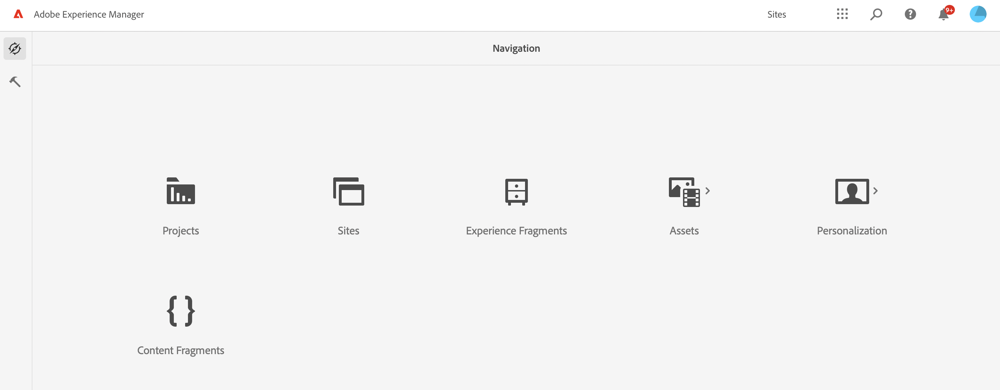

# How to Get Access

To use UI Extensibility you will need what to extend and Adobe App Builder. You will also need developer and admin roles assigned to users within your organization.

To add your own business cases implementation to Adobe Service through UI Extensibility your IMS organization needs:
1. Access to Adobe Service that implemented UI Extensibility, e.g. [Adobe Experience Manager Content Fragments Console](../services/aem-cf-console-admin/).
2. Access to Adobe App Builder.

In order to [create UI extension](guides/development-flow/) for their own IMS organization user should have a **developer** role in the AEM or Adobe I/O Runtime product profiles at [Adobe Admin Console](https://adminconsole.adobe.com/].
Having such a developer or admin role for the user will also grant access to [Adobe Developer Console](https://developer.adobe.com/console/).

Pay attention that implementing and deploying UI Extension is not enough. To enable UI Extension for all IMS organization members it should be [published](guides/publication/) by the IMS organization **system admin** at [Adobe Exchange](https://exchange.adobe.com/).

### Access AEM Content Fragments Console

AEM Content Fragments Console available for all users of AEM as a Cloud Service with latest version. You may access it by logging in into your authoring service and clicking on Content Fragments button.
.

As during development of UI Extensions developer will need access to AEM API please ensure that permissions allows to do so at least for development environment.

### Access App Builder

<InlineAlert slots="text" />

Extensibility is a core capability of Adobe products. After stable release App Builder will be offered together with services which implement UI Extensibility and will not require any additional onboarding.

To get access to [App Builder](https://developer.adobe.com/app-builder/) please contact your Adobe account manager or proceed to self-onboarding and request a [trial access](https://developer.adobe.com/app-builder/trial/)  for your IMS organization.

