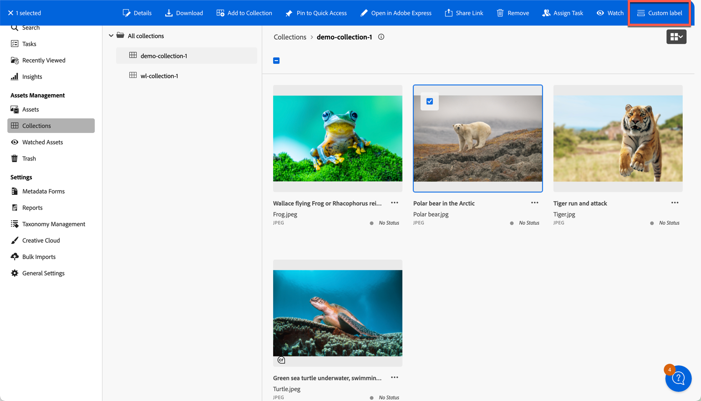

# Browse View

The Browse View in the AEM Assets View refers to the asset listing pages such as
Assets, Collections, Libraries, Recent, Search and Trash.

Extensions should use the `aem/assets/browse/1` extension point to utilize extensibility services of the Browse View.

An extension needs to implement both `actionBar` and `quickActions` namespace to be recognized by Assets View.

## Custom action bar buttons and quick actions

This extensibility feature allows context-aware customization of the action bar buttons and also the quick actions
items associated with the selected assets.

Using the `actionBar` namespace, custom buttons could be added after the list of built-in action bar buttons, and
built-in action bar buttons could be overridden or hidden based on the context and the selected assets.

In this example, a custom button is added to the action bar after the list of built-in action bar buttons.



Using the `quickActions` namespace, built-in quick actions can be overridden and hidden based on the context and the
current asset.

## API Reference

This API reference section is further broken down into two parts: the API provided by the AEM Assets View host application
to the extension and the API provided by the extension to the AEM Assets View host application.

### Host API Reference

In addition to the [Common API](../commons) provided by AEM Assets View to all extensions,
the host application provides the following API specific to the `aem/assets/browse/1` extension point,
the `actionBar` and `quickActions` namespace.

`browse.getContext`

**Description:** returns current browsing context.

**Returns** (`string`): current context that could be `assets`, `collections`, `libraries`, `recent`, `search` or
`trash`

**Example:**
```js
const context = await guestConnection.host.browse.getContext();
```

To open a custom dialog from from custom action bar buttons or quick actions items, refer to the
[Modal API](../commons/#modal-api) provided by AEM Assets View to all extensions for implementation of
dialog management.

### Extension API Reference

The extension definition object passed by the extension to the `register()` function defines the `actionBar` and
`quickActions` namespaces.

Additional buttons could be added to the action bar, and existing built-in actions could be hidden or customized based
on the browsing context and resource selection provided to the methods in these namespaces.

#### Browsing context

Assets View supports assets browsing experiences in multiple modes, or "contexts". The current context is exposed in
the Host API and is also communicated to Extension APIs, so that the custom code within Extension can adopt to Assets
View state. Supported browsing contexts are:

| Browsing Context | Description | Path |
|------------|------------|------------|
| assets | Main asset browsing experience | /assets/browse |
| collections | Collections | /assets/collections |
| libraries | Libraries | /assets/libraries |
| recent | Recent | /assets/recent |
| search | Search | /assets/search |
| trash | Trash | /assets/trash |

#### Built-in actions

The host application allows to hide certain built-in actions. Depending on the browsing content, below if the list of
action IDs of actions that can be hidden:

| Browsing Context | Action IDs that can be hidden or overridden |
|------------|------------|
| assets | "edit", "openInExpress", "reprocess", "copy", "move", "rename", "bulkRename", "managePermissions", "delete", "publish", "download", "share" |
| collections | "openInExpress", "rename", "managePermissions", "delete", "download", "share" |
| libraries | "copy", "move", "rename", "delete" |
| recent | - |
| trash | "delete" |


#### actionBar namespace
The `actionBar` namespace include these 3 methods
- `getActions({ context, resourceSelection })`
- `getHiddenBuiltInActions({ context, resourceSelection })`
- `overrideBuiltInAction({ actionId, context, resourceSelection })`

`actionBar.getActions({ context, resourceSelection })`

**Description:** returns an array of custom action descriptors or an empty array if no custom actions should be added
to the ActionBar in the specified context for the selected assets.

**Parameters:**
- context (`string`): current browsing context that could be `assets`, `collections`, `libraries`, `recent`, `search`
or `trash`
- **resourceSelection** (`object`): an object representing the current resource selection
  - resources (`array`): an array of currently selected resources.
    - id (`string`): selected resource URN; in case of the library item the 'id' is the library URN followed by slash '/' and the id of the element.
    - path (`string`): selected resource path

**Returns** an array of custom action descriptors or an empty array if no custom actions should be added to the ActionBar.

Each array element is a custom action descriptor is a JSON with the following properties:
- `id` (`string`): action id, unique within given extension.
- `label` (`string`): Custom action title.
- `icon` (`string`): Name of the [React-Spectrum workflow icon](https://react-spectrum.adobe.com/react-spectrum/workflow-icons.html#available-icons).
- `onClick` (`function`): An activation handler.

**Example:**
```js
actionBar: {
  getActions: ({ context, resourceSelection }) => {
    if (context === 'collections' && resourceSelection.resources.length === 1) {
        return [{
        'id': 'customId',
        'icon': 'Form',
        'label': 'Custom label',
        'onClick': async () => {
            // ...
        }
      }];
    }
    return [];
  },
}
```


`getHiddenBuiltInActions({ context, resourceSelection })`

 **Description:**  returns an array of built-in action id that should be hidden in the specified context for the selected assets.

#### quickActions namespace

The `quickActions` namespace include these 2 methods
- `getHiddenBuiltInActions({ context, resource })`
- `overrideBuiltInAction({ actionId, context, resource })`


## Examples

### Example of adding custom action bar buttons


### Example of hiding built-in action bar buttons


### Example of overriding built-in action bar buttons


### Example of hiding built-in quick actions


### Example of overriding built-in quick actions
