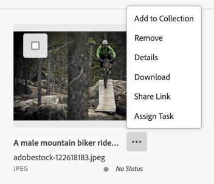

# Browse View

AEM Assets View offers the ability to customize the ActionBar and QuickActions in the Browse View.

The Browse View in the AEM Assets View refers to the asset listing pages such as
Assets, Collections, Recent, Search and Trash.

**ActionBar** is the blue bar with actions that appears at the top when one or more assets in the
Browse View are selected.


**QuickActions** is the dropdown menu from the More action button (shown as `⋯`) next to each asset.


Extensions should use the `aem/assets/browse/1` extension point to utilize extensibility services of the Browse View.

An extension needs to implement both `actionBar` and `quickActions` namespace to be recognized by Assets View.

## Custom ActionBar actions and QuickActions menu actions

This extensibility feature allows context-aware customization of the ActionBar actions and the QuickActions menu actions
associated with the selected resources.

Using the `actionBar` namespace, custom actions could be added to the ActionBar after the list of built-in actions, and
the built-in actions could be overridden or hidden based on the context and the selected resources.

In this example, a custom action is added to the ActionBar after the list of built-in ActionBar actions.


Using the `quickActions` namespace, built-in QuickActions menu actions can be overridden and hidden based on the context and the
selected asset.

## API Reference

This API reference section is further broken down into two parts: the API provided by the AEM Assets View host application
to the extension and the API provided by the extension to the AEM Assets View host application.

### Host API Reference

In addition to the [Common API](../commons) provided by AEM Assets View to all extensions,
the host application provides the following definitions specific to the `aem/assets/browse/1` extension point,
the `actionBar` and `quickActions` namespace.

#### Browsing context

Assets View supports assets browsing experiences in multiple modes, or "contexts". The current context is exposed in
the Host API and is also communicated to Extension APIs, so that the custom code within Extension can adapt to the
state of Assets View.  Supported browsing contexts are:

| Browsing Context | Description | Path |
|------------|------------|------------|
| assets | Main asset browsing experience | /assets/browse |
| collections | Collections | /assets/collections |
| recent | Recent | /assets/recent |
| search | Search | /assets/search |
| trash | Trash | /assets/trash |

#### Built-in actions

The host application allows to hide certain built-in actions. Depending on the browsing content, below is the list of
action IDs of actions that can be hidden:

| Browsing Context | Action IDs that can be hidden or overridden |
|------------|------------|
| assets | "edit", "openInExpress", "reprocess", "copy", "move", "rename", "bulkRename", "managePermissions", "delete", "publish", "download", "share" |
| collections | "openInExpress", "rename", "managePermissions", "delete", "download", "share" |
| recent | - |
| search | "edit", "openInExpress", "reprocess", "copy", "move", "rename", "bulkRename", "managePermissions", "delete", "publish", "download", "share" |
| trash | "delete" |

### Extension API Reference

The extension definition object passed by the extension to the `register()` function defines the `actionBar` and
`quickActions` namespaces.

Additional actions could be added to the ActionBar, and existing built-in actions could be hidden or customized based
on the browsing context and resource selection provided to the methods in these namespaces.

#### actionBar namespace
The `actionBar` namespace include these 3 methods
- `getActions({ context, resourceSelection })`
- `getHiddenBuiltInActions({ context, resourceSelection })`
- `overrideBuiltInAction({ actionId, context, resourceSelection })`

`actionBar.getActions({ context, resourceSelection })`

**Description:** returns an array of custom action descriptors or an empty array if no custom actions should be added
to the ActionBar in the specified context for the selected resources.

**Parameters:**
- context (`string`): current [browsing context](#browsing-context).
- **resourceSelection** (`object`): an object representing the resource selection.
  - resources (`array`): an array of selected resources.
    - id (`string`): selected resource URN.
    - path (`string`): selected resource path.

**Returns** (`array`) an array of custom action descriptors or an empty array if no custom actions should be added to the ActionBar.

Each array element is a custom action descriptor is a JSON with the following properties:
- `id` (`string`): action id, unique within given extension.
- `label` (`string`): Custom action title.
- `icon` (`string`): Name of the [React-Spectrum workflow icon](https://react-spectrum.adobe.com/react-spectrum/workflow-icons.html#available-icons).
- `onClick` (`function`): An activation handler.

**Example:**
```js
actionBar: {
    getActions: ({ context, resourceSelection }) => {
        return [{
            'id': 'customId',
            'icon': 'Form',
            'label': 'Custom label',
            'onClick': async () => {
                // ...
            }
        }];
    },
}
```

`getHiddenBuiltInActions({ context, resourceSelection })`

**Description:**  returns an array of [built-in action id](#built-in-actions) that should be hidden in the specified context for the selected resources.

This method is called by the host application to determine which built-in actions are hidden. The host calls this
method once when a resource selection changes.
 
Extension code should ensure this method returns fast because the host application blocks rendering of the ActionBar until actions are checked for visibility.
In particular it is recommended not to use backend server calls in this method.

**Parameters:**
- context (`string`): current [browsing context](#browsing-context)
- **resourceSelection** (`object`): an object representing the resource selection
  - resources (`array`): an array of selected resources.
    - id (`string`): selected resource URN.
    - path (`string`): selected resource path.

**Returns** (`array`) an array of action Ids which should be hidden from the ActionBar, or an empty array in case no action needs to be hidden

**Example:**
 ```js
getHiddenBuiltInActions: ({ context, resourceSelection }) => {
    return [];
},
```

`overrideBuiltInAction({ actionId, context, resourceSelection })`

**Description:**  Return true to indicate the Host should perform the built-in action, false otherwise. 

This method is called by the Host when the user activates one of the built-in actions, before invoking actual action handler. The method returns true if the Extension had
performed custom action processing and the Host should not invoke built-in action handler. Otherwise the method call returns false, to indicate that the Extension
had ignored the invocation and the Host should use built-in action handler.

**Parameters:**
- actionId (`string`): actionId built-in action id.
- context (`string`): current [browsing context](#browsing-context).
- **resourceSelection** (`object`): an object representing the resource selection.
  - resources (`array`): an array of selected resources.
    - id (`string`): selected resource URN.
    - path (`string`): selected resource path.

**Returns** (`boolean`) false for Host to use built-in action handler, true to skip built-in handler and stop

**Example:**
```js
overrideBuiltInAction: ({ actionId, context, resourceSelection }) => {
    //do some custom tasks
    return true;  // skip the Host's built-in handler and stop  
},
```

#### quickActions namespace

The `quickActions` namespace include these 2 methods
- `getHiddenBuiltInActions({ context, resource })`
- `overrideBuiltInAction({ actionId, context, resource })`

`getHiddenBuiltInActions({ context, resource })`

**Description:**  returns an array of [built-in action id](#built-in-actions) that should be hidden in the specified context for the selected asset.

This method is called by the host application to determine which built-in actions are hidden.
The host calls this method once when an asset selection changes.

Extension code should ensure this method returns fast because the host application blocks rendering of the QuickActions menu until actions are checked for visibility.
In particular it is recommended not to use backend server calls in this method.

**Parameters:**
- context (`string`): current [browsing context](#browsing-context).
- **resource** (`object`): an object representing the selected resource.
  - id (`string`): selected resource URN.
  - path (`string`): selected resource path.

**Returns** (`array`) an array of action Ids which should be hidden from the QuickActions menu, or an empty array in case no action needs to be hidden.

**Example:**
```js
getHiddenBuiltInActions: ({ context, resource }) => {
    return [];
},
```

`overrideBuiltInAction: ({ actionId, context, resource })`

**Description:**  

This method is called by the Host when the user activates one of the built-in QuickActions menu actions, before invoking actual action handler.
The method returns true if the Extension had performed custom action processing and the Host should not invoke built-in action handler.
Otherwise the method call returns false, to indicate that the Extension had ignored the invocation and the Host should use built-in action handler.

**Parameters:**
- actionId (`string`): actionId built-in action id.
- context (`string`): current [browsing context](#browsing-context).
- **resource** (`object`): an object representing the selected resource.
  - id (`string`): selected resource URN.
  - path (`string`): selected resource path.

**Returns** (`boolean`) false for Host to use built-in action handler, true to skip built-in handler and stop.

**Example:**
```js
overrideBuiltInAction: ({ actionId, context, resource }) => {
    //do some custom tasks
    return true;
},
```

## Examples

These code snippets demonstrate how to add a custom action to the ActionBar, hide built-in actions from the ActionBar and QuickActions menu, or override the built-in action handler in the Browse View. (The examples below serve illustrative purposes thus omit certain import statements and other non-important parts.)

The ExtensionRegistration component initializes the extension registration process by calling the register() function
provided by the `@adobe/uix-guest` library.

The objects passed to the register() function describe the extension and its capabilities. In particular, it declares
that the extension uses the `actionBar` and `quickActions` namespaces and declares required methods for these namespaces.

```js
function ExtensionRegistration() {
    const init = async () => {
        const guestConnection = await register({
            id: extensionId,
            methods: {
                actionBar: {
                    async getActions({ context, resourceSelection }) {
                        return [];
                    },
                    async getHiddenBuiltInActions({ context, resourceSelection }) {
                        return [];
                    },
                    async overrideBuiltInAction({ actionId, context, resourceSelection }) {
                        return false;
                    },
                },
                quickActions: {
                    async getHiddenBuiltInActions({ context, resource }) {
                        return [];
                    },
                    async overrideBuiltInAction({ actionId, context, resource }) {
                        return false;
                    },
                },
            },
        });
    };
    init().catch(console.error);

    return <Text>IFrame for integration with Host (AEM Assets View)...</Text>;
}

export default ExtensionRegistration;
```

This examples demonstrations the minimal set of namespaces and methods required for a browse extension to be recognized
by the Host application.

### Example of adding custom actions

Here is an example for adding a custom action after the built-in actions in the ActionBar.

```js
function ExtensionRegistration() {
    const init = async () => {
        const guestConnection = await register({
            id: extensionId,
            methods: {
                actionBar: {
                    async getActions({ context, resourceSelection }) {
                        if (context === 'assets' && resourceSelection.resources.length === 1) {
                            return [{
                                'id': 'customId',
                                'icon': 'Form',
                                'label': 'Custom label',
                                'onClick': async () => {
                                    // ...
                                }
                            }];
                        }
                        return [];
                    },
                },
                // ...
            },
        });
    };
    init().catch(console.error);

    return <Text>IFrame for integration with Host (AEM Assets View)...</Text>;
}

export default ExtensionRegistration;
```

In this example, the `context` and the number of selected resources are considered for the decision of adding a custom
action labeled with `Custom label` along with the `Form` icon is added in the `assets` context when the number of
selected resources is 1.

### Example of hiding built-in actions

Here are the examples for hiding built-in actions from the ActionBar and the QuickActions menu.

In this example, the `Delete` action is hidden from the ActionBar only in the `trash` context.  It does not hide any
actions in the other contexts.

```js
function ExtensionRegistration() {
    const init = async () => {
        const guestConnection = await register({
            id: extensionId,
            methods: {
                actionBar: {
                    // ...
                    async getHiddenBuiltInActions({ context, resourceSelection }) {
                        if (context === 'trash') {
                            return ['delete'];
                        }
                        return [];
                    },
                },
                // ...
            },
        });
    };
    init().catch(console.error);

    return <Text>IFrame for integration with Host (AEM Assets View)...</Text>;
}
```

In this example, the `Delete` action is hidden from the QuickActions menu only in the `trash` context.  It does not
hide any actions in the other contexts.

```js
function ExtensionRegistration() {
    const init = async () => {
        const guestConnection = await register({
            id: extensionId,
            methods: {
                quickActions: {
                    async getHiddenBuiltInActions({ context, resource }) {
                        if (context === 'trash') {
                            return ['delete'];
                        }
                        return [];
                    },
                },
                // ...
            },
        });
    };
    init().catch(console.error);

    return <Text>IFrame for integration with Host (AEM Assets View)...</Text>;
}
```

### Example of overriding built-in actions

Here are the examples for overriding the built-in actions from the ActionBar and the QuickActions menu.

```js
function ExtensionRegistration() {
    const init = async () => {
        const guestConnection = await register({
            id: extensionId,
            methods: {
                actionBar: {
                    // ...
                    async overrideBuiltInAction({ actionId, context, resourceSelection }) {
                        if (actionId === 'download') {
                            // determines the user's permission to download
                            const canDownload = ...
                            // shows an info dialog explaining why the user cannot download and return true to skip built-in handler and stop 
                            if (!canDownload) {
                                guestConnection.host.modal.openDialog({
                                    title: 'Download',
                                    contentUrl: '/#modal-download-warning',
                                    type: 'modal',
                                    size: 'S',
                                    payload: { /* arbitrary payload */ }
                                });
                                // skip built-in handler
                                return true;
                            }
                        }
                        // continue to execute built-in handler
                        return false;
                    },
                },
                // ...
            },
        });
    };
    init().catch(console.error);

    return <Text>IFrame for integration with Host (AEM Assets View)...</Text>;
}
```
In this example, the `Download` action is overriden in the ActionBar in any applicable context.  The extention will
determine the user's permission to download the resource selection.  If the user does not have sufficient permision,
a dialog will be displayed and the built-in handler in the Host application will be skipped.  If the user has permission
to download, then the built-in handler for Download will be executed.

The built-in handlers will be executed for other built-in actions as well as when the user has
sufficient permission to download.

```js
function ExtensionRegistration() {
    const init = async () => {
        const guestConnection = await register({
            id: extensionId,
            methods: {
                quickActions: {
                    // ...
                    async overrideBuiltInAction({ actionId, context, resource }) {
                        if (actionId === 'download') {
                            // determines the user's permission to download
                            const canDownload = ...
                            // shows an info dialog explaining why the user cannot download and return true to skip built-in handler and stop 
                            if (!canDownload) {
                                guestConnection.host.modal.openDialog({
                                    title: 'Download',
                                    contentUrl: '/#modal-download-warning',
                                    type: 'modal',
                                    size: 'S',
                                    payload: { /* arbitrary payload */ }
                                });
                                // skip built-in handler
                                return true;
                            }
                        }
                        // continue to execute built-in handler
                        return false;
                    },
                },
                // ...
            },
        });
    };
    init().catch(console.error);

    return <Text>IFrame for integration with Host (AEM Assets View)...</Text>;
}
```

In this example, the `Download` action is overriden in the QuickActions menu in any applicable context.  The extention will
determine the user's permission to download the resource selection.  If the user does not have sufficient permision,
a dialog will be displayed and the built-in handler in the Host application will be skipped.  If the user has permission
to download, the built-in handler for Download will be executed.

The built-in handlers will be executed for other built-in actions as well as when the user has
sufficient permission to download.

To open a custom dialog from from custom ActionBar actions or QuickActions menu actions, refer to the
[Modal API](../commons/#modal-api) provided by AEM Assets View to all extensions for implementation of
dialog management.