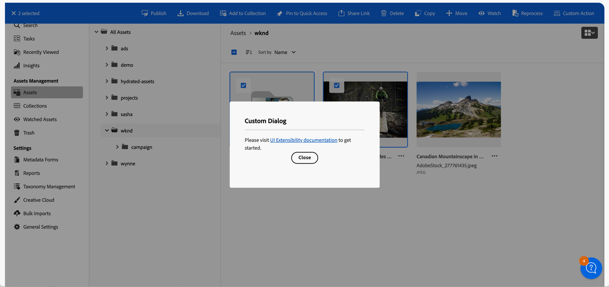

# Common Concepts in Creating Extensions

Understand the fundamentals required to develop an extension for the AEM Assets View.

<InlineAlert variant="info" slots="text" />

UI Extensibility is supported in Assets Ultimate only.

<InlineAlert variant="info" slots="text" />

To get access to Assets View UI extensibility,
[create and submit an Adobe Customer Support case](https://helpx.adobe.com/enterprise/using/support-for-experience-cloud.html).
You can provide documentation feedback by clicking "Log an issue".

## Extension Point

AEM Assets View has an `aem/assets/details/1` [extension point](https://developer.adobe.com/app-builder/docs/guides/extensions/) 
that allows you to extend its functionality in the Details View.
To declare it to be used by your extension, you need to add the following configuration to your `app.config.yaml` at the
root of your extension:

```yaml
extensions:
  aem/assets/details/1:
    $include: src/aem-assets-details-1/ext.config.yaml
```
Here is an example of `ext.config.yaml` file:

```yaml
operations:
  view:
    - type: web
      impl: index.html
actions: actions
web: web-src
```

More **extension points** may be added in future releases to add extensibility features to other parts of the AEM Assets View.

## Extension Registration

Interaction between UI Extension and AEM Assets View starts with the initialization process that includes extension's
capabilities registration so AEM Assets View knows when to invoke the extension and which APIs to expose. Registration is done by calling the `register()` 
function provided by `@adobe/uix-guest` library. This asynchronous function takes single object that describes extension 
and returns an object representing connection to the AEM Assets View.

The `register()` function should be invoked after extension initialization page is loaded.

Extension registration data must include:

- `id` - string with random extension identifier. This identifier is useful for debugging of interaction between AEM Assets 
View and extension and is needed if extension provides custom UI.
- `methods` - objects with the extension APIs exposed to the AEM Assets View. All methods are grouped into 
**namespaces** that represent more granular areas of AEM Assets View functionality within the extension point.
Currently, only the following **namespace** is available:
  - `detailSidePanel`, that allows to add custom side panels in the Details View

More **namespaces** may be added in future releases to add more extensibility features within the Details View.

```js
import { register } from '@adobe/uix-guest';

// ...

      const guestConnection = await register({
        id: 'extension-id',
        methods: {
          detailSidePanel: {
            getPanels() {
              // ..
            }
          },
        }
      });
// ...
```
## Building Extension UI

The `aem/assets/details/1` extension point and its `detailSidePanel` **namespace** requires UI extension to provide 
its own interface for the custom side panel. This interface should be implemented as a separate entry point within the extension
web application.

Normally this interface needs data from the AEM Assets View or needs to trigger certain action within the host application. 
To support this the interface page should establish its own connection with AEM Assets View  using the `attach()` function
provided by `@adobe/uix-guest` library.

In this example, the interface page establishes a connection with the AEM Assets View using extension `id` and obtains
the AEM host URL:

```js
import { attach } from '@adobe/uix-guest';

const guestConnection = await attach({ id: 'extension-id' });
const aemHost = await guestConnection.discovery.getAemHost();
```

## Set up communication with AEM Assets View

Both `register()` and `attach()` functions of `@adobe/uix-guest` library return the same connection object that has `host` property and
exposes AEM Assets View API to UI Extensions. Through this API you can access data from the host application as well as 
invoke certain actions within it.

## Common APIs exposed by AEM Assets View to all UI Extensions

The APIs documented below are available to all AEM Assets View UI Extensions, irrespective of the extension point they are using.

Every API is defined under its own namespace, which in turn is contained within the `host` object of the connection instance.

All API invocations are asynchronous and return a `Promise`.

### Authentication API

This API provides information about the current Org, access token and API key in the AEM Assets View. 
The API uses `auth` namespace.

`auth.getIMSInfo()`

**Description:** returns information about IMS Org name, Id and access token.

**Return Object Structure**
- `imsOrg` (`string`): The IMS organization identifier.
- `imsOrgName` (`string`): The name of the IMS organization.
- `accessToken` (`string`): The access token for the IMS.

`auth.getApiKey()`

**Description:** returns API key used by the AEM Assets View.

**Returns** (`string`): API key 

**Example:**
```js
const { imsOrg, accessToken } = await guestConnection.host.auth.getIMSInfo();

const apiKey = await guestConnection.host.auth.getApiKey();
```

### Discovery API

This API provides information AEM author instance location.

`discovery.getAemHost()`

**Description:** returns the URL of the AEM author instance.

**Returns** (`string`): AEM author instance URL

**Example:**
```js
const aemHost = await guestConnection.host.discovery.getAemHost();
```

### Toast API

This API provides methods to show toast messages in the AEM Assets View.

`toast.display({ variant, message })`

**Description:** shows a toast message in the AEM Assets View.

**Parameters:**
- **options** (`object`): Object with the following properties:
  - variant (`string`, optional): The type of toast message. Possible values are `neutral`, `positive`, `info`, `negative`. Default value is `info`.
  - message (`string`, required): The message to display in the toast.

**Example:**
```js
guestConnection.host.toast.display({ variant: 'positive', message: 'Asset saved successfully' });
```

### Router API

This API provides methods to navigate to different parts of the AEM Assets View.

`router.navigateToAssetDetails({ assetPath })`

**Description:** navigates to a Details View of the specific asset.

**Parameters:**
- **options** (`object`): Object with the following properties:
  - assetPath (`string`, required): The path to the asset in the AEM Assets View.

**Example:**
```js
guestConnection.host.router.navigateToAssetDetails({ assetPath: '/content/dam/my-assets/image.jpg' });
```
### i18n API

This API provides methods to support localization of the UI Extension.

`i18n.getLocalizationInfo()`

**Description:** returns information about the current locale used in the AEM Assets View.

**Return Object Structure**
- `locale` (`string`): The current locale used in the AEM Assets View.

**Example:**
```js
const { locale } = await guestConnection.host.i18n.getLocalizationInfo();
```

### Theme API

This API provides methods to retrieve the current host application color scheme. 

`theme.getThemeInfo()`

**Description:** returns information about the current color scheme used in the AEM Assets View.

**Return Object Structure**
- `colorScheme` (`string`): The current color scheme locale used in the AEM Assets View, either `light` or `dark`.

**Example:**
```js
const { colorScheme } = await guestConnection.host.theme.getThemeInfo();
```

### Modal API

This API provides methods to open a modal dialog in the host application, close it and retrieve the payload associated with it.



`modal.openDialog(options)`

**Description:** opens a dialog with the configuration info provided. The dialog content is loaded from a specified url.

**Parameters:**
- **options** (`object`): Object with the following dialog configuration properties:
  - title (`string`, optional): The title of the dialog.
  - contentUrl (`string`): Relative root to the dialog's content.
  - type (`string`, optional): The type of the dialog. Possible values are `modal`, `fullscreen`. Default value is `modal`.
  - size (`string`, optional): The size of the dialog. Possible values are `S`, `M`, `L`. Default value is `M`.  Ignored when the dialog type is `fullscreen`.
  - payload (`any`, optional): arbitrary payload object the extension may want to pass over the code inside the dialog. This payload object can later be accessed by the extension via `modal.getPayload()`.

**Example:**

These code snippets demonstrate how to create a custom dialog using UIX SDK library and add open it in the Host
application.  (The examples below serve illustrative purposes thus omit certain `import` statements and other
non-important parts.)

Here, the main application code defines three routes:
- the first two are the default routes which trigger the `ExtensionRegistration` component responsible for initial extension registration
within the AEM Assets View application.
- the `modal-custom-action` route which invokes the `ModalCustomAction` component responsible for rendering the
custom dialog content. This route gets called by the AEM Assets View application when the extension calls `modal.openDialog`.
During the registration the extension will specify `/#modal-custom-action` as content location.

```js
import React from 'react';
import ErrorBoundary from 'react-error-boundary';
import { HashRouter as Router, Routes, Route } from 'react-router-dom';
import ExtensionRegistration from './ExtensionRegistration';
import ModalCustomAction from './ModalCustomAction';

function App() {
    return (
        <Router>
            <ErrorBoundary onError={onError} FallbackComponent={fallbackComponent}>
                <Routes>
                    <Route index element={<ExtensionRegistration />} />
                    <Route exact path="index.html" element={<ExtensionRegistration />} />
                    <Route path="modal-custom-action" element={<ModalCustomAction />} />
                    // YOUR CUSTOM ROUTES SHOULD BE HERE
                </Routes>
            </ErrorBoundary>
        </Router>
    );

    // Methods

    // error handler on UI rendering failure
    function onError(e, componentStack) {}

    // component to show if UI fails rendering
    function fallbackComponent({ componentStack, error }) {
        return (
            <React.Fragment>
                <h1 style={{ textAlign: "center", marginTop: "20px" }}>
                    Extension rendering error
                </h1>
                <pre>{componentStack + '\n' + error.message}</pre>
            </React.Fragment>
        );
    }
}

export default App;
```
The `ModalCustomAction` component is responsible for rendering the custom dialog content. It uses the `attach()` function
provided by the `@adobe/uix-guest` library to establish a connection with the AEM Assets View and uses this connection object to
obtain the theme information of the AEM Assets View for rendering its content with the matching theme.

```js
export default function ModalCustomAction() {
    // Fields
    const [guestConnection, setGuestConnection] = useState();
    const [colorScheme, setColorScheme] = useState('light');

    useEffect(() => {
        (async () => {
            const guestConnection = await attach({ id: extensionId });
            setGuestConnection(guestConnection);

            const { colorScheme } = await guestConnection.host.theme.getThemeInfo();
            setColorScheme(colorScheme);
        })()
    }, []);

    function closeDialog() {
        guestConnection.host.modal.closeDialog();
    }

    return (

        <Provider theme={defaultTheme} colorScheme={colorScheme}>

            <View>
                <View paddingBottom="size-300">
                    <Text>Please visit <Link href="https://developer.adobe.com/uix/docs/">UI Extensibility documentation</Link> to get started.</Text>

                    <Flex justifyContent="center" paddingBottom="size-300">
                        <ButtonGroup>
                            <Button variant="primary" onPress={() => closeDialog()}>Close</Button>
                        </ButtonGroup>
                    </Flex>
                </View>
            </View>
        </Provider>
    );
}
```

The custom dialog can be opened in Assets View using `modal.openDialog` and passing in the dialog's content url, title,
type size and an optional payload object.  The custom dialog component can retrieve the payload object using
`modal.getPayload()`

```js
'onClick': async () => {
    guestConnection.host.modal.openDialog({
        title: 'Custom Dialog',
        contentUrl: '/#modal-custom-action',
        type: 'modal',
        size: 'S',
        payload: { /* arbitrary payload */ }
    });
},
```

`modal.closeDialog()`

**Description:** closes currently active dialog.

**Example:**
```js
function closeDialog() {
    guestConnection.host.modal.closeDialog();
}

<View>
  <ButtonGroup>
    <Button variant="primary" onPress={() => closeDialog()}>Close</Button>
  </ButtonGroup>
</View>
```

`modal.getPayload();`

**Description:** returns the payload object which could potentially be used by the extension code when calling
`modal.openDialog()`.

**Returns** optional arbitrary payload object.

**Example:**
```js
const payload = await guestConnection.host.modal.getPayload();
// work with payload
// ...
```
