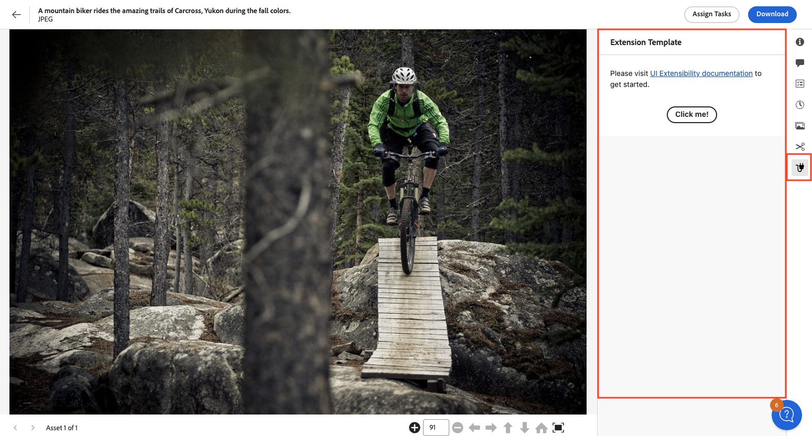

# Details View

The Details View in the AEM Assets View shows detailed information about the selected asset.

Extensions should use the `aem/assets/details/1` extension point to utilize extensibility services of the Details View.

## Custom side panels

The extensibility feature allows adding new panels and corresponding icon buttons to the side rail 
using the `detailsSidePanel` namespace. The custom icons appear under the 
list of the standard panel icons.



The host application fully manages UI interaction, including toggling the panel when user clicks the button, 
deep linking panel in the URL and auto-hiding the panel when an asset changes.

The host is also responsible for rendering panel's header.

The extension only declares the icon type, panel title and the URL for the custom panel content.

## API Reference

This API reference section is further broken down into two parts: the API provided by the AEM Assets View host application
to the extension and the API provided by the extension to the AEM Assets View host application.

### Host API Reference

In addition to the [Common API](../commons) provided by AEM Assets View to all extensions, 
the host application provides the following API specific to the `aem/assets/details/1` extension point 
and the `detailSidePanel` namespace.

`details.getCurrentResourceInfo()`

**Description:** returns the path and id of the asset shown in the Details View.

**Return Object Structure**
- `path` (`string`): Current asset path.
- `id` (`string`): Current asset id.

**Example:**
```js
const { path, id } = await guestConnection.host.details.getCurrentResourceInfo();
```

### Extension API Reference

The extension definition object passed by the extension to the `register()` function defines the `detailSidePanel` namespace
and the `getPanels()` method within that namespace.

The `getPanels()` method returns an array of custom panel descriptors that the extension wants to add to the side rail 
of the Details View. Each panel descriptor should include the following properties:
- `id` (`string`): Panel id, unique within given extension.
- `tooltip` (`string`): Icon tooltip.
- `title` (`string`): Custom panel title.
- `icon` (`string`): Name of the [React-Spectrum workflow icon](https://react-spectrum.adobe.com/react-spectrum/workflow-icons.html#available-icons).
- `contentUrl` (`string`): Relative root to the panel's content.
- `reloadOnThemeChange` (`boolean`): Whether to reload custom panel when application theme changes.

## Example of adding custom side panels

These code snippets demonstrate how to create a custom side panel using UIX SDK library and add it to the side rail
of the Details View. (The examples below serve illustrative purposes thus omit certain `import` statements and other
non-important parts.)

Here, the main application code defines three routes:
- the first two are the default routes which trigger the `ExtensionRegistration` component responsible for initial extension registration
within the AEM Assets View application.
- the `extension-template` route which invokes the `PanelExtensionTemplate` component responsible for rendering the 
custom panel content. This route gets called by the AEM Assets View application when the user clicks the custom panel icon.
During the registration the extension will specify `/#extension-template` as content location.

```js
function App() {
    return (
        <Router>
            <ErrorBoundary onError={onError} FallbackComponent={fallbackComponent}>
                <Routes>
                    <Route index element={<ExtensionRegistration />} />
                    <Route exact path="index.html" element={<ExtensionRegistration />} />
                    <Route path="extension-template" element={<PanelExtensionTemplate />} />
                    // YOUR CUSTOM ROUTES SHOULD BE HERE
                </Routes>
            </ErrorBoundary>
        </Router>
    );

    function onError(e, componentStack) {}

    function fallbackComponent({ componentStack, error }) {
        return (
            <React.Fragment>
                <h1 style={{ textAlign: 'center', marginTop: '20px' }}>
                    Extension rendering error
                </h1>
                <pre>{componentStack + '\n' + error.message}</pre>
            </React.Fragment>
        );
    }
}

export default App;
```

The `ExtensionRegistration` component initializes the extension registration process by calling the `register()` function 
provided by the `@adobe/uix-guest` library. 

The objects passed to the `register()` function describe the extension and its capabilities. In particular, it declares that the
extension uses the `detailSidePanel` namespace and declares `getPanels` method which returns an array of custom panels.
The custom panel, among other properties, specifies the icon's tooltip, the custom panel title and the route to the panel content.

```js
function ExtensionRegistration() {
    const init = async () => {
        const guestConnection = await register({
            id: extensionId,
            methods: {
                detailSidePanel: {
                    getPanels() {
                        return [
                            {
                                'id': 'extension-template',
                                'tooltip': 'Extension Template',
                                'icon': 'Extension',
                                'title': 'Extension Template',
                                'contentUrl': '/#extension-template',
                                'reloadOnThemeChange': 'true',
                            },
                        ];
                    },
                },
            },
        });
    };
    init().catch(console.error);

    return <Text>IFrame for integration with Host (AEM Assets View)...</Text>;
}

export default ExtensionRegistration;
```

The `PanelExtensionTemplate` component is responsible for rendering the custom panel content. It uses the `attach()` function
provided by the `@adobe/uix-guest` library to establish a connection with the AEM Assets View and uses this connection object to
render a toast message within the AEM Assets View when the user clicks the "Click me!" button.

```js
export default function PanelExtensionTemplate() {
    // Fields
    const [guestConnection, setGuestConnection] = useState();
    const [colorScheme, setColorScheme] = useState('light');

    useEffect(() => {
        (async () => {
            const guestConnection = await attach({ id: extensionId });
            setGuestConnection(guestConnection);

            const { colorScheme } = await guestConnection.host.theme.getThemeInfo();
            setColorScheme(colorScheme);
        })()
    }, []);

    function displayToast(variant, message) {
        guestConnection.host.toast.display({ variant, message });
    }

    return (
        <Provider theme={defaultTheme} colorScheme={colorScheme} height={'100vh'}>
            <View backgroundColor="gray-50">
                <View padding="size-300">
                    <Text>Please visit <Link href="https://developer.adobe.com/uix/docs/">UI Extensibility documentation</Link> to get started.</Text>

                    <Flex justifyContent="center" marginTop="size-400">
                        <ButtonGroup>
                            <Button variant="primary" onPress={() => displayToast('neutral', 'Message from the Extension')}>Click me!</Button>
                        </ButtonGroup>
                    </Flex>
                </View>
            </View>
        </Provider>
    );
}
```
