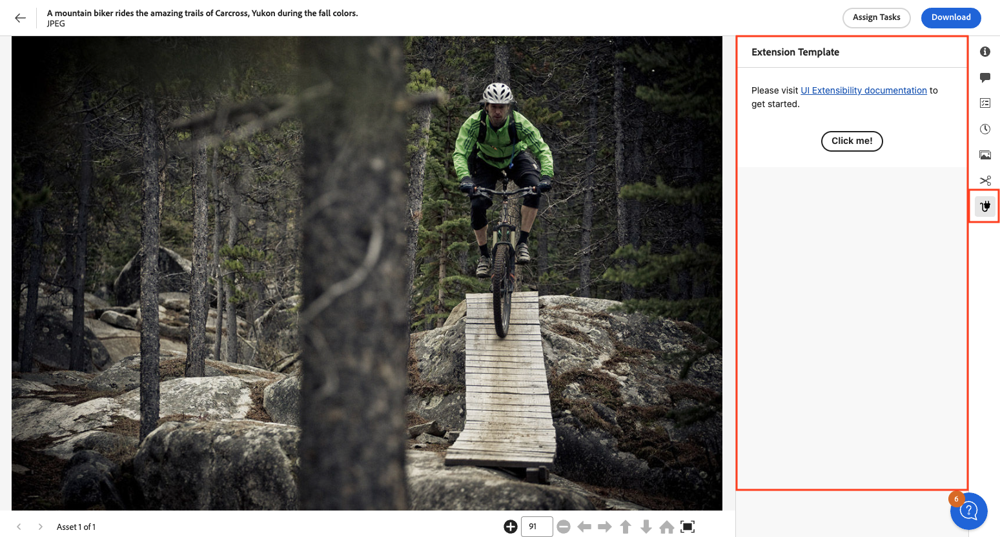

# Details View

The Details View in the AEM Assets View shows detailed information about the selected asset.

<InlineAlert variant="info" slots="text" />

UI Extensibility is supported in Assets Ultimate only.

<InlineAlert variant="info" slots="text" />

To get access to Assets View UI extensibility,
[create and submit an Adobe Customer Support case](https://helpx.adobe.com/enterprise/using/support-for-experience-cloud.html).
You can provide documentation feedback by clicking "Log an issue".


Extensions should use the `aem/assets/details/1` extension point to utilize extensibility services of the Details View.

## Custom side panels

The extensibility feature allows adding new panels and corresponding icon buttons to the side rail 
using the [`getPanels`](#detailsidepanelgetpanels) method from the [`detailSidePanel`](#detailsidepanel-namespace) namespace. The custom icons appear under the 
list of the built-in panel icons.



The host application fully manages UI interaction, including toggling the panel when user clicks the button, 
deep linking panel in the URL and auto-hiding the panel when an asset changes.

The host is also responsible for rendering panel's header.

The extension only declares the icon type, panel title and the URL for the custom panel content.

### Hiding and overriding built-in panels

AEM Assets View supports built-in panel customization:

- **Hide** selected built-in panels by returning their IDs from [`getHiddenBuiltInPanels`](#detailsidepanelgethiddenbuiltinpanels).
- **Replace** the body of a built-in panel with extension-hosted content by implementing [`overrideBuiltInPanel`](#detailsidepaneloverridebuiltinpanel). The built-in icon and rail entry stay; only the panel content is swapped for your `contentUrl`.

Methods may return a Promise or a plain value; the host awaits them.

#### Built-in panel IDs

The host application allows hiding and overriding only certain built-in panels. Depending on what is open in the Details View, below is the list of panel IDs that are honored for [`getHiddenBuiltInPanels`](#detailsidepanelgethiddenbuiltinpanels) and [`overrideBuiltInPanel`](#detailsidepaneloverridebuiltinpanel). Any other ID is ignored.

| Details context | Panel IDs that can be hidden or overridden |
|------------|------------|
| `asset-details` (file asset) | "comment", "edit", "renditions", "tasks", "version", "dynamicmedia", "assetRelations", "watchedAssets" |
| `folder-details` | "watchedAssets" |
| `collection-details` | "watchedAssets" |


## API Reference

This API reference section is further broken down into two parts: the API provided by the AEM Assets View host application
to the extension and the API provided by the extension to the AEM Assets View host application.

### Host API Reference

In addition to the [Common API](../commons/index.md) provided by AEM Assets View to all extensions, 
the host application provides the following API specific to the `aem/assets/details/1` extension point 
and the [`detailSidePanel`](#detailsidepanel-namespace) namespace.

`details.getCurrentResourceInfo()`

**Description:** returns the path and id of the asset shown in the Details View.

**Return Object Structure**
- `path` (`string`): Current asset path.
- `id` (`string`): Current asset id.

**Example:**
```js
const { path, id } = await guestConnection.host.details.getCurrentResourceInfo();
```

### Extension API Reference

The extension definition object passed by the extension to the `register()` function defines the [`detailSidePanel`](#detailsidepanel-namespace) namespace.

#### detailSidePanel namespace

The `detailSidePanel` namespace can implement the following methods:

- [`getPanels`](#detailsidepanelgetpanels) 
- [`getHiddenBuiltInPanels`](#detailsidepanelgethiddenbuiltinpanels) 
- [`overrideBuiltInPanel`](#detailsidepaneloverridebuiltinpanel) 

##### detailSidePanel.getPanels()

**Description:** returns an array of custom panel descriptors that the extension wants to add to the side rail 
of the Details View.

**Parameters**

- `resource` (`object`): Current asset context.
  - `id` (`string`): Current asset id.
  - `path` (`string`): Current asset path.

**Returns** (`array` or `Promise<array>`) an array of custom panel descriptors or an empty array if no custom panels should be added.

Each array element is a custom panel descriptor that is a JSON with the following properties:
- `id` (`string`): Panel id, unique within given extension.
- `tooltip` (`string`): Icon tooltip.
- `title` (`string`): Custom panel title.
- `icon` (`string`): Name of the [React-Spectrum workflow icon](https://react-spectrum.adobe.com/react-spectrum/workflow-icons.html#available-icons).
- `contentUrl` (`string`): Relative root to the panel's content.
- `reloadOnThemeChange` (`boolean`): Whether to reload custom panel when application theme changes.

##### detailSidePanel.getHiddenBuiltInPanels()

**Description:** returns an array of built-in panel IDs that this extension wants removed from the Details side rail for the current asset.

**Parameters**

- `resource` (`object`): Current asset context.
  - `id` (`string`): Current asset id.
  - `path` (`string`): Current asset path.

**Returns** (`array` of `string` or `Promise<array>`): Panel IDs to hide. IDs that are not on the host allowlist are ignored.

##### detailSidePanel.overrideBuiltInPanel()

**Description:** Return replacement content hosted by the extension, or `null` to keep the default implementation. The host calls this when the user selects a built-in rail button whose panel is eligible for override. 

**Parameters**

- `panelId` (`string`): Built-in panel ID (one of the allowlisted IDs).
- `resource` (`object`): Current asset context.
  - `id` (`string`): Current asset id.
  - `path` (`string`): Current asset path.

**Returns** (`object`, `null`, or `Promise`):

- Return `null` to use the built-in panel content.
- To override, return an object with:
  - `contentUrl` (`string`, required): URL for the replacement panel body (same pattern as custom panels).
  - `reloadOnThemeChange` (`boolean`, optional): Reload iframe on theme change when `true`. Defaults to `false`.
  - `title` (`string`, optional): Non-empty string replaces the sets panel header title for this override. Otherwise title is not shown on overridden panels. 

The built-in **icon, tooltip, and rail button** are unchanged; only **title** (optional) and **panel body** come from the extension when an override applies.

## Example of adding custom side panels

These code snippets demonstrate how to create a custom side panel using UIX SDK library and add it to the side rail
of the Details View. (The examples below serve illustrative purposes thus omit certain `import` statements and other
non-important parts.)

Here, the main application code defines three routes:
- the first two are the default routes which trigger the `ExtensionRegistration` component responsible for initial extension registration
within the AEM Assets View application.
- the `extension-template` route which invokes the `PanelExtensionTemplate` component responsible for rendering the 
custom panel content. This route gets called by the AEM Assets View application when the user clicks the custom panel icon.
During the registration the extension will specify `/#extension-template` as content location.

```js
function App() {
    return (
        <Router>
            <ErrorBoundary onError={onError} FallbackComponent={fallbackComponent}>
                <Routes>
                    <Route index element={<ExtensionRegistration />} />
                    <Route exact path="index.html" element={<ExtensionRegistration />} />
                    <Route path="extension-template" element={<PanelExtensionTemplate />} />
                    // YOUR CUSTOM ROUTES SHOULD BE HERE
                </Routes>
            </ErrorBoundary>
        </Router>
    );

    function onError(e, componentStack) {}

    function fallbackComponent({ componentStack, error }) {
        return (
            <React.Fragment>
                <h1 style={{ textAlign: 'center', marginTop: '20px' }}>
                    Extension rendering error
                </h1>
                <pre>{componentStack + '\n' + error.message}</pre>
            </React.Fragment>
        );
    }
}

export default App;
```

The `ExtensionRegistration` component initializes the extension registration process by calling the `register()` function 
provided by the `@adobe/uix-guest` library. 

The objects passed to the `register()` function describe the extension and its capabilities. In particular, it declares that the
extension uses the `detailSidePanel` namespace and implements at least one of the following: `getPanels`, `getHiddenBuiltInPanels` or `overrideBuiltInPanel`. 
The custom panel objects returned by `getPanels`, specifies the icon's tooltip, the custom panel title and the route to the panel content.

```js
function ExtensionRegistration() {
    const init = async () => {
        const guestConnection = await register({
            id: extensionId,
            methods: {
                detailSidePanel: {
                    getPanels({ resource }) {
                        return [
                            {
                                id: 'extension-template',
                                tooltip: 'Extension Template',
                                icon: 'Extension',
                                title: 'Extension Template',
                                contentUrl: '/#extension-template',
                                reloadOnThemeChange: true,
                            },
                        ];
                    },
                    getHiddenBuiltInPanels({ resource }) {
                        return ['dynamicmedia', 'comment'];
                    },
                    overrideBuiltInPanel({ panelId, resource }) {
                        if (panelId === 'renditions') {
                            return {
                                contentUrl: '/#custom-renditions',
                                reloadOnThemeChange: true,
                                title: 'Custom renditions',
                            };
                        }
                        return null;
                    },
                },
            },
        });
    };
    init().catch(console.error);

    return <Text>IFrame for integration with Host (AEM Assets View)...</Text>;
}

export default ExtensionRegistration;
```

The `PanelExtensionTemplate` component is responsible for rendering the custom panel content. It uses the `attach()` function
provided by the `@adobe/uix-guest` library to establish a connection with the AEM Assets View and uses this connection object to
render a toast message within the AEM Assets View when the user clicks the "Click me!" button.

```js
export default function PanelExtensionTemplate() {
    // Fields
    const [guestConnection, setGuestConnection] = useState();
    const [colorScheme, setColorScheme] = useState('light');

    useEffect(() => {
        (async () => {
            const guestConnection = await attach({ id: extensionId });
            setGuestConnection(guestConnection);

            const { colorScheme } = await guestConnection.host.theme.getThemeInfo();
            setColorScheme(colorScheme);
        })()
    }, []);

    function displayToast(variant, message) {
        guestConnection.host.toast.display({ variant, message });
    }

    return (
        <Provider theme={defaultTheme} colorScheme={colorScheme} height={'100vh'}>
            <View backgroundColor="gray-50">
                <View padding="size-300">
                    <Text>Please visit <Link href="https://developer.adobe.com/uix/docs/">UI Extensibility documentation</Link> to get started.</Text>

                    <Flex justifyContent="center" marginTop="size-400">
                        <ButtonGroup>
                            <Button variant="primary" onPress={() => displayToast('neutral', 'Message from the Extension')}>Click me!</Button>
                        </ButtonGroup>
                    </Flex>
                </View>
            </View>
        </Provider>
    );
}
```
