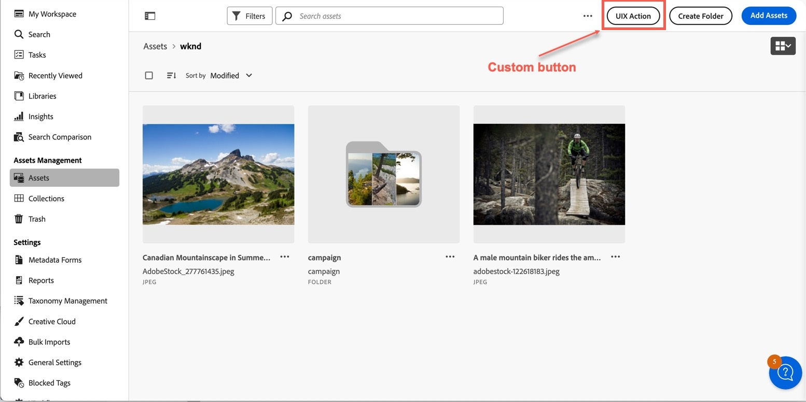

# Header Menu

The **header menu** is the set of buttons at the top right of AEM Assets View. Using the `headerMenu` namespace,
an extension can add custom header menu buttons, hide built-in header menu buttons by id (removing them from the
header menu), and override built-in header menu button clicks so the default handler does not run.

<InlineAlert variant="info" slots="text" />

UI Extensibility is supported in Assets Ultimate only.

<InlineAlert variant="info" slots="text" />

To get access to Assets View UI extensibility,
[create and submit an Adobe Customer Support case](https://helpx.adobe.com/enterprise/using/support-for-experience-cloud.html).
You can provide documentation feedback by clicking "Log an issue".

## A namespace shared across screens

Unlike the [`actionBar`](../browse-view/index.md#actionbar-namespace) and [`quickActions`](../browse-view/index.md#quickactions-namespace)
namespaces (specific to the [Browse View](../browse-view/index.md)) and the
[`detailSidePanel`](../details-view/index.md#detailsidepanel-namespace) namespace (specific to the
[Details View](../details-view/index.md)), the `headerMenu` namespace is **shared between the Browse View and the
Details View**. When an extension implements `headerMenu` (under the unified `aem/assets/assetsview/1` extension point,
or a standalone `aem/assets/browse/1` or `aem/assets/details/1` extension point), those methods are used for header
menu handling on both screens.

The built-in button set and button ids differ by screen and context, so use the appropriate ids from the
[Built-in header menu buttons](#built-in-header-menu-buttons) tables below. The meaning of the `context` and `resource`
arguments passed to the methods also depends on the screen — see [Method arguments by screen](#method-arguments-by-screen).

In the Browse View, custom buttons are added to the header menu between the ellipses menu and the default header menu buttons.



## Built-in header menu buttons

The host exposes the following built-in header menu button ids that can be hidden or overridden through the
[`headerMenu` methods](#extension-api-reference).

**Browse View** ([browsing context](../browse-view/index.md#browsing-context)):

| Context | Header menu button IDs that can be hidden or overridden |
|------------|------------|
| `assets` | "createFolder", "addAssets" |
| `collections` | "createCollection", "addToCollection", "editSmartCollection" |
| `recent` | — |
| `search` | — |
| `trash` | — |

In `recent`, `search`, and `trash`, there are no built-in header menu buttons to hide, but extensions can still add
custom header menu buttons via [`getButtons`](#extension-api-reference).

**Details View** (the `details` context):

| Context | Header menu button IDs that can be hidden or overridden |
|------------|------------|
| `details` | "assignTasks", "download" |

## Method arguments by screen

All `headerMenu` methods receive a `context` and, for `getButtons`/`getHiddenButtonIds`/`overrideButton`, a `resource`.
Their meaning depends on the screen the header menu is being rendered on:

| Argument | Browse View | Details View |
|------------|------------|------------|
| `context` | The current [browsing context](../browse-view/index.md#browsing-context): `assets`, `collections`, `recent`, `search`, or `trash`. | `details`. |
| `resource` | Information about the current location being browsed (`id`, `path`). In contexts without a notion of active resource (`trash`, `search`, `recent`), `resource` is `undefined`. In `assets` and `collections`, it is an object with `id` and `path`, even for the root folder. | The asset or folder currently shown in the Details View (`id`, `path`), matching [`details.getCurrentResourceInfo()`](../details-view/index.md#host-api-reference). |

## Extension API Reference

The `headerMenu` namespace supports adding custom header menu buttons and, optionally, hiding and overriding built-in
header menu buttons. All of its methods are optional — implement only the ones your extension needs:

- `getButtons({ context, resource })` — optional
- `getHiddenButtonIds({ context, resource })` — optional
- `overrideButton({ buttonId, context, resource })` — optional

For example, you can implement only `getHiddenButtonIds` or `overrideButton` without implementing `getButtons`.

### getButtons({ context, resource })

**Description:** Returns an array of custom header menu button definitions that are added to the application's header
menu. These buttons are rendered alongside built-in header menu buttons and let extensions surface actions in the header
menu.

**Parameters:**
- context (`string`): current context (see [Method arguments by screen](#method-arguments-by-screen)).
- resource (`object`): information about the current location or asset (see [Method arguments by screen](#method-arguments-by-screen)).

**Returns:** (`array`) An array of button configuration objects, where each object contains:
- id (`string`): Unique identifier for the button within the extension
- label (`string`): Display text for the button
- icon (`string`): Name of the [React-Spectrum workflow icon](https://react-spectrum.adobe.com/react-spectrum/workflow-icons.html#available-icons)
- onClick (`function`): Callback function executed when the header menu button is clicked; receives `{ context, resource }`
- variant (`string`, optional): Button visual style, defaults to `'primary'`
  - Supported values: `'accent'`, `'primary'`, `'secondary'`, `'negative'`

**Example:**

```javascript
headerMenu: {
  async getButtons({ context, resource }) {
    if (context !== 'assets') {
      return [];
    }
    return [
      {
        id: 'export-metadata',
        label: 'Export Metadata',
        icon: 'Download',
        variant: 'secondary',
        onClick: async ({ context, resource }) => {
          // Custom logic
        },
      },
      {
        id: 'custom-workflow',
        label: 'Start Workflow',
        icon: 'Workflow',
        onClick: async ({ context, resource }) => {
          // Custom logic
        },
      },
    ];
  },
},
```

### getHiddenButtonIds({ context, resource })

**Description:** Returns an array of [built-in header menu button ids](#built-in-header-menu-buttons) that should be hidden.

The host calls this method when the location, asset, or context relevant to the header menu changes. Extension code
should return quickly; avoid slow or blocking work (for example backend calls), because the host may wait on the result
before rendering header menu buttons.

**Parameters:**
- context (`string`): current context (see [Method arguments by screen](#method-arguments-by-screen)).
- resource (`object`): information about the current location or asset (see [Method arguments by screen](#method-arguments-by-screen)).

**Returns:** (`array`) An array of built-in header menu button ids to hide, or an empty array if none should be hidden.

**Example:**

```js
getHiddenButtonIds: ({ context, resource }) => {
  if (context === 'assets') {
    return ['createFolder'];
  }
  return [];
},
```

### overrideButton({ buttonId, context, resource })

**Description:** Return `true` if the extension handled the click and the built-in header menu button handler should
**not** run. Return `false` to let the Host run the default behavior.

**Parameters:**
- buttonId (`string`): Built-in header menu button id from [Built-in header menu buttons](#built-in-header-menu-buttons).
- context (`string`): current context (see [Method arguments by screen](#method-arguments-by-screen)).
- resource (`object`): information about the current location or asset (see [Method arguments by screen](#method-arguments-by-screen)).

**Returns:** (`boolean`) `false` for the Host to use the built-in handler, `true` to skip the built-in handler.

**Example:**

```js
overrideButton: ({ buttonId, context, resource }) => {
  if (buttonId === 'addAssets') {
    // Custom handling; skip built-in handler
    return true;
  }
  return false;
},
```

## Examples

These code snippets demonstrate how to add, hide, and override header menu buttons. (The examples below serve
illustrative purposes thus omit certain `import` statements and other non-important parts.) In a combined extension,
the `headerMenu` namespace is declared alongside the Browse View (`actionBar`, `quickActions`) and Details View
(`detailSidePanel`) namespaces in the same `register()` call.

### Example of adding a custom header menu button

In this example, an **Export Metadata** button is added to the header menu in the `assets` context.

```js
function ExtensionRegistration() {
    const init = async () => {
        const guestConnection = await register({
            id: extensionId,
            methods: {
                // other namespaces (actionBar, quickActions, detailSidePanel) ...
                headerMenu: {
                    async getButtons({ context, resource }) {
                        if (context !== 'assets') {
                            return [];
                        }
                        return [
                            {
                                id: 'export-metadata',
                                label: 'Export Metadata',
                                icon: 'Download',
                                variant: 'secondary',
                                onClick: async ({ context, resource }) => {
                                    // Custom logic
                                },
                            },
                        ];
                    },
                },
            },
        });
    };
    init().catch(console.error);

    return <Text>IFrame for integration with Host (AEM Assets View)...</Text>;
}

export default ExtensionRegistration;
```

### Example of hiding a built-in header menu button

In this example, the built-in **Create folder** header menu button (`createFolder`) is hidden in the `assets` context.

```js
headerMenu: {
    async getHiddenButtonIds({ context, resource }) {
        if (context === 'assets') {
            return ['createFolder'];
        }
        return [];
    },
},
```

### Example of overriding a built-in header menu button

In this example, when the user activates the **Add assets** header menu button (`addAssets`), the extension runs custom
logic and skips the Host's default handler by returning `true`.

```js
headerMenu: {
    async overrideButton({ buttonId, context, resource }) {
        if (buttonId === 'addAssets') {
            // Custom upload or validation flow
            return true;
        }
        return false;
    },
},
```

### Example in the Details View

In the Details View, hide the built-in **Download** header menu button and take over the **Assign tasks** click
(skipping the Host handler when you return `true`):

```js
headerMenu: {
    async getHiddenButtonIds({ context, resource }) {
        return ['download'];
    },
    async overrideButton({ buttonId, context, resource }) {
        if (buttonId === 'assignTasks') {
            // Custom assign-tasks flow; skip built-in handler
            return true;
        }
        return false;
    },
},
```

To open a custom dialog from a header menu button, refer to the [Modal API](../commons/index.md#modal-api) provided by
AEM Assets View to all extensions for implementation of dialog management.
