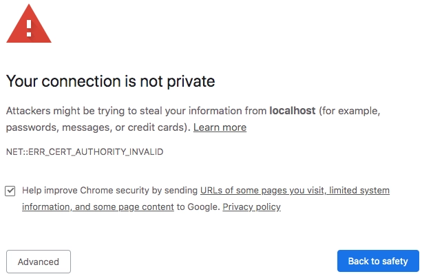
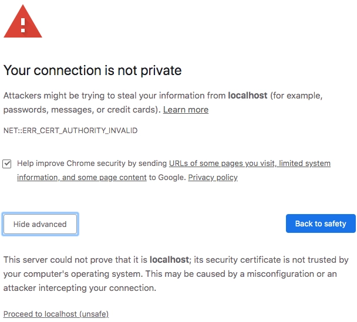

# Troubleshooting - AEM Assets View Extensibility

The ability to get fast feedback and see if the code works as expected is crucial for rapid development. A developer 
may connect locally running UI Extension to production AEM Assets View, link it to the correct AEM backend, 
and verify all changes before deployment and extension publication.

## Running in local environment

There are two options to run an extension locally:
1. Complete local environment isolation. In this case, both the front-end code of your extension and the serverless actions 
run locally. This mode is enabled with the `aio app dev` command.
2. Partial isolation using the `aio app run` command, where the extension still uses Adobe I/O Runtime and deploys server-side functions in Adobe cloud.

For both options, the local development server with file change monitoring will be started to serve as the UI Extension front-end part.

Regardless of where the server-side handlers are running, in local containers or on I/O Runtime, the developer will be able to connect a debugger to trace script execution. 

### Complete local environment isolation
```shell
➜  demo-extension-project % aio app dev
```

This will deploy the actions to a local [OpenWhisk](https://openwhisk.apache.org/) instance, which the [CLI](https://github.com/adobe/aio-cli) 
will automatically download and install. The extension SPA will be run on the local machine.

```shell
➜  demo-extension-project % aio app dev
To view your local application:
  -> https://localhost:9080
To view your deployed application in the Experience Cloud shell:
  -> https://experience.adobe.com/?devMode=true#/custom-apps/?localDevUrl=https://localhost:9080
Your actions:
web actions:
  -> https://localhost:9080/api/v1/web/aem-assets-details-1/my-action
non-web actions:
press CTRL+C to terminate the dev environment
2024-10-16T13:53:10.658Z [serve] info: server running on port : 9080
2024-10-16T13:53:11.983Z [serve] info: 513 static asset(s) changed
2024-10-16T13:53:11.983Z [serve] info: ✨ Built 3 bundles in 1223ms!
```

### Use Adobe I/O Runtime to deploy server-side handlers
```shell
➜  demo-extension-project % aio app run
```

This will deploy the actions to [Adobe I/O Runtime](/apis/experienceplatform/runtime) while running the UI part on the local machine. 

```shell
➜  demo-extension-project % aio app run
For a developer preview of your UI extension in the AEM environment, follow the URL:
  -> https://experience.adobe.com/aem/extension-manager/preview/<preview hash>
   create .vscode/launch.json

No change to package.json was detected. No package manager install will be executed.

To view your local application:
  -> https://localhost:9080
To view your deployed application in the Experience Cloud shell:
  -> https://experience.adobe.com/?devMode=true#/custom-apps/?localDevUrl=https://localhost:9080
press CTRL+C to terminate dev environment
```

Now your UI extension is reachable via the URL shown in the Terminal. 

### UI Extension endpoint

Once local runtime is started extension endpoint is returned as URL in `To view your local application`. 
You will need this URL to embed the locally running extension into AEM Assets View.

### Accept the Certificate

If you are using this application for the first time, you will see a message similar to

```shell
success: generated certificate
A self signed development certificate has been generated, you will need to accept it in your browser in order to use it.
Waiting for the certificate to be accepted.... timed out
```

This message pops up because we use a development SSL certificate for secure communication. Learn more about the purpose of this certificate [here](https://letsencrypt.org/docs/certificates-for-localhost/).

If you see this message, please navigate to `https://localhost:9080`. In Google Chrome you should see a screen similar to this.



Click on `Advanced`, the nex screen may vary from browser to browser, but you should see a screen like this, where you can click on `Proceed to localhost (unsafe)` to accept the certificate.



As alternative in Google Chrome you may type `thisisunsafe`. Please reference to documentation of your browser how to accept self-signed certificate.

You may need to exit the current process and run `aio app run` again.

## Load UI Extension

Using extension endpoint URL returned at the end of run command output you may embed it into production environment of AEM Assets View:

1. Navigate to AEM Assets View
2. Add the following query parameters to the URL:
    1. `devMode=true` - instructs Adobe Experience Shell to allow content from localhost
    2. `ext=<extension_endpoint_url>` - full extension endpoint URL. You may use multiple `ext` parameters to test several extensions at time.
3. Hit Enter to reload AEM Assets View with added extension

Overall AEM Assets View URL should look similar to `https://experience.adobe.com/?devMode=true&ext=https://localhost:9080&repoId=author-p12345-e123456-cm.adobeaemcloud.com#/@org/assets/workspace/`.

### ext= query parameter

The `ext` query parameter supports different syntax variations depending on number of extensions to be loaded and 
their extension points.

The complete syntax of the `ext=` query parameter is:

```
ext.<ExtensionPointId>=<url>[,<url>]
```
, where
- `ExtensionPointId` is the ID of the extension point in AEM Assets View
- `url` is the URL of the extension to be loaded

You may specify multiple `ext` parameters with different `ExtensionPointId`s to load several extensions
for different extension points at the same time. You may also specify multiple extension URLs 
for the same extension point by separating them with a comma.

**Example:**

`ext.aem%2fassets%2fdetails%2f1=https://localhost:9080` loads locally running extension from `https://localhost:9080` 
and applies it to the `aem/assets/details/1` extension point.  

The `ext=` parameter can also be used without specifying the extension point ID:
```
ext=<url>[,<url>]
```
, where
- `url` is the URL of the extension to be loaded

In this case, AEM Assets View will apply the extension to all available extension points.
