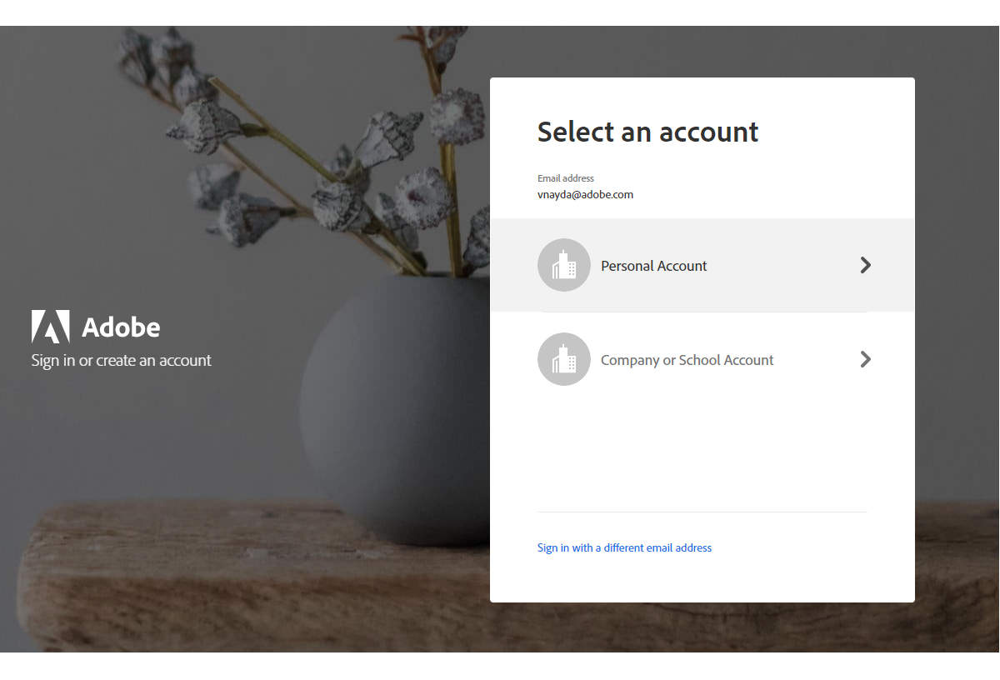
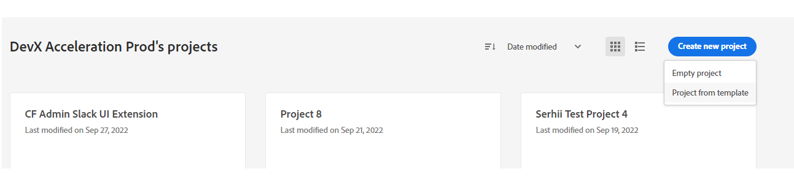
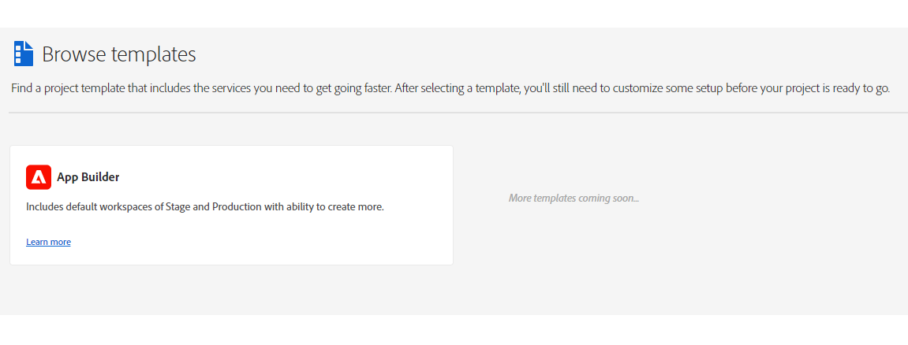
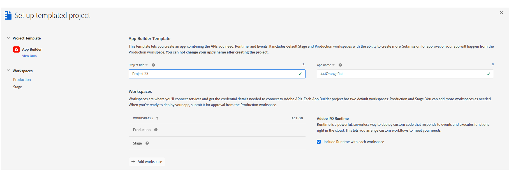
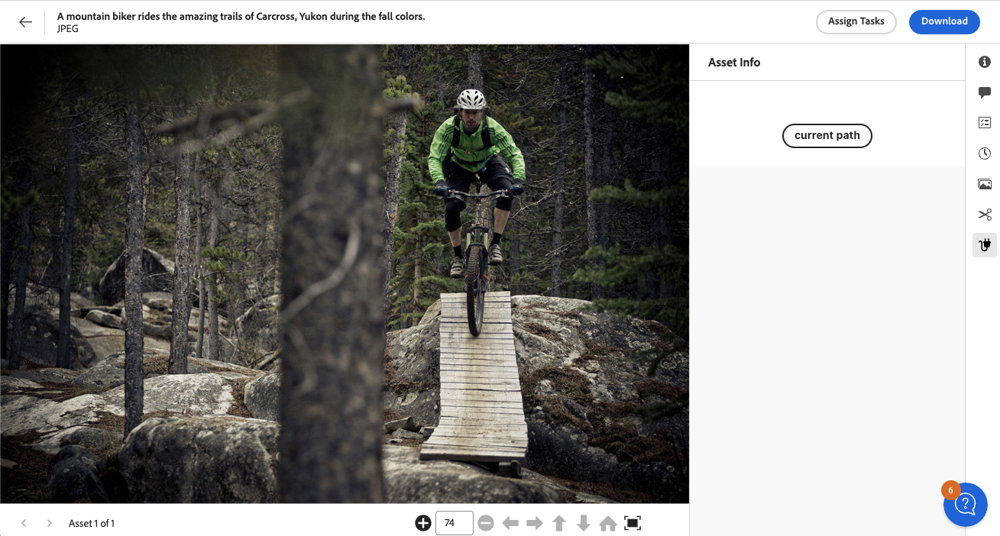

# Step-by-step AEM Assets View Extension Development

The document helps you understand how to set up local environment and start developing your first UI Extension.

## About application

This example application will use the [Details View extension point](../api/details-view). It will render
a custom icon in the side panel rail only if the selected asset has the "jpeg" extension. When the user clicks on the icon, 
the extension will display a custom panel with a button. Clicking the button will display a toast message with the asset's path.

More information about AEM Assets View extension points can be found at [AEM Assets View Extension Points](../api).

## Create a project in Adobe Developer Console

UI Extensions, as with any App Builder application, are represented as projects in [Adobe Developer Console](https://developer.adobe.com/developer-console/docs/guides/).

<InlineAlert slots="text" />

If you don't have access to the Adobe Developer Console, refer to the [How to Get Access](../../../guides/get-access) guide for instructions.

To begin, we need to create a new Project which will supply us with the configuration and resources.

1. Sign in to [Adobe Developer Console](https://developer.adobe.com/console) with your Adobe ID.


2. Choose your account.



3. Choose your profile or organization.


3. Make sure you are in a proper organization (a switcher is in the right top corner).


4. Click "Create new project" -> "Project from template":



And choose "App Builder":



5. Fill in the project data.



- `Project Title` is used to identify your project within [Adobe Developer Console](https://developer.adobe.com/console) and in [CLI](https://github.com/adobe/aio-cli).
- `App Name` will be used as a unique identifier for your application and this value cannot be changed after project creating.

After creating, you should see a new project generated with 2 default Workspaces.
Each App Builder project has two default workspaces: `Production` and `Stage`. You can add more workspaces as needed.
The `Production` workspace is special, as it is used for the submission and distribution flow.


## Setting up local environment

- [Node.js](https://nodejs.org/) + [npm (package manager)](https://www.npmjs.com/). Make sure you are using the latest stable version of `Node.js` and `npm`.

```shell
$ node -v
 v20.9.0
```

```shell
$ npm -v
10.1.0
```

These are the current versions at the moment of creating the documentation.
Make sure you are using the latest versions supported by Adobe I/O when you create the application.

If you already have [Adobe I/O CLI](https://github.com/adobe/aio-cli) on your local, please ensure you use the latest version of the library. You can check the version through:

```shell
aio -v
```

and compare it with

```shell
npm show @adobe/aio-cli
```

If your version is outdated, update your `Adobe I/O CLI` by running

```shell
npm install -g @adobe/aio-cli
```

More details are described in [Local environment set up](../../../guides/local-environment).

## Initialize your extension using the AIO CLI and generate a base structure from the template

First, we need to [sign in from CLI](https://developer.adobe.com/app-builder/docs/getting_started/first_app/#3-signing-in-from-cli) and bootstrap our project.
Please complete all the steps described in [Code Generation for the Details View Extension in AEM Assets View](../code-generation).

For the purposes of this guide, we will use
- `Asset Info Extension` as the extension name and description
- `Asset Info` as the icon tooltip and the side panel title
- `Extension` as the icon

Also, we will not add Adobe I/O action to our extension.

After this step, we will have a generated project structure with necessary npm dependencies are getting installed.

If you have worked with an Adobe App Builder App before, you will notice that you have generated a starter project 
of a UI Extension that implements [extension points](https://developer.adobe.com/app-builder/docs/guides/extensions/).

```
.
|-- README.md
|-- app.config.yaml
|-- extension-manifest.json
|-- hooks
|   `-- post-deploy.js
|-- jest.setup.js
|-- package-lock.json
|-- package.json
`-- src
    `-- aem-assets-details-1
        |-- ext.config.yaml
        `-- web-src
            |-- index.html
            `-- src
                |-- components
                |   |-- App.js
                |   |-- Constants.js
                |   |-- ExtensionRegistration.js
                |   `-- PanelAssetInfo.js
                |-- index.css
                |-- index.js
                `-- utils.js
```

```yaml
# app.config.yaml
extensions:
  aem/assets/details/1:
    $include: src/aem-assets-details-1/ext.config.yaml
```

If necessary, you can find other bootstrap options in [Bootstrapping new App using the CLI](https://developer.adobe.com/app-builder/docs/getting_started/first_app/#4-bootstrapping-new-app-using-the-cli).

## Overview of generated components

### Routing

The root component `src/aem-assets-details-1/web-src/src/components/App.js` contains the routing of our application. It defines three routes:
- the first two are the default routes which trigger the `ExtensionRegistration` component responsible for initial extension registration
  within the AEM Assets View application.
- the `asset-info` route which invokes the `PanelAssetInfo` component responsible for rendering the
  custom panel content. This route gets called by the AEM Assets View application when the user clicks the custom panel icon.
  During the registration the extension will specify `/#asset-info` as content location.

[React Routing](https://reactrouter.com/web/guides/quick-start) determines which part of the extension should be executed depending on the request.

```js
import React from 'react';
import ErrorBoundary from 'react-error-boundary';
import { HashRouter as Router, Routes, Route } from 'react-router-dom';
import ExtensionRegistration from './ExtensionRegistration';
import PanelAssetInfo from './PanelAssetInfo';

function App() {
  return (
          <Router>
            <ErrorBoundary onError={onError} FallbackComponent={fallbackComponent}>
              <Routes>
                <Route index element={<ExtensionRegistration />} />
                <Route exact path="index.html" element={<ExtensionRegistration />} />
                <Route path="asset-info" element={<PanelAssetInfo />} />
                // YOUR CUSTOM ROUTES SHOULD BE HERE
              </Routes>
            </ErrorBoundary>
          </Router>
  );

  // Methods

  // error handler on UI rendering failure
  function onError(e, componentStack) {}

  // component to show if UI fails rendering
  function fallbackComponent({ componentStack, error }) {
    return (
            <React.Fragment>
              <h1 style={{ textAlign: 'center', marginTop: '20px' }}>
                Extension rendering error
              </h1>
              <pre>{componentStack + '\n' + error.message}</pre>
            </React.Fragment>
    );
  }
}

export default App;
```

Please note that your code may slightly differ from the given example depending on the version of the template for generation, but the main logic will be the same.

### Extension registration

This logic component `src/aem-assets-view-1/web-src/src/components/ExtensionRegistration.js` registers our extension 
with the host AEM instance as soon as it loads, so they can share data and communicate with each other.

```js
import React from 'react';
import { Text } from '@adobe/react-spectrum';
import { register } from '@adobe/uix-guest';
import { extensionId } from './Constants';

function ExtensionRegistration() {
  const init = async () => {
    const guestConnection = await register({
      id: extensionId,
      methods: {
        detailSidePanel: {
          async getPanels() {
            const { path } = await guestConnection.host.details.getCurrentResourceInfo();
            if (path && path.toLowerCase().endsWith('.jpeg')) {
              return [
                {
                  'id': 'asset-info',
                  'tooltip': 'Asset Info',
                  'icon': 'Extension',
                  'title': 'Asset Info',
                  'contentUrl': '/#asset-info',
                  'reloadOnThemeChange': 'true',
                },
              ];
            }
            return [];
          },
        },
      },
    });
  };
  init().catch(console.error);

  return <Text>IFrame for integration with Host (AEM Assets View)...</Text>;
}

export default ExtensionRegistration;
```
We use the [UIX SDK Guest library](https://github.com/adobe/uix-sdk) and call the `register()` function, which connects to the host application
and declares methods the host can call on the extension. 

The extension descriptor passed to the `register()` function in particular declares the [`getPanels()`](../api/details-view/#extension-api-reference) 
method, which in turns returns an array of custom panel descriptors upon a request from the AEM Assets View.

In case of our extension, we check the selected asset's path and return a custom panel descriptor only if the asset has a "png" extension,
otherwise we return an empty array:
```js
const { path } = await guestConnection.host.details.getCurrentResourceInfo();
if (path && path.toLowerCase().endsWith('.jpeg')) {
  return [
    {
        ...
    },
  ];
}
return [];
```
Note that we have to `await` the `getCurrentResourceInfo()` method call to get the selected asset's path, as all the communication with the host application is asynchronous.

### Custom panel

The `src/aem-assets-details-1/web-src/src/components/PanelAssetInfo.js` component is responsible for rendering the custom panel content.

```js
import React, { useState, useEffect } from 'react';
import { attach } from '@adobe/uix-guest';
import {
  Flex,
  Provider,
  defaultTheme,
  Link,
  Text,
  ButtonGroup,
  Button,
  View
} from '@adobe/react-spectrum';

import { extensionId } from './Constants';

export default function PanelAssetInfo() {
  // Fields
  const [guestConnection, setGuestConnection] = useState();
  const [colorScheme, setColorScheme] = useState('light');
  const [path, setPath] = useState('');

  useEffect(() => {
    (async () => {
      const guestConnection = await attach({ id: extensionId });
      setGuestConnection(guestConnection);

      const { colorScheme } = await guestConnection.host.theme.getThemeInfo();
      setColorScheme(colorScheme);

      const { path } = await guestConnection.host.details.getCurrentResourceInfo();
      setPath(path);
    })()
  }, []);

  function displayToast(variant, message) {
    guestConnection.host.toast.display({ variant, message });
  }

  return (
          <Provider theme={defaultTheme} colorScheme={colorScheme} height={'100vh'}>
            <View backgroundColor="gray-50">
              <View padding="size-300">
                <Flex justifyContent="center" marginTop="size-400">
                  <ButtonGroup>
                    <Button variant="primary" onPress={() => displayToast('neutral', `Current path: ${path}`)}>current path</Button>
                  </ButtonGroup>
                </Flex>
              </View>
            </View>
          </Provider>
  );
}
```

The `PanelAssetInfo` establishes a connection with the AEM Assets View using the `attach()` function and
sets up React Spectrum color scheme based on information obtained from the AEM Assets View.

The `displayToast()` function is used to display a toast message with the selected asset's path when the user clicks the button.

## Test in local environment

From the extension project directory, run the following command:

```shell
aio app run
```

This will deploy the actions to Adobe I/O Runtime while running the UI part on the local machine.

```shell
➜  demo-extension-project % aio app run
  create .vscode/launch.json

No change to package.json was detected. No package manager install will be executed.

To view your local application:
  -> https://localhost:9080
To view your deployed application in the Experience Cloud shell:
  -> https://experience.adobe.com/?devMode=true#/custom-apps/?localDevUrl=https://localhost:9080
press CTRL+C to terminate dev environment
```

Now your UI extension is reachable via the URL displayed URL in the Terminal. You can test your UI extension 
within AEM Assets View by adding the following URL parameters:

- ext (extension): `ext=https://localhost:9080`
- devMode (development mode): `devMode=true`

**Sample AEM Assets View URL:** `https://experience.adobe.com/?devMode=true&ext=https://localhost:9080&#/assets/workspace/

You may have to accept self-signed certificate as described in the [Troubleshooting](../debug/#accept-the-certificate) section.

## Run on Stage

After the development is completed, we can test our application on `Stage` before deploying to `Production`.
For this we will use the `Stage` workspace in the Adobe Developer Console.

First, make sure you are logged in proper organization, and use `Stage` works:

```shell
$ aio where

You are currently in:
1. Org: Alpha Org
2. Project: AssetInfoExtension
3. Workspace: Stage
```

After that, we build and deploy the frontend files/assets:

```shell
aio app deploy
  no backend or a build already exists, skipping action build for 'aem/assets/details/1'
✔ Building web assets for 'aem/assets/details/1'
no backend, skipping action deploy 'aem/assets/details/1'
✔ Deploying web assets for 'aem/assets/details/1'
To view your deployed application:
  -> https://123456-yournamespace-stage.adobeio-static.net/index.html
To view your deployed application in the Experience Cloud shell:
  -> https://experience.adobe.com/?devMode=true#/custom-apps/?localDevUrl=https://123456-yournamespace-stage.adobeio-static.net/index.html
For a developer preview of your UI extension in the AEM Assets View environment, follow the URL:
  -> https://experience.adobe.com/aem/extension-manager/preview/<preview hash>
New Extension Point(s) in Workspace 'Stage': 'aem/assets/details/1'
Successful deployment 🏄
```

You can use the staging deployment URL (`https://123456-yournamespace-stage.adobeio-static.net/index.html` in this  example) 
to test the extension with AEM Assets View by passing this URL to the `ext=` URL parameter as described in [Load UI Extension](../debug/#load-ui-extension) section.



To learn more about deployment, please refer to [Deploying the Application](https://developer.adobe.com/app-builder/docs/getting_started/first_app/#7-deploying-the-application)
and [Deployment Overview](https://developer.adobe.com/app-builder/docs/guides/deployment/).

## Deploy on Production and create approval request

After the application has been completed, tested locally, and on `Stage`: we are ready to deploy it to `Production`.
Refer to the [UI Extensions Development Flow](../../../guides/development-flow#deploy-on-production) to learn how to do this.

Also in this document you can find the whole development flow of a UI Extensions.

## Additional resources

- [UI Extensions Development Flow](../../../guides/development-flow)
- [UI Extensions Management](../../../guides/publication)
- [Troubleshooting](../debug)
- [FAQ](../../../getting-started/faq/)
