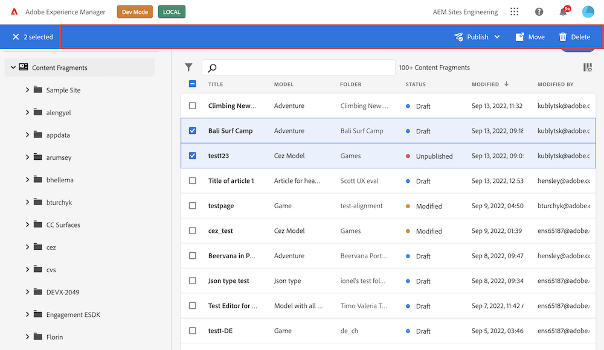

# Action Bar

The Action Bar is an area above the content fragment list in the [Content Fragments Console](../../) that displays action items that can be executed on selected content fragments. These actions may include editing, deleting, exporting, cloning, or publishing content fragments, and the Action Bar appears over the [Header Menu](../header-menu) when one or multiple content fragments are selected.



Action bar can be customized via methods defined in `actionBar` namespace.

You have the ability to:

- create multiple buttons from single extension;
- implement drop-down menu buttons;
- use any [icon](https://react-spectrum.adobe.com/react-spectrum/workflow-icons.html#available-icons) from React Spectrum;
- delete default or added by extension buttons;

## Custom button with callback

```js
import { register } from "@adobe/uix-guest";

// ...

const guestConnection = await register({
    id: "my.company.extension-with-action-bar-button",
    methods: {
        actionBar: {
            getButtons() {
                return [
                    {
                        id: "my.company.export-button",
                        label: "Export",
                        icon: 'Export',
                        onClick: (selections) => {
                            console.log('Export button has been pressed', selections);
                        },
                    },
                ];
            },
        },
    },
});
```

The callback is invoked when user clicks on the button and receives list of content fragments selected in the list.

## Custom button with sub menu

```js
import { register } from "@adobe/uix-guest";

// ...

const guestConnection = await register({
    id: "my.company.extension-with-action-bar-button",
    methods: {
        actionBar: {
            getButtons() {
                return [
                    {
                        id: "my.company.export-button",
                        label: "Export",
                        icon: 'Export',
                        subItems: [
                            {
                                id: 'xml',
                                label: 'XML',
                                onClick: (selections) => {
                                    console.log('Export in XML button has been pressed.', selections);
                                    // ...
                                },
                            },
                            {
                                id: 'csv',
                                label: 'CSV',
                                onClick: (selections) => {
                                    console.log('Export in CSV button has been pressed.', selections);
                                    // ...
                                },
                            },
                        ],
                    },
                ];
            },
        },
    },
});
```

The callback is invoked when user clicks on the button and receives list of content fragments selected in the list.

## Delete button

```js
import { register } from "@adobe/uix-guest";

// ...

const guestConnection = await register({
    id: "my.company.extension-with-action-bar-button",
    methods: {
        actionBar: {
            deleteButtons() {
                return [
                    {
                        //The "id" property is the "data-id" property of html button element.
                        id: "my.company.export-button"
                    },
                ];
            },
        },
    },
});
```

## API Reference

### Button API

| Field    | Type                                                                        | Required | Description                                                                                                                   |
|----------|-----------------------------------------------------------------------------| ------ |-------------------------------------------------------------------------------------------------------------------------------|
| id       | `string`                                                                    | ✔️  | **Must be unique** across all extensions. Consider adding a vendor prefix to this field                                       |
| label    | `string`                                                                    | ✔️  | Button label that will be visible on UI                                                                                       |
| icon     | `string`                                                                    |    | Name of a [React-Spectrum workflow icon](https://react-spectrum.adobe.com/react-spectrum/workflow-icons.html#available-icons) |
| subItems | `array`                                                                     |    | A list with sub menu items                                                                                                    |
| onClick  | `callback(selections): void`                                                          |  ✔️ | A callback for a button `onClick` event. Receives list of content fragments selected in the list                              |

### Sub menu item API

| Field    | Type                         | Required | Description                                                                                                  |
|----------|------------------------------| ------ |--------------------------------------------------------------------------------------------------------------|
| id       | `string`                     | ✔️  | **Must be unique** across the current button sub menu                                                        |
| label    | `string`                     | ✔️  | Button label that will be visible on UI                                                                      |
| icon     | `string`                     |    | Name of a [React-Spectrum workflow icon](https://react-spectrum.adobe.com/react-spectrum/workflow-icons.html#available-icons) |
| onClick  | `callback(selections): void` |  ✔️ | A callback for a button `onClick` event. Receives list of content fragments selected in the list             |

### Delete button API

| Field    | Type                                                                        | Required | Description                                                                  |
|----------|-----------------------------------------------------------------------------| ------ |------------------------------------------------------------------------------|
| id       | `string`                                                                    | ✔️  | "id" is a "data-id" attribute of the button (please use browser developer console to find actual value). |

## Examples:
### Buttons conditional rendering

Content Fragment Admin invokes getButtons method each time a user changes content fragments selection. Therefore, you can dynamically return different sets of buttons based on the data that has changed on the page. 

For example:

```js
import { register } from "@adobe/uix-guest";

// ...

const guestConnection = await register({
    id: "my.company.extension-with-action-bar-button",
    methods: {
        actionBar: {
            async getButtons() {
                const selections = await guestConnection?.host?.fragmentSelections?.getSelections?.() || [];
                const defaultButtons = [
                    {
                        id: "default_btn",
                        label: "Default Button",
                        onClick(selections) {}
                    }
                ]

                if (selections.length > 1 ) {
                    return [
                        ...defaultButtons,
                        {
                            id: "two_and_more_selected",
                            label: "Ext two and more selected",
                        }
                    ]
                }

                return [
                    ...defaultButtons,
                    {
                        id: "one_or_less_selected",
                        label: "Ext one or less selected",
                    }
                ]
            },
        },
    },
});
```
The `defaultButtons` constant contains the buttons that will be rendered every time, doesn't matter what condition is.
On the line `const selections = await guestConnection?.host?.fragmentSelections?.getSelections?.() || [];` 
we get information about current list of selected content fragments.

Based on quantity of selected content fragments we rendered different set of buttons.

In case if selected more then one content fragment (`selections.length > 1`) the default buttons and button with id "two_and_more_selected" will be rendered
In case if selected just one content fragment the default button and button with id "one_or_less_selected" will be rendered

This technic provides possibility to build complex logic behind the buttons rendering.
