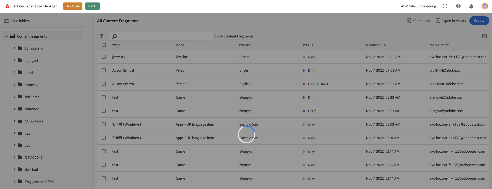

# Common Concepts in Creating Extensions

Learn about common concepts, extension registration, and methods that can be used in any extension.

## Extension Registration

Interaction between UI Extension and Content Fragments console starts with the initialization process that includes extension's capabilities registration so Content Fragments console knows when to invoke the extension. Registration is done by `register` method provided by `@adobe/uix-guest` library. This asynchronous method takes single object that describes extension and returns object representing connection to Content Fragments console.

Method `register` should be invoked after extension initialization page is loaded.

Extension registration data must include:

- `id` - string with random extension identifier. This identifier useful for debugging of interaction between Content Fragments console and extension and needed if extension provides custom UI.
- `methods` - objects with extension code exposed to Content Fragments console. All methods are grouped into namespaces that represents extension points provided by Content Fragments console.

```js
import { register } from "@adobe/uix-guest";

// ...

const guestConnection = await register({
    id: "extension-id",
    methods: {
        // ...
    }
});
```

## Extension UI

For use-cases when UI Extension provides any data handling or send data to remote service `register` is the only method that is expected to be invoked.

If UI Extension implements own UI it should be provided as separate page. If this UI requires data from Content Fragments console or need to invoke any logic it should establish connection with `attach` method.

```js
import { attach } from "@adobe/uix-guest";

const guestConnection = await attach({ id: "id-used-during-extension-registration" });
```

<InlineAlert variant="warning" slots="text" />

At the moment [Modal](#modal) is the only way for extension to provide custom UI.

## Connection Object

Both `register` and `attach` function of `@adobe/uix-guest` returns same connection object that has `host` property and expose API of Content Fragments console exposed for UI Extensions.

### Progress Circle

A progress circle shows the presence of background system operation in a visual way. The progress circle also blocks all user interactions with the UI.



The API consist of two methods `start` and `stop` which allow to start the progress circle or stop it respectively. An example below introduces a button that starts the progress circle and stops it in 5 seconds.

```js
const guestConnection = await register({
  id: "aem-headless-ui-ext-examples-progress-circle",
  methods: {
    headerMenu: {
      getButtons() {
        return [
          {
            id: "my.company.progress-circle-action",
            label: "Start circle",
            icon: 'OpenIn',
            onClick: () => {
              guestConnection.host.progressCircle.start();
              setTimeout(() => guestConnection.host.progressCircle.stop(), 5000);
            },
          },
        ];
      },
    },
  },
});
```

Please keep in mind, multiple extensions may use the progress circle simultaneously. The progress circle will not disappear until all involved extensions call `stop` method.

**API Reference**

| Method | Arguments  | Description |
| ----- | -------- | ----------- |
| start |  | Shows progress circle and blocks all user input |
| stop |  | Stops progress circle and release user input if all other extensions stopped their progress circles |

### Toaster

Content Fragments console provides an API for showing small informational messages (toasts) in the bottom part of the UI. These messages are meant to communicate errors, confirm actions and show other notifications to the user. Toaster API is defined in the `toaster` namespace.

In order to display a message an extension must call `display` method in `toaster` namespace.

```js
import { register } from "@adobe/uix-guest";

const guestConnection = await register({
    id: "my.company.extension-with-taster",
    {
        //...
    }
}

guestConnection.host.toaster.display({
    variant: "positive",
    message: "Toast displayed successfully!",
})
```

**API Reference**

| Field   | Type                                                        | Required | Description                                                                                                                      |
|---------|-------------------------------------------------------------| -------- |----------------------------------------------------------------------------------------------------------------------------------|
| variant | `neutral` <br /> `info` <br /> `negative` <br /> `positive` | ✔️    | Defines type of the message, based on this parameter message will be shown in a different color and different icon               |
| message | `string`                                                    | ✔️    | Text of the message                                                                                                              |
| timeout | `number`                                                    |     | An optional timeout in milliseconds when message should automatically disappear. If not set, default timeout value will be used. |

### Shared Context

In order to empower UI Extensions perform useful actions Content Fragments console provides access to data that simplifies user authentication and usage of AEM API. Such data may be accessed through `sharedContext` property of `host`.

```js
import { attach } from "@adobe/uix-guest";

const guestConnection = await attach({
    id: "my-id"
}
const context = guestConnection.sharedContext;
const aemHost = context.get("aemHost");
```

Available shared context data:

```js
{
    aemHost: string, // hostname of connected AEM environment
    locale: string, // locale of current user
    theme: "light" | "dark", // color schema selected by current user
    auth: {
        imsOrg: string, // current IMS organization
        imsToken: string, // user token
        apiKey: string, // API key to use for requests to Adobe services
        imsOrgName: string, // Human readable organization name
        authScheme: "Bearer" // Auth schema that should be used during communication with Adobe services
    }
}
```
