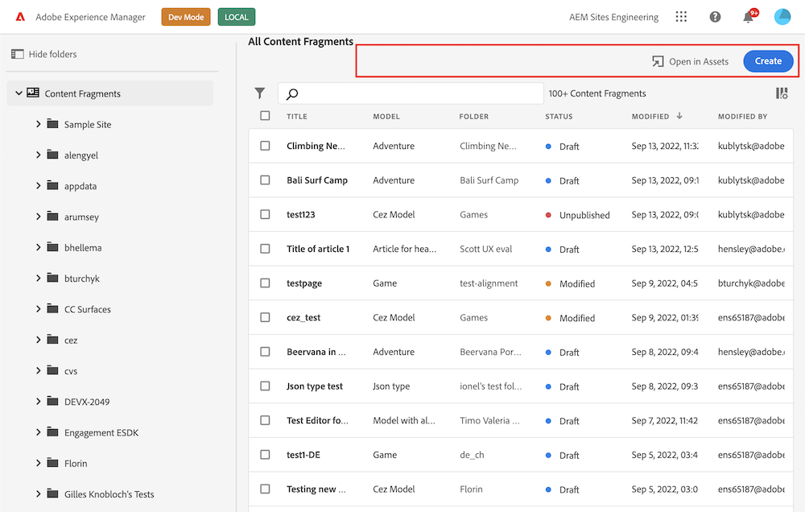

# Header Menu

The Header Menu is an area above the content fragments list in the [Content Fragments Console](../../) that displays action items unrelated to any particular content fragment. It includes buttons or links for common actions such as creating new content fragments, importing content fragments, and performing other operations that are not tied to a specific content fragment.



Header menu can be customized via methods defined in `headerMenu` namespace.

You have the ability to:

- create multiple buttons from single extension;
- implement drop-down menu buttons;
- use different [variations](https://spectrum.adobe.com/page/button/#Options) of buttons from React Spectrum;
- use any [icon](https://react-spectrum.adobe.com/react-spectrum/workflow-icons.html#available-icons) from React Spectrum;
- delete default or added by extension buttons;

## Custom button with callback

```js
import { register } from "@adobe/uix-guest";

// ...

const guestConnection = await register({
    id: "my.company.extension-with-header-menu-button",
    methods: {
        headerMenu: {
            getButtons() {
                return [
                    {
                        id: "my.company.export-button",
                        label: "Export",
                        icon: 'Export',
                        onClick: () => {
                            console.log('Export button has been pressed.');
                        },
                    },
                ];
            },
        },
    },
});
```

The `onClick` callback is invoked when a user clicks on the button. It does not receive any arguments.

## Custom button with sub menu

```js
import { register } from "@adobe/uix-guest";

// ...

const guestConnection = await register({
    id: "my.company.extension-with-header-menu-button",
    methods: {
        headerMenu: {
            getButtons() {
                return [
                    {
                        id: "my.company.export-button",
                        label: "Export",
                        icon: 'Export',
                        subItems: [
                            {
                                id: 'xml',
                                label: 'XML',
                                onClick: async () => {
                                    console.log('Export in XML button has been pressed.');
                                    // ...
                                },
                            },
                            {
                                id: 'csv',
                                label: 'CSV',
                                onClick: async () => {
                                    console.log('Export in CSV button has been pressed.');
                                    // ...
                                },
                            },
                        ],
                    },
                ];
            },
        },
    },
});
```

The `onClick` callback is invoked when a user clicks on the button. It does not receive any arguments.

## Delete button

```js
import { register } from "@adobe/uix-guest";

// ...

const guestConnection = await register({
    id: "my.company.extension-with-header-menu-button",
    methods: {
        headerMenu: {
            deleteButtons() {
                return [
                    {
                        id: "my.company.export-button"
                    },
                ];
            },
        },
    },
});
```

## API Reference

### Button API

| Field    | Type                                                                        | Required | Description                                                                                                                   |
|----------|-----------------------------------------------------------------------------| ------ |-------------------------------------------------------------------------------------------------------------------------------|
| id       | `string`                                                                    | ✔️  | **Must be unique** across all extensions. Consider adding a vendor prefix to this field                                       |
| label    | `string`                                                                    | ✔️  | Button label that will be visible on UI                                                                                       |
| icon     | `string`                                                                    |    | Name of a [React-Spectrum workflow icon](https://react-spectrum.adobe.com/react-spectrum/workflow-icons.html#available-icons) |
| variant  | `cta` <br /> `primary` <br /> `secondary` <br /> `negative` <br /> `action` |    | The [visual style](https://spectrum.adobe.com/page/button/#Options) of the button                                             |
| subItems | `array`                                                                     |    | A list with sub menu items                                                                                                    |
| onClick  | `callback(): void`                                                          |  ✔️ | A callback for a button `onClick` event                                                                                       |

### Sub menu item API

| Field    | Type                                                                        | Required | Description                                                                                                 |
|----------|-----------------------------------------------------------------------------| ------ |-------------------------------------------------------------------------------------------------------------|
| id       | `string`                                                                    | ✔️  | **Must be unique** across the current button sub menu                                                       |
| label    | `string`                                                                    | ✔️  | Button label that will be visible on UI                                                                     |
| icon     | `string`                                                                    |    | Name of a [React-Spectrum workflow icon](https://react-spectrum.adobe.com/react-spectrum/workflow-icons.html#available-icons) |
| onClick  | `callback(): void`                                                          |  ✔️ | A callback for a button `onClick` event                                                                     |

### Delete button API

| Field    | Type                                                                        | Required | Description                                                                  |
|----------|-----------------------------------------------------------------------------| ------ |------------------------------------------------------------------------------|
| id       | `string`                                                                    | ✔️  | "id" is a "data-id" attribute of the button (please use browser developer console to find actual value). |
