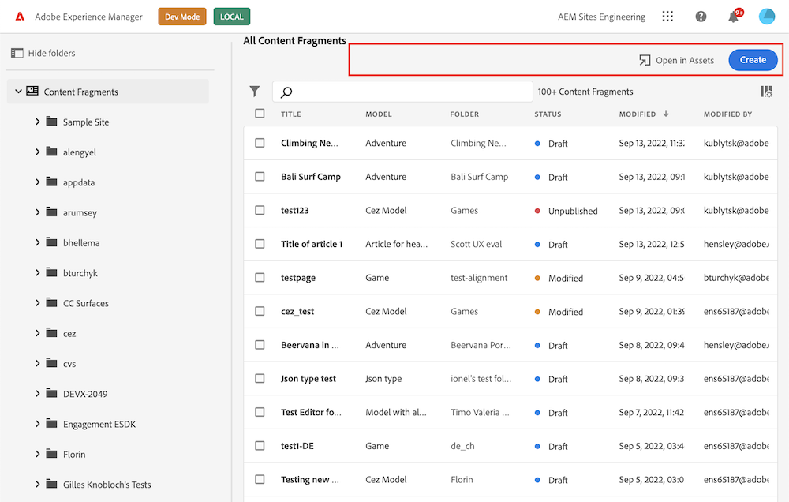

# AEM Content Fragments Console Extension Points

Learn what is possible to extend and customize in AEM Content Fragments console.

The AEM Content Fragments console is dedicated to managing, searching for, and creating Content Fragments. It has been optimized for use in a Headless context, but is also used when creating Content Fragments for use in page authoring.

Extensions can customize navigation, add own actions on Content Fragments and implement custom UI via Modals etc.

## Extension Registration

Interaction between UI Extension and Content Fragments console starts with the initialization process that includes extension's capabilities registration so Content Fragments console knows when to invoke the extension. Registration is done by `register` method provided by `@adobe/uix-guest` library. This asynchronous method takes single object that describes extension and returns object representing connection to Content Fragments console.

Method `register` should be invoked after extension initialization page is loaded.

Extension registration data must include:

- `id` - string with random extension identifier. This identifier useful for debugging of interaction between Content Fragments console and extension and needed if extension provides custom UI.
- `methods` - objects with extension code exposed to Content Fragments console. All methods are grouped into namespaces that represents extension points provided by Content Fragments console.

```js
import { register } from "@adobe/uix-guest";

// ...

const guestConnection = await register({
    id: "extension-id",
    methods: {
        // ...
    }
});
```

### Header Menu

Header Menu is area above Content Fragments list meant for action items unrelated to any particular content fragment, for example creating or importing content fragments.



Header menu can be customized via methods defined in `headerMenu` namespace.

First, define your button in getButton method:

```js
import { register } from "@adobe/uix-guest";

// ...

const guestConnection = await register({
    id: "my.company.extension-with-header-menu-button",
    methods: {
        headerMenu: {
            getButton() {
                return {
                    id: "import",
                    label: "Import",
                    icon: 'OpenIn',
                };
            }
        },
    }
});
```

This method must define button unique ID and label.

Now, you can define button's callback in onClick method.

```js
import { register } from "@adobe/uix-guest";

// ...

const guestConnection = await register({
    id: "my.company.extension-with-header-menu-button",
    methods: {
        headerMenu: {
            getButton() {
                return {
                    id: "import",
                    label: "Import",
                    icon: 'OpenIn',
                };
            },
            onClick() {
                console.log('Import button has been pressed');
            }
        },
    }
});
```

The callback is invoked when user clicks on the button and does not receive any extra parameters.

<InlineAlert variant="warning" slots="text" />

At the moment an extension can only define a single button.

**API Reference**

| Field | Type | Required | Description |
| ----- | ---- | -------- | ----------- |
| id | `string` | ✔️    | **Must be unique** across all extensions. Consider adding vendor prefix to this field. |
| label | `string` | ✔️    | Button label that will be visible on UI |
| icon | `string` |     | An icon field accepts workflow icon code from @spectrum-icons library - https://spectrum.adobe.com/page/icons/ |
| variant | `cta` <br /> `primary` <br /> `secondary` <br /> `negative` <br /> `action` |    | The [visual style](https://spectrum.adobe.com/page/button/#Options) of the button |

### Action Bar

Action Bar is area above content fragment list meant for action items which can be executed on selected content fragments, for example: editing, deleting, exporting or cloning. Action Bar appears over Header Menu when one or multiple content fragments are selected.


Header menu can be customized via methods defined in `actionBar` namespace.

First, define your button in getButton method:

```js
import { register } from "@adobe/uix-guest";

// ...

const guestConnection = await register({
    id: "my.company.extension-with-action-bar-button",
    methods: {
        headerMenu: {
            getButton() {
                return {
                    id: "export",
                    label: "Export",
                    icon: 'OpenIn',
                };
            }
        },
    }
});
```

This method must define unique ID and button label. Now, you can define button's callback in onClick method.

```js
import { register } from "@adobe/uix-guest";

// ...

const guestConnection = await register({
    id: "my.company.extension-with-action-bar-button",
    methods: {
        headerMenu: {
            getButton() {
                return {
                    id: "export",
                    label: "Export",
                    icon: 'OpenIn',
                };
            },
            onClick: (selection) => {
                console.log('Export button has been pressed', {selection});
            }
        },
    }
});
```

The callback is invoked when user clicks on the button and receives list of content fragments selected in the list.

<InlineAlert variant="warning" slots="text" />

At the moment an extension can only define a single button.

**API Reference**

| Field | Type | Required | Description |
| ----- | ---- | -------- | ----------- |
| id | `string` | ✔️    | **Must be unique** across all extensions. Consider adding vendor prefix to this field. |
| label | `string` | ✔️    | Button label that will be visible on UI |
| icon | `string` |     | An icon field accepts workflow icon code from @spectrum-icons library - https://spectrum.adobe.com/page/icons/ |

### Content Fragment Grid Columns

The content fragement grid is area above below the action bar. It host the list of all the content fragments in the current view.

```js
const guestConnection = await register({
  id: "aem-headless-ui-ext-examples-progress-circle",
  methods: {
    contentFragmentGrid: {
        getColumns() {
        return [
            {
                key: "extended",
                labelMessage: "Extended",
                render: {
                    type: 'mapToField'
                    value: 'extended',
                }
            },
            {
                key: "second",
                labelMessage: "From extension",
                render: {
                    type: 'fillWith',
                    value: 'Extension was here'
                }
            }
        ]
        }
    }
    },
  }
});
```

**API Reference**

| Field | Type | Required | Description |
| ----- | ---- | -------- | ----------- |
| key | `string` | ✔️      | Key of the column, must be unique between all extensions |
| labelMessage | `string` | ✔️ | Label of the column as seen by the user |
| sortable | `boolean` |  | Wether the column is sortable or not |
| defaultSortOrder | `ascending`, `descending` | Default order in which to sort the column |
| render | `RenderType` | | Configuration on how cell content should be rendered |

**RenderType**

| Field | Type | Required | Description |
| ----- | ---- | -------- | ----------- |
| type  | `fillWith`, `mapToField` | ✔️ | Type of rendering of the cell |
| value | `string` | ✔️ | Value used in the rendering (see below) |

Type of rendering:

- `fillWith` will fill the cell with the value of the `value` property
- `mapToField` will fill the cell with the value of the `value` property of each fragment

## Extension UI

For use-cases when UI Extension provides any data handling or send data to remote service `register` is the only method that is expected to be invoked.

If UI Extension implements own UI it should be provided as separate page. If this UI requires data from Content Fragments console or need to invoke any logic it should establish connection with `attach` method.

```js
import { attach } from "@adobe/uix-guest";

const guestConnection = await attach({ id: "id-used-during-extension-registration" });
```

<InlineAlert variant="warning" slots="text" />

At the moment [Modal](#modal) is the only way for extension to provide custom UI.

## Connection Object

Both `register` and `attach` function of `@adobe/uix-guest` returns same connection object that has `host` property and expose API of Content Fragments console exposed for UI Extensions.

### Modal

Content Fragments console provides API for showing modal dialogs with custom UI defined by an extension. These modals can be triggered by a click on the button or other events. Modal API is defined in the `modal` namespace.

Content of the modal is rendered in an iframe with source defined by extension. Before showing modal you should create a page which renders Modal UI. This UI should use Adobe Spectrum UI library to provide consistent experiense to the user.

In order to display modal dialog extension must call `showUrl` method in `modal` namespace.

```js
import { register } from "@adobe/uix-guest";

const guestConnection = await register({
    id: "my.company.extension-with-modal",
    {
        //...
    }
}

guestConnection.host.modal.showUrl({
    title: "Extension Modal",
    url: "/index.html#/modal", // absolute or relative path
})
```

Modal may be closed by `close` method

```js
import { attach } from "@adobe/uix-guest";

const guestConnection = await attach({
    id: "my.company.extension-with-modal"
}

guestConnection.host.modal.close();
```

### Progress Circle

A progress circle shows the presence of background system operation in a visual way. The progress circle also blocks all user interactions with the UI.


The API consist of two methods `start` and `stop` which allow to start the progress circle or stop it respectively. An example below introduces a button that starts the progress circle and stops it in 5 seconds.

```js
const guestConnection = await register({
  id: "aem-headless-ui-ext-examples-progress-circle",
  methods: {
    headerMenu: {
      getButton() {
        return {
          id: "progress-circle-action",
          label: "Start circle",
          icon: 'OpenIn'
        };
      },

      onClick() {
        guestConnection.host.progressCircle.start();
        setTimeout(() => guestConnection.host.progressCircle.stop(), 5000);
      }
    },
  }
});
```

Please keep in mind, multiple extensions may use the progress circle simultaneously. The progress circle will not disappear until all involved extensions call `stop` method.

**API Reference**

| Method | Arguments  | Description |
| ----- | -------- | ----------- |
| start |  | Shows progress circle and blocks all user input |
| stop |  | Stops progress circle and release user input if all other extensions stopped their progress circles |

### Toaster

Content Fragments console provides an API for showing small informational messages (toasts) in the bottom part of the UI. These messages are meant to communicate errors, confirm actions and show other notifications to the user. Toaster API is defined in the `toaster` namespace.

In order to display a message an extension must call `display` method in `toaster` namespace.

```js
import { register } from "@adobe/uix-guest";

const guestConnection = await register({
    id: "my.company.extension-with-taster",
    {
        //...
    }
}

guestConnection.host.toaster.display({
    variant: "positive",
    message: "Toast displayed successfully!",
})
```

**API Reference**

| Field   | Type                                                        | Required | Description                                                                                                                      |
|---------|-------------------------------------------------------------| -------- |----------------------------------------------------------------------------------------------------------------------------------|
| variant | `neutral` <br /> `info` <br /> `negative` <br /> `positive` | ✔️    | Defines type of the message, based on this parameter message will be shown in a different color and different icon               |
| message | `string`                                                    | ✔️    | Text of the message                                                                                                              |
| timeout | `number`                                                    |     | An optional timeout in milliseconds when message should automatically disappear. If not set, default timeout value will be used. |

### Shared Context

In order to empower UI Extensions perform useful actions Content Fragments console provides access to data that simplifies user authentication and usage of AEM API. Such data may be accessed through `sharedContext` property of `host`.

```js
import { attach } from "@adobe/uix-guest";

const guestConnection = await attach({
    id: "my-id"
}
const context = guestConnection.sharedContext;
const aemHost = context.get("aemHost");
```

Available shared context data:

```js
{
    aemHost: string, // hostname of connected AEM environment
    locale: string, // locale of current user
    theme: "light" | "dark", // color schema selected by current user
    auth: {
        imsOrg: string, // current IMS organization
        imsToken: string, // user token
        apiKey: string, // API key to use for requests to Adobe services
        imsOrgName: string, // Human readable organization name
        authScheme: "Bearer" // Auth schema that should be used during communication with Adobe services
    }
}
```
