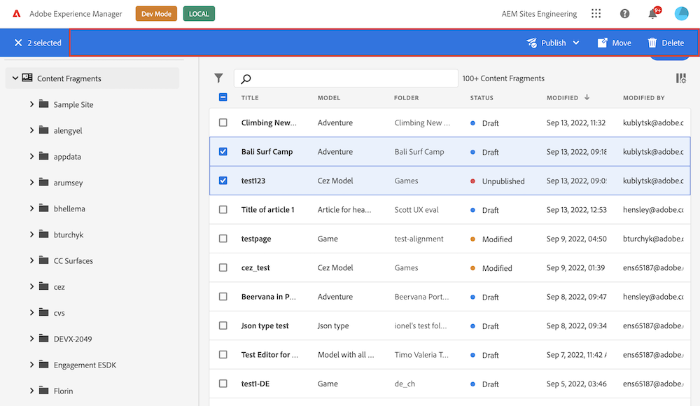

# AEM Content Fragments Console Extension Points

Learn what is possible to extend and customize in AEM Content Fragments console.

The AEM Content Fragments console is dedicated to managing, searching for, and creating Content Fragments. It has been optimized for use in a Headless context, but is also used when creating Content Fragments for use in page authoring. 

Extensions can customize navigation, add own actions on Content Fragments and implement custom UI via Modals etc.

## Extension Registration

Interaction between UI Extension and Content Fragments console starts with the initialization process that includes extension's capabilities registration so Content Fragments console knows when to invoke the extension. Registration is done by `register` method provided by `"@adobe/uix-guest` library. This asynchronous method takes single object that describes extension and returns object representing connection to Content Fragments console.

Method `register` should be invoked after extension initialization page is loaded.

Extension registration data must include:

- `id` - string with random extension identifier. This identifier useful for debugging of interaction between Content Fragments console and extension and needed if extension provides custom UI.
- `methods` - objects with extension code exposed to Content Fragments console. All methods are grouped into namespaces that represents extension points provided by Content Fragments console.

```JavaScript
import { register } from "@adobe/uix-guest";

// ...

const guestConnection = await register({
    id: "extension-id",
    methods: {
        // ...
    }
});
```

### Header Menu

Header Menu is area above Content Fragments list meant for action items unrelated to any particular content fragment, for example creating or importing content fragments.


Header menu can be customized via methods defined in `headerMenu` namespace. 

First, define your button in getButton method:

```JavaScript
import { register } from "@adobe/uix-guest";

// ...

const guestConnection = await register({
    id: "my.company.extension-with-header-menu-button",
    methods: {
        headerMenu: {
            getButton() {
                return {
                    id: "import",
                    label: "Import",
                    icon: 'OpenIn',
                };
            }
        },
    }
});
```

This method must define button unique ID, label and icon.

Now, you can define button's callback in onClick method.

```JavaScript
import { register } from "@adobe/uix-guest";

// ...

const guestConnection = await register({
    id: "my.company.extension-with-header-menu-button",
    methods: {
        headerMenu: {
            getButton() {
                return {
                    id: "import",
                    label: "Import",
                    icon: 'OpenIn',
                };
            },
            onClick() {
                console.log('Import button has been pressed');
            }
        },
    }
});
```

The callback is invoked when user clicks on the button and does not receive any extra parameters.

<InlineAlert variant="warning" slots="text" />

At the moment an extension can only define a single button.

### Action Bar

Action Bar is area above content fragment list meant for action items which can be executed on selected content fragments, for example: editing, deleting, exporting or cloning. Action Bar appears over Header Menu when one or multiple content fragments are selected.



Header menu can be customized via methods defined in `actionBar` namespace. 

First, define your button in getButton method:

```JavaScript
import { register } from "@adobe/uix-guest";

// ...

const guestConnection = await register({
    id: "my.company.extension-with-action-bar-button",
    methods: {
        headerMenu: {
            getButton() {
                return {
                    id: "export",
                    label: "Export",
                    icon: 'OpenIn',
                };
            }
        },
    }
});
```

This method must define unique ID, button label and icon displayed next to it. Now, you can define button's callback in onClick method.

```JavaScript
import { register } from "@adobe/uix-guest";

// ...

const guestConnection = await register({
    id: "my.company.extension-with-action-bar-button",
    methods: {
        headerMenu: {
            getButton() {
                return {
                    id: "export",
                    label: "Export",
                    icon: 'OpenIn',
                };
            },
            onClick: (selection) => {
                console.log('Export button has been pressed', {selection});
            }
        },
    }
});
```

The callback is invoked when user clicks on the button and receives list of content fragments selected in the list.

<InlineAlert variant="warning" slots="text" />

At the moment an extension can only define a single button.

## Extension UI

For use-cases when UI Extension provides any data handling or send data to remote service `register` is the only method that is expected to be invoked.

If UI Extension implements own UI it should be provided as separate page. If this UI requires data from Content Fragments console or need to invoke any logic it should establish connection with `attach` method.

```JavaScript
import { attach } from "@adobe/uix-guest";

const guestConnection = await attach({ id: "id-used-during-extension-registration" });
```

<InlineAlert variant="warning" slots="text" />

At the moment [Modal](#modal) is the only way for extension to provide custom UI.

## Connection Object

Both `register` and `attach` function of `@adobe/uix-guest` returns same connection object that has `host` property and expose API of Content Fragments console exposed for UI Extensions.

### Modal

Content Fragments console provides API for showing modal dialogs with custom UI defined by an extension. These modals can be triggered by a click on the button or other events. Modal API is defined in the `modal` namespace. 

Content of the modal is rendered in an iframe with source defined by extension. Before showing modal you should create a page which renders Modal UI. This UI should use Adobe Spectrum UI library to provide consistent experiense to the user.

In order to display modal dialog extension must call `showUrl` method in `modal` namespace.

```JavaScript
import { register } from "@adobe/uix-guest";

const guestConnection = await register({
    id: "my.company.extension-with-modal",
    {
        //...
    }
}

guestConnection.host.modal.showUrl({
    title: "Extension Modal",
    url: "/index.html#/modal", // absolute or relative path
})
```

Modal may be closed by `close` method

```JavaScript
import { attach } from "@adobe/uix-guest";

const guestConnection = await attach({
    id: "my.company.extension-with-modal"
}

guestConnection.host.modal.close();
```

### Shared Context

In order to empower UI Extensions perform useful actions Content Fragments console provides access to data that simplifies user authentication and usage of AEM API. Such data may be accessed through `sharedContext` property of `host`.

```JavaScript
import { attach } from "@adobe/uix-guest";

const guestConnection = await attach({
    id: "my-id"
}
const context = guestConnection.sharedContext;
const aemHost = context.get("aemHost");
```

Available shared context data:

```JavaScript
{
    aemHost: string, // hostname of connected AEM environment
    locale: string, // locale of current user
    theme: "light" | "dark", // color schema selected by current user
    auth: {
        imsOrg: string, // current IMS organization
        imsToken: string, // user token
        apiKey: string, // API key to use for requests to Adobe services
        imsOrgName: string, // Human readable organization name
        authScheme: "Bearer" // Auth schema that should be used during communication with Adobe services
    }
}
```
