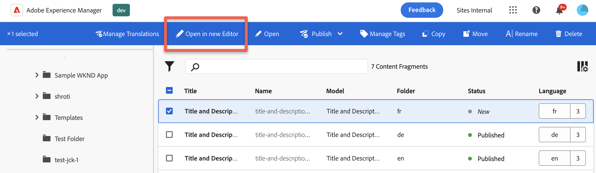

# Navigation

Describes basic methods for navigating within an extension.

## API to open Content Fragment from an extension

Default editor for your organization will be used to open Content Fragment.

```js
import { useEffect } from "react";
import { Text } from "@adobe/react-spectrum"
import { extensionId } from "./Constants"
import { register } from "@adobe/uix-guest";

function ExtensionRegistration() {
    useEffect(() => {
        const init = async () => {
            const registrationConfig = {
                id: extensionId,
                methods: {
                    actionBar: {
                        getButtons() {
                            return [
                                {
                                    id: "example.open_in_editor",
                                    label: "UIX Open In Editor",
                                    icon: 'Export',
                                    variant: "primary",
                                    onClick: (selections) => {
                                        console.log("UIX Open In Editor has been pressed.");
                                        console.log(selections[0].id);
                                        // or any other content fragment path
                                        
                                        guestConnection.host.navigation.openEditor(selections[0].id);
                                    },
                                },
                            ];
                        },
                    },
                },
            };
            const guestConnection = await register(registrationConfig);
        }
        init().catch(console.error)
    }, []);
    return <Text>IFrame for integration with Host (AEM)...</Text>
}

export default ExtensionRegistration;
```



**API Reference**

| Field                  | Type      | Required | Default | Description                                           |
|------------------------|-----------|--------|-----------|-------------------------------------------------------|
| fragmentPath           | `string`  | ✔️     |           | The path of the CF to be open.                        |
