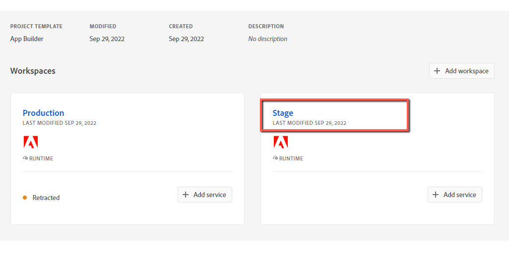

# AEM Content Fragments Console UI Extensions Development Guide

This guide includes step-by-step instructions for creating a UI (User Interface) extension for AEM (Adobe Experience Manager) Content Fragments Console using an extensibility template.

## Create a project in Adobe Developer Console

Adobe Developer Console gives you access to APIs, SDKs and developer tools to integrate, and extend Adobe products. 
In App Builder, you need access to Adobe I/O Runtime credentials used for deploying your application, 
and access to API credentials if you want to access Adobe APIs in your application.
>
We assume that your organization have access to [Adobe App Builder](https://developer.adobe.com/app-builder/docs/overview/) and you created a project in [Adobe Developer Console](https://developer.adobe.com/console).

If not, please refer to [Get Access](../../../guides/get-access) and [Create a new project in Adobe Developer Console](../../../guides/development-flow#create-a-new-project-in-adobe-developer-console).

## Initialize the UI Extension project using AIO CLI

> Important Notes:
> - You need to have AIO CLI version >= 9.1.0 to use the available templates.
> - Please refer to [Local Environment Set Up](../../../guides/local-environment).

Firstly, you need to [Signing in from CLI](https://developer.adobe.com/app-builder/docs/getting_started/first_app/#3-signing-in-from-cli):
1. In your Terminal type the following command:`aio login`.
A browser window and prompt should open, asking you to sign in with your Adobe ID. If the window does not automatically open,
you can also copy/paste the URL printed in your browser to log in. 
    ```shell
    $ aio login
    Visit this url to log in:
    https://aio-login.adobeioruntime.net/api/v1/web/default/applogin?id=78cfd597&port=7341&redirect_uri=https%3A%2F%2Faio-login.adobeioruntime.net%2Fapi%2Fv1%2Fweb%2Fdefault%2Fapplogin%2Flogin-success
    - Waiting for browser login
    ```
2. After logging in, you can close the browser window and return to the Terminal. You will see your user token printed in the Terminal. 
It is automatically stored in the [CLI](https://github.com/adobe/aio-cli) configuration, which allows the [CLI](https://github.com/adobe/aio-cli) to use the token to interact with the [Adobe Developer Console](https://developer.adobe.com/console).
    ```shell
    $ aio login
    Visit this url to log in:
    https://aio-login.adobeioruntime.net/api/v1/web/default/applogin?id=78cfd597&port=7341&redirect_uri=https%3A%2F%2Faio-login.adobeioruntime.net%2Fapi%2Fv1%2Fweb%2Fdefault%2Fapplogin%2Flogin-success
    
    You are currently in:
    1. Org: Sites Internal
    2. Project: 562TurquoiseShrimp
    3. Workspace: Stage
    eyJhbGciOiJSUzI...
    ```

To bootstrap the project code, create a directory and run the following commands from that directory:

1. First, select the appropriate organization.

    ```shell
    ➜  demo-extension-project % aio app init
    ? Select Org:
      Alpha Org
    ❯ Adobe Org
      Beta Org 
      Delta Org
    ```

2. Then, select your project from within that organization.

    You can either select the project by scrolling or you can filter the list of projects by beginning to type the name of the project.

    ```shell
    ➜  demo-extension-project % aio app init
    ? Select Org: Adobe Org
    ? Select a Project, or press + to create new:
      service-account-test
    ❯ aem-cf-admin-ui-extension-demo
      new-cli-test-project
    ```

3. Select one of the search options to specify the templates that you are interested in.

    ```shell
    ➜  demo-extension-project % aio app init
    ? Select Org: Adobe Org
    ? Select a Project, or press + to create new: aem-cf-admin-ui-extension-demo
    ? What templates do you want to search for?
    ❯ All Templates 
      All Extension Points 
      Only Templates Supported By My Org
    ```

4. Select the template named @adobe/aem-cf-admin-ui-ext-tpl (Extensibility Template for AEM Content Fragment Console)

    ```shell
    ➜  demo-extension-project % aio app init
    ? Select Org: Adobe Org
    ? Select a Project, or press + to create new: aem-cf-admin-ui-extension-demo
    ? What templates do you want to search for? All Templates
    ✔ Downloaded the list of templates
    ? Choose the template(s) to install:
    |    | Template                             | Description                                                | Extension Point           | Categories           |
    |----|--------------------------------------|------------------------------------------------------------|---------------------------|----------------------|
    | ❯◉ | @adobe/aem-cf-admin-ui-ext-tpl *     | Extensibility Template for AEM Content Fragment Console    | aem/cf-console-admin/1    | action, ui           |
    |  ◯ | @adobe/generator-app-api-mesh *      | Extensibility template for Adobe API Mesh, for App Builder | N/A                       | action, graphql-mesh |
    |  ◯ | @adobe/generator-app-excshell *      | Extensibility template for generator-aio-app               | dx/excshell/1             | action, ui           |
    |  - | @adobe/generator-app-asset-compute * | Extensibility template for generator-aio-app               | dx/asset-compute/worker/1 | action               |
    
    * = recommended by Adobe; to learn more about the templates, go to https://adobe.ly/templates
    Bootstrapping code in: /Users/akayastha/Developer/Work/Projects/demos/demo-project
      create package.json
      create README.md
      create jest.setup.js
      create .env
      create .gitignore

    Changes to package.json were detected.
    Skipping package manager install.

      create .github/workflows/deploy_prod.yml
      create .github/workflows/deploy_stage.yml
      create .github/workflows/pr_test.yml
    ℹ Installing template @adobe/aem-cf-admin-ui-ext-tpl
    ℹ Installing npm package @adobe/aem-cf-admin-ui-ext-tpl
    
    found 0 vulnerabilities
    ✔ Installed npm package @adobe/aem-cf-admin-ui-ext-tpl
    ℹ Running template @adobe/aem-cf-admin-ui-ext-tpl

    AEM Content Fragment Admin UI Template Overview:

      * You have the option to generate boilerplate code for your extensible buttons.
      * You can get help regarding documentation at any time from the menu.
      * You can check out a sample demo project.
      * An App Builder project will be created with Node.js packages pre-configured.
    ```

5. Answer the prompts related to extension metadata.

    ```shell
    ? What do you want to name your extension? CF Admin Console Demo UI Extension
    ? Please provide a short description of your extension: Demo UI Extension for AEM Content Fragment Console
    ? What version would you like to start with? 0.0.1
    ```

6. The next prompt is implemented as a menu system and is designed to help you generate boilerplate code for your specific needs. When you are ready to complete the project creation, please select `I'm done`.

    ```shell
    ? What would you like to do next? (Use arrow keys)
      ──────────────
      Add a custom button to Action Bar 
      Add a custom button to Header Menu 
      Add server-side handler 
      ──────────────
    ❯ I'm done 
      I don't know 
    ```

7. Wait for the installation of project's package dependencies to complete.

    ```shell
    ? What would you like to do next? I'm done

    Extension Manifest for Code Pre-generation
    ------------------------------------------
    {
      "name": "CF Admin Console Demo UI Extension",
      "id": "cf-admin-console-demo-ui-extension",
      "description": "Demo UI Extension for AEM Content Fragment Console",
      "version": "0.0.1"
    }
        force package.json
      create app.config.yaml
      create src/aem/cf-console-admin-1/ext.config.yaml
      create src/aem/cf-console-admin-1/web-src/index.html
      create src/aem/cf-console-admin-1/web-src/src/config.json
      create src/aem/cf-console-admin-1/web-src/src/exc-runtime.js
      create src/aem/cf-console-admin-1/web-src/src/index.css
      create src/aem/cf-console-admin-1/web-src/src/index.js
      create src/aem/cf-console-admin-1/web-src/src/utils.js
      create src/aem/cf-console-admin-1/web-src/src/components/Constants.js
      create src/aem/cf-console-admin-1/web-src/src/components/Spinner.js
      create src/aem/cf-console-admin-1/web-src/src/components/App.js
      create src/aem/cf-console-admin-1/web-src/src/components/ExtensionRegistration.js
      create .babelrc
    ...
    found 0 vulnerabilities

    Sample code files have been generated.

    Next steps:
    1) Populate your local environment variables in the ".env" file
    2) You can use `aio app run` or `aio app deploy` to see the sample code files in action


    ✔ Finished running template @adobe/aem-cf-admin-ui-ext-tpl
    ✔ Installed template @adobe/aem-cf-admin-ui-ext-tpl
    Project initialized for Workspace Stage, you can run 'aio app use -w <workspace>' to switch workspace.
    ✔ App initialization finished!
    > Tip: you can add more actions, web-assets and events to your project via the 'aio app add' commands
    ```

## Run on Local Environment
To run the application locally, use one of the following commands from the same directory:

#### First Option:
```shell
➜  demo-extension-project % aio app run --local
```

This will deploy the actions to a local [OpenWhisk](https://openwhisk.apache.org/) instance, which the [CLI](https://github.com/adobe/aio-cli) will automatically download and install. The SPA will be run on the local machine.

```shell
➜  demo-extension-project % aio app run --local
  ℹ checking if java is installed...
  ℹ checking if docker is installed...
  ℹ checking if docker is running...
  ℹ starting local OpenWhisk stack...
  ℹ writing credentials to tmp wskdebug config '/Users/akayastha/Developer/Work/Projects/demos/cf-admin-console-demo-proj/dist/aem-cf-console-admin-1/.env.local'
  ℹ building actions..
  ℹ watching action files at /Users/akayastha/Developer/Work/Projects/demos/cf-admin-console-demo-proj/src/aem/cf-console-admin-1/actions...
  ℹ injecting backend urls into frontend config
  ℹ bundling /Users/akayastha/Developer/Work/Projects/demos/cf-admin-console-demo-proj/src/aem/cf-console-admin-1/web-src/**/*.html
  ℹ redeploying actions..
  ℹ Info: Deploying package [cf-console-admin-1]...
  ℹ Info: package [cf-console-admin-1] has been successfully deployed.

  ℹ Info: Deploying action [cf-console-admin-1/import]...
  ℹ Info: action [cf-console-admin-1/import] has been successfully deployed.

  ℹ Info: Deploying action [cf-console-admin-1/export]...
  ℹ Info: action [cf-console-admin-1/export] has been successfully deployed.

  ℹ Success: Deployment completed successfully.
  ℹ web actions:
  ℹ   -> http://localhost:3233/api/v1/web/guest/cf-console-admin-1/import
  ℹ   -> http://localhost:3233/api/v1/web/guest/cf-console-admin-1/export
  ℹ serving front-end using bundler serve...
  ℹ local frontend server running at https://localhost:9080
  ℹ setting up vscode debug configuration files...
  ⠋    create .vscode/launch.json

  No change to package.json was detected. No package manager install will be executed.
  ℹ press CTRL+C to terminate dev environment
  
  To view your local application:
    -> https://localhost:9080
  To view your deployed application in the Experience Cloud shell:
    -> https://experience.adobe.com/?devMode=true#/custom-apps/?localDevUrl=https://localhost:9080
  press CTRL+C to terminate dev environment
```

#### Second Option:
```shell
➜  demo-extension-project % aio app run
```

This will deploy the actions to [Adobe I/O Runtime](/apis/experienceplatform/runtime), while running the UI part on the local machine. 

```shell
➜  demo-extension-project % aio app run
  create .vscode/launch.json

No change to package.json was detected. No package manager install will be executed.

To view your local application:
  -> https://localhost:9080
To view your deployed application in the Experience Cloud shell:
  -> https://experience.adobe.com/?devMode=true#/custom-apps/?localDevUrl=https://localhost:9080
press CTRL+C to terminate dev environment
```

Now your UI extension is reachable by the displayed URL on the Terminal. You can test your UI extension within your AEM Content Fragment Consle by passing the following parameters to your AEM Content Fragment Console URL:
- repo (host name of AEM instance): `repo=author-p7452-e12437.adobeaemcloud.com`
- ext (extension): `ext=https://localhost:9080`
- devMode (development mode): `devMode=true`

**Sample AEM Content Fragment Console URL:** `https://experience.adobe.com/?cq-aem-headless-ui-admin_version=PR-444-df883867ebbbc09c49b2df86018c4bce901c746a&ext=https://localhost:9080&devMode=true&repo=author-p7452-e12437.adobeaemcloud.com#/@sitesinternal/aem/cf/admin/`

#### (First time users) Accepting the Certificate

If you are using this application for the first time, you will see a message similar to

```shell
success: generated certificate
A self signed development certificate has been generated, you will need to accept it in your browser in order to use it.
Waiting for the certificate to be accepted.... timed out
```

This message pops up because we use a development SSL certificate for secure communication. Understand more about the purpose of this certificate [here](https://letsencrypt.org/docs/certificates-for-localhost/).

If you see this message, please navigate to `https://localhost:9080`, you should see a screen similar to this.

)

Click on `Advanced`, the nex screen may vary from browser to browser, but you should see a screen like this, where you can click on `Proceed to localhost (unsafe)` to accept the certificate.


You may need to exit the current process and run `aio app run` again.

## Run on Stage

After the development is completed, we can test our application on `Stage` before deploying to `Production`.
For this we will use the `Stage workgroup`.



Firstly, make sure you are logged in proper organization, and use `Stage` workgroup:

```shell
$ aio where

You are currently in:
1. Org: Sites Internal
2. Project: 562TurquoiseShrimp
3. Workspace: Stage
```

After that, we build and deploy declared actions and frontend files/assets:
```shell
aio app deploy

√ Built 3 action(s) for 'aem/cf-console-admin/1'
√ Building web assets for 'aem/cf-console-admin/1'
√ Deployed 3 action(s) for 'aem/cf-console-admin/1'
√ Deploying web assets for 'aem/cf-console-admin/1'
Your deployed actions:
web actions:
  -> https://245265-562turquoiseshrimp-stage.adobeio-static.net/api/v1/web/aem-headless-ui-ext-examples/get-language-copies
  -> https://245265-562turquoiseshrimp-stage.adobeio-static.net/api/v1/web/aem-headless-ui-ext-examples/quick-publish-language-copies
  -> https://245265-562turquoiseshrimp-stage.adobeio-static.net/api/v1/web/aem-headless-ui-ext-examples/unpublish-language-copies
To view your deployed application:
  -> https://245265-562turquoiseshrimp-stage.adobeio-static.net/index.html
To view your deployed application in the Experience Cloud shell:
  -> https://experience.adobe.com/?devMode=true#/custom-apps/?localDevUrl=https://245265-562turquoiseshrimp-stage.adobeio-static.net/index.html
New Extension Point(s) in Workspace 'Stage': 'aem/cf-console-admin/1'
Successful deployment 🏄
```

Now your application is reachable by URL, printed in Terminal.
You can use this URL for end-to-end testing.      
 
We can use the `ext` parameter (how we did it during testing on a local machine) of your AEM instance to test and view the unpublished application.


To learn more about deployment, please refer to [Deploying the Application](https://developer.adobe.com/app-builder/docs/getting_started/first_app/#7-deploying-the-application) 
and [Deployment Overview](https://developer.adobe.com/app-builder/docs/guides/deployment/).

## Deploy on Production and create approval request

After the application has been completed, tested locally and on `Stage`, we are ready to deploy it to `Production`.
Refer to the [UI Extensions Development Flow](../../../guides/development-flow/#deploy-on-production) to learn how to do this.

Also in this document you can find the whole development flow of a UI Extensions.

```shell
➜  demo-project % aio app use -w Production
```

```shell
➜  demo-project % aio app deploy
ℹ no backend or a build already exists, skipping action build for 'aem/cf-console-admin/1'
✔ Building web assets for 'aem/cf-console-admin/1'
no backend, skipping action deploy 'aem/cf-console-admin/1'
✔ Deploying web assets for 'aem/cf-console-admin/1'
To view your deployed application:
  -> https://245265-959magentaaardwolf-stage.adobeio-static.net/index.html
To view your deployed application in the Experience Cloud shell:
  -> https://experience.adobe.com/?devMode=true#/custom-apps/?localDevUrl=https://245265-959magentaaardwolf-stage.adobeio-static.net/index.html
New Extension Point(s) in Workspace 'Stage': 'aem/cf-console-admin/1'
Successful deployment 🏄
```

## Further Reading

<DiscoverBlock slots="heading, link, text"/>

[Local Environment Set Up](../../../guides/local-environment)

Prepare your local environment for Content Fragments console UI extension development.

<DiscoverBlock slots="heading, link"/>

[First Extension](extension-development)

Create your first AEM Content Fragments console UI extension.


<DiscoverBlock slots="heading, link"/>

[Implementation Patterns](how-to)

Explore common use-cases for Content Fragments console UI extensions and how to solve them.

<DiscoverBlock slots="heading, link"/>

[Troubleshooting](debug)

Resolve issue with Content Fragments console UI extension.
