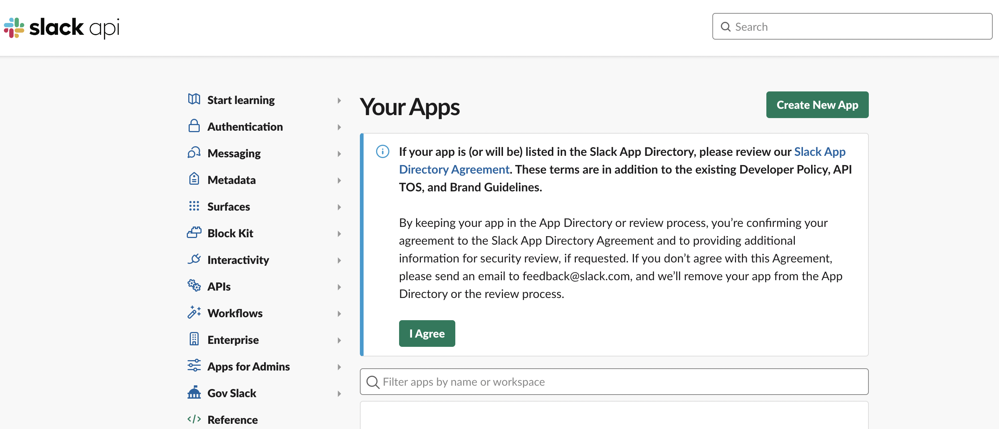
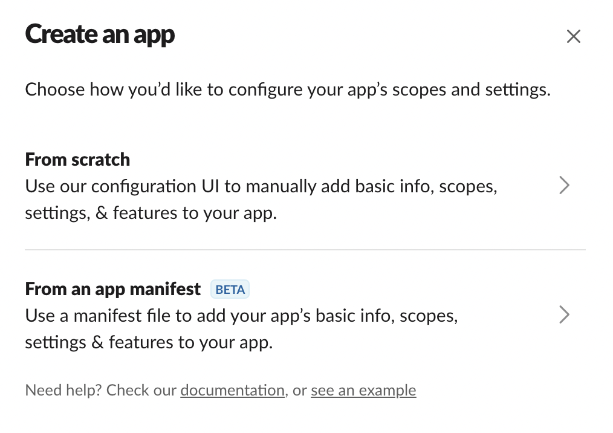
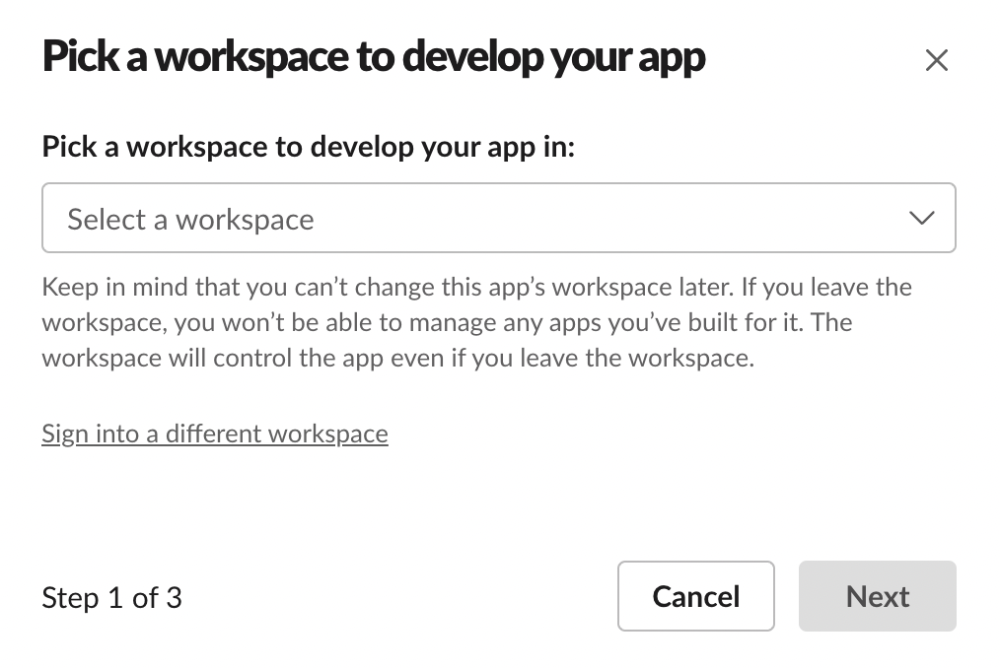
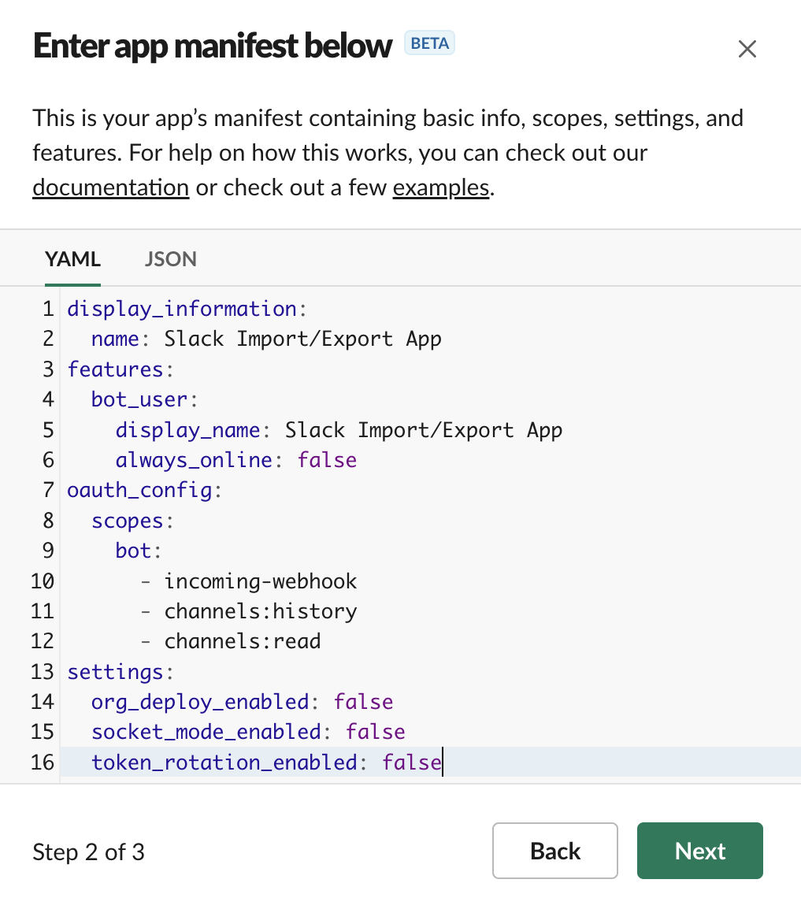
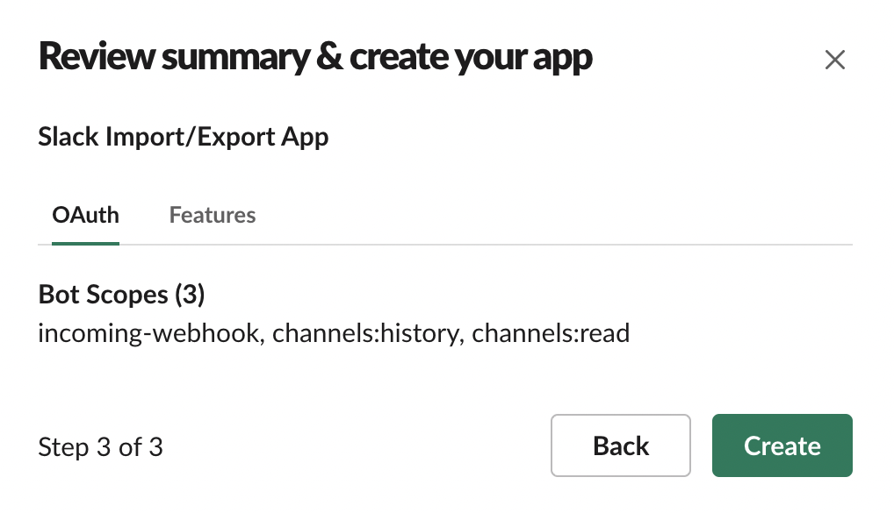
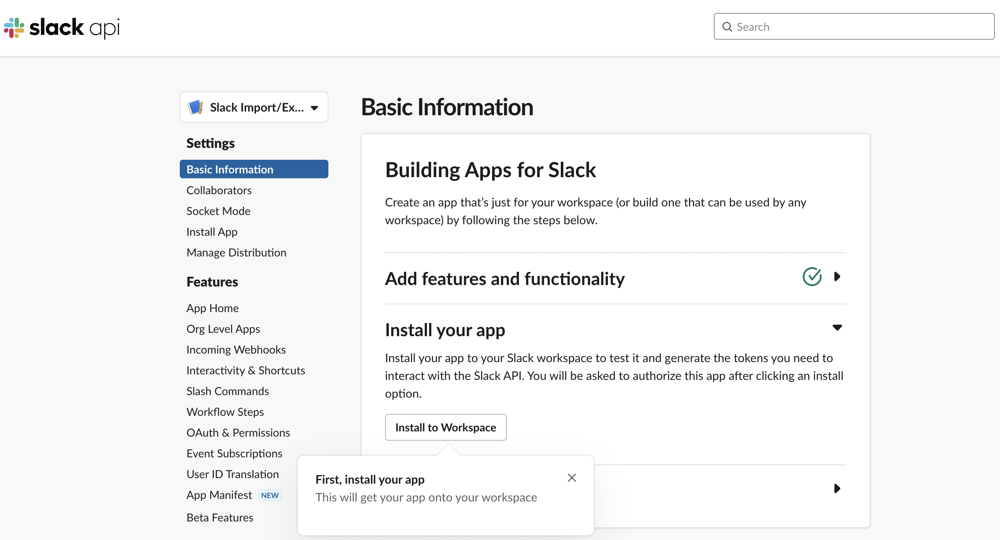
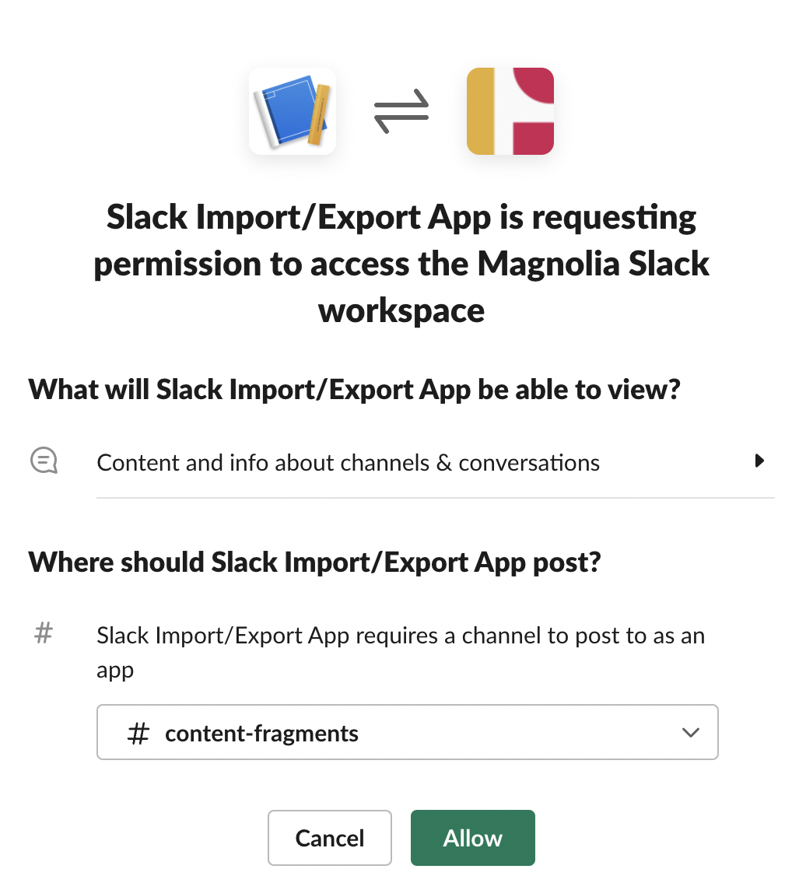
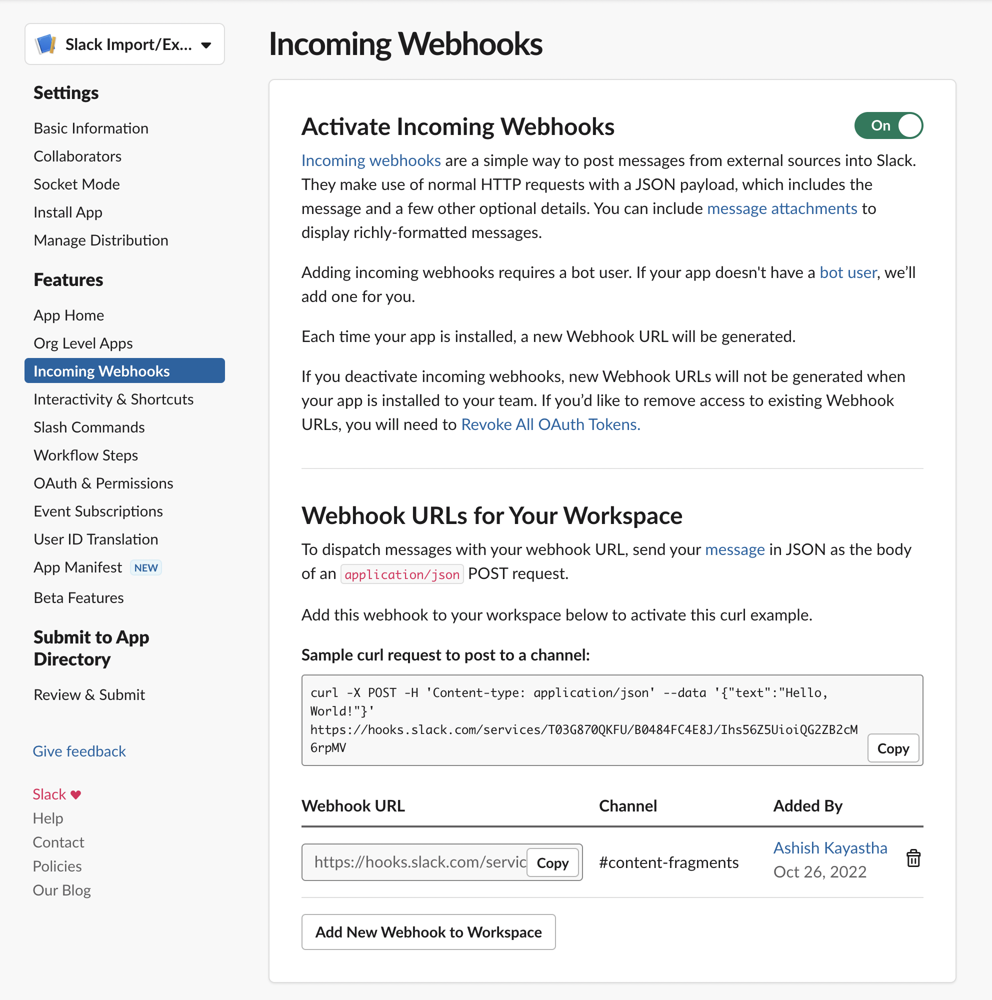
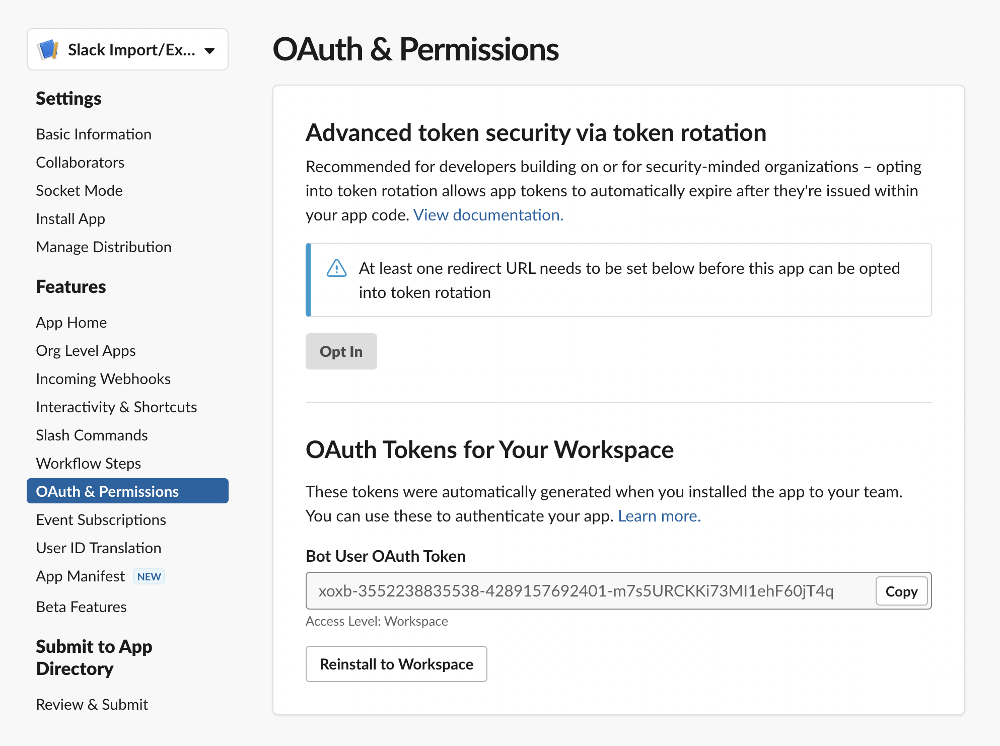
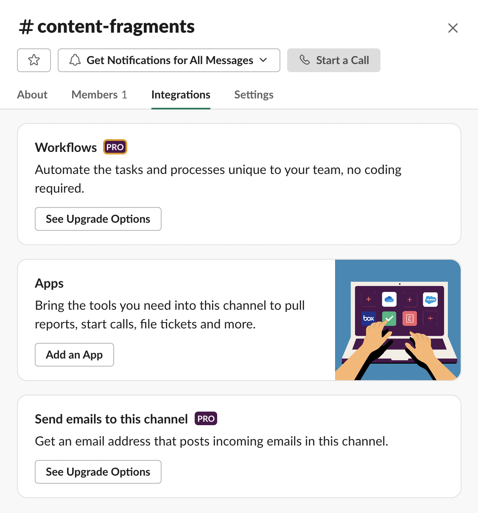

# Code Generation for AEM Content Fragments Console Extension 

The [AEM Content Fragment Console Extension Template](https://github.com/adobe/aem-cf-admin-ui-ext-tpl) help developers to bootstrap their App Builder apps when using the [CLI](https://github.com/adobe/aio-cli) and generates basic extension structure and all required code.

Template is optional to use but we highly recommend it in order to save time and has less knowledge regarding internal UI Extensions structure.

Template provides code generation capabilities targeted to 3 main developers group:
1. Novices, developers who just starting explore UI Extensibility will benefit from direct links to documentation and ability to generate working demo project.
2. Seasoned developers may generate skeleton code for their features and jump directly into business logic implementation.
3. Experts may generate bare bone project and write all the code from scratch

## Launch code generation during project initialization

<InlineAlert slots="text" />

You need to have AIO CLI version >= 9.1.0 to use the available templates. Please refer to [Local Environment Set Up](../../guides/local-environment).

You may access code generation functionality during project initialization. 

Create a directory and run the following commands from that directory:

1. First, select the appropriate organization.

    ```shell
    ➜  demo-extension-project % aio app init
    ? Select Org:
    ❯ Alpha Org
      Beta Org 
      Delta Org
    ```

2. Then, select your project from within that organization.

    You can either select the project by scrolling or you can filter the list of projects by beginning to type the name of the project.

    ```shell
    ➜  demo-extension-project % aio app init
    ? Select Org: Alpha Org
    ? Select a Project, or press + to create new:
      great-project
    ❯ useful-project
      awesome-project
    ```

3. Select one of the search options to specify the templates that you are interested in (we recommend to use `All Extension Points`).

    ```shell
    ➜  demo-extension-project % aio app init
    ? Select Org: Alpha Org
    ? Select a Project, or press + to create new: useful-project
    ? What templates do you want to search for?
      All Templates 
    ❯ All Extension Points 
      Only Templates Supported By My Org
    ```

4. Select the template named @adobe/aem-cf-admin-ui-ext-tpl (AEM Content Fragment Console Extensions Template)

    ```shell
    ➜  demo-extension-project % aio app init
    ? Select Org: Alpha Org
    ? Select a Project, or press + to create new: useful-project
    ? What templates do you want to search for? All Templates
    ✔ Downloaded the list of templates
    ? Choose the template(s) to install:
    |    | Template                             | Description                                                | Extension Point           | Categories           |
    |----|--------------------------------------|------------------------------------------------------------|---------------------------|----------------------|
    | ❯◉ | @adobe/aem-cf-admin-ui-ext-tpl *     | Extensibility Template for AEM Content Fragment Console    | aem/cf-console-admin/1    | action, ui           |
    |  ◯ | @adobe/generator-app-api-mesh *      | Extensibility template for Adobe API Mesh, for App Builder | N/A                       | action, graphql-mesh |
    |  ◯ | @adobe/generator-app-excshell *      | Extensibility template for generator-aio-app               | dx/excshell/1             | action, ui           |
    |  - | @adobe/generator-app-asset-compute * | Extensibility template for generator-aio-app               | dx/asset-compute/worker/1 | action               |

    * = recommended by Adobe; to learn more about the templates, go to https://adobe.ly/templates
    Bootstrapping code in: project
      create package.json
      create README.md
      create jest.setup.js
      create .env
      create .gitignore

    Changes to package.json were detected.
    Skipping package manager install.

      create .github/workflows/deploy_prod.yml
      create .github/workflows/deploy_stage.yml
      create .github/workflows/pr_test.yml
    ℹ Installing template @adobe/aem-cf-admin-ui-ext-tpl
    ℹ Installing npm package @adobe/aem-cf-admin-ui-ext-tpl

    found 0 vulnerabilities
    ✔ Installed npm package @adobe/aem-cf-admin-ui-ext-tpl
    ℹ Running template @adobe/aem-cf-admin-ui-ext-tpl

    AEM Content Fragment Admin UI Template Overview:

      * You have the option to generate boilerplate code for your extensible buttons.
      * You can get help regarding documentation at any time from the menu.
      * You can check out a sample demo project.
      * An App Builder project will be created with Node.js packages pre-configured.
    ```

> If you are experienced user you may also simplify process of template selection by running command

> ```shell
aio app init --template=@adobe/aem-cf-admin-ui-ext-tpl

> At this point AEM Content Fragment Console Extensions Template is added to yor project and ready to use

## Provide basic information about extension

5. Answer the prompts related to extension metadata such as human readable name, description and version.

    ```shell
    ? What do you want to name your extension? CF Console Demo UI Extension
    ? Please provide a short description of your extension: Demo UI Extension for AEM Content Fragments Console
    ? What version would you like to start with? 0.0.1
    ```

## Choose code generation strategy

6. The next prompt is implemented as a menu system and is designed to help you generate boilerplate code for your specific needs. When you are ready to complete the project creation, please select `I'm done`.

    ```shell
    ? What would you like to do next? (Use arrow keys)
      ──────────────
      Add a custom button to Action Bar 
      Add a custom button to Header Menu 
      Add server-side handler 
      ──────────────
    ❯ I'm done 
      I don't know 
    ```

### Novice, explore what is possible

> 6.1. If you only starting with exploring UI Extensibility feel no hesitation to choose `I don't know`

> ```shell
? What would you like to do next? I don't know
? What about this then? (Use arrow keys)
  ──────────────
❯ Try a demo project 
  Find some help 
  ──────────────
  Go back

> `Try demo project` generates ready-to-use UI Extension with Import/Export functionality and integration with Slack.
    
> `Find some help` displays list of useful links.  

### Seasoned developer, choose what you need

> 6.2. If you already know what you want to do start add features to you extensions by selecting items from the main part of the menu. Each part correspond to single Extension Point in AEM Content Fragments Console. 

> ```shell
? What would you like to do next? Add a custom button to Action Bar
? Please provide label name for the button: Export
? Do you need to show a modal for the button? Yes

> For each extension. For example, for `Action Bar` and `Header Menu` you may specify title and if button suppose to open modal dialog with UI provided by extension or it will run background script.


> In addition, if your extension requires server-to-server communication add as many server-side handlers as you need.
> ```shell
? What would you like to do next? Add server-side handler
? Adobe I/O Runtime lets you invoke serverless code on demand. How would you like to name this action? export-to-remote-service

### Experts, have full control

> 6.3. If you know what you are doing and want to tweak implementation on low level hit `I'm done` as first answer and you will get bare bone project structure.

## Add business logic

7. After you choose `I'm done` template starts installation of project's package dependencies and generates code.

    ```shell
    ? What would you like to do next? I'm done

    Extension Manifest for Code Pre-generation
    ------------------------------------------
    {
      "name": "CF Console Demo UI Extension",
      "id": "useful-project",
      "description": "Demo UI Extension for AEM Content Fragment Console",
      "version": "0.0.1"
    }
        force package.json
      create app.config.yaml
      create src/aem-cf-console-admin-1/ext.config.yaml
      create src/aem-cf-console-admin-1/web-src/index.html
      create src/aem-cf-console-admin-1/web-src/src/config.json
      create src/aem-cf-console-admin-1/web-src/src/exc-runtime.js
      create src/aem-cf-console-admin-1/web-src/src/index.css
      create src/aem-cf-console-admin-1/web-src/src/index.js
      create src/aem-cf-console-admin-1/web-src/src/utils.js
      create src/aem-cf-console-admin-1/web-src/src/components/Constants.js
      create src/aem-cf-console-admin-1/web-src/src/components/Spinner.js
      create src/aem-cf-console-admin-1/web-src/src/components/App.js
      create src/aem-cf-console-admin-1/web-src/src/components/ExtensionRegistration.js
      create .babelrc
    ...
    found 0 vulnerabilities

    Sample code files have been generated.

    Next steps:
    1) Populate your local environment variables in the ".env" file
    2) You can use `aio app run` or `aio app deploy` to see the sample code files in action

    ✔ Finished running template @adobe/aem-cf-admin-ui-ext-tpl
    ✔ Installed template @adobe/aem-cf-admin-ui-ext-tpl
    Project initialized for Workspace Stage, you can run 'aio app use -w <workspace>' to switch workspace.
    ✔ App initialization finished!
    > Tip: you can add more actions, web-assets and events to your project via the 'aio app add' commands

> At this point you already have fully functional UI Extension and it's time to add functionality that you business needs. The best place to start is navigating directly to `src/aem-cf-console-admin-1/web-src/src/components/ExtensionRegistration.js` which contains code that defines capabilities of the extension and provides information to the AEM Content Fragments Console when and how extension should be invoked.

## Configure demo application

If you opted to generate a demo application you will get a fully functional application with the ability to import/export the Content Fragment(s) between the Content Fragments Console and your selected Slack channel and demonstrate:
1. How to use the Action Bar extension point to implement handling of selected Content Fragments (export).
2. How to use the Header Menu extension point to implement actions not related to existing content fragments (import).
3. How to use server-side handlers and deployment parameters for secure communication with remote service.

### Creating and Configuring a Slack App
First, you will need to sign in to your Slack account at `https://api.slack.com/apps`. 

1. Once signed in, create a new Slack app by clicking `Create New App` .

> 

2. You will see a setup wizard modal dialog like the one below.
Choose how you would like to configure your app's scopes and settings. To make things simple, choose `From an app manifest`.

> 

3. Next, you are prompted to pick a workspace to develop your app in. Select the one that you are interested in.

> 

4. Next, you need to enter an app manifest either in YAML or JSON. The app's manifest contains basic info, scopes, settings, and features. Simply copy and paste the YAML below:
    ```
    display_information:
      name: Slack Import/Export App
    features:
      bot_user:
        display_name: Slack Import/Export App
        always_online: false
    oauth_config:
      scopes:
        bot:
          - incoming-webhook
          - channels:history
          - channels:read
    settings:
      org_deploy_enabled: false
      socket_mode_enabled: false
      token_rotation_enabled: false
    ```

> 

5. Review the configuration of your Slack app and click `Create`.

> 

6. Next, you need to install the newly created Slack app to your selected workspace by clicking the `Install to Workspace` button. This will also generate the tokens you need to interact with the Slack APIs.

> 

7. Next, your Slack app needs permission to access the selected workspace. Choose the channel where you would like the Slack app to post and click `Allow`.

> 

### Finding the Slack Configuration

Your Slack app should now be set up with the correct permissions and requested scopes. The incoming webhook URL and OAuth token should also be generated.

1. You can find your Slack webhook URL by clicking `Incoming Webhooks` subsection under the `Features` section. You need to copy the shown URL and configure it in your App Builder extension project's `.env` file.

> 

2. Similarly, you can find your Slack app's OAuth token by clicking `OAuth & Permissions` subsection under the `Features` section. Copy the token string called `Bot User OAuth Token` and configure it in your App Builder extension projects's `.env` file.

> 

### Adding the Slack App to a Channel

Finally, you need to add the Slack app to your desired channel where you would like to post and read from. Open channel details by either right clicking on your desired channel (Side Bar) or click on the header of the channel. You can find the `Add an App` button in `Apps` section under the `Integrations` tab. Add your Slack app by clicking on that button.



You are now all set to deploy the Slack Import/Export demo extension to Adobe I/O and use it in the AEM Content Fragments Console.
