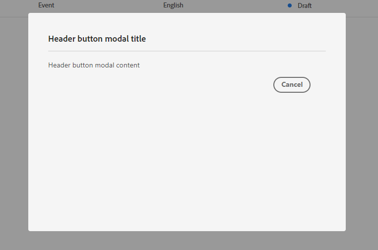

#AEM Step-by-step Extension Development

The document helps you understand how to set up local environment and start developing your first [Adobe App Builder App](pages/dx-devex-acceleration/uix-docs/overview/).

## About Application

This example application will use two extension points provided by the [AEM (Adobe Experience Manager)](https://experienceleague.adobe.com/docs/experience-manager.html).
We would like to add two buttons. The first button will be added the header menu:


The second one to a menu that displays when a content fragment is selected:


After clicking on buttons we would like to show some content in a pop-up:


More information about [AEM](https://experienceleague.adobe.com/docs/experience-manager.html) extension points can be found at [AEM Content Fragments Console Extension Points](pages/dx-devex-acceleration/uix-docs/services/aem-cf-console-admin/api/).

You can find the source of [the wholly completed application on GitHub](https://git.corp.adobe.com/dx-devex-acceleration/aem-headless-ui-ext-examples).

## Setting up Local Environment
- [Node.js](https://nodejs.org/) + [npm (package manager)](https://www.npmjs.com/). Make sure you are using the latest stable version of `Node.js` and `npm`.
```shell
$ node -v
 v16.15.1
```
```shell
$ npm -v
8.11.0
```
These are the current versions at the moment of creating the documentation.
Make sure you are using the latest versions supported by Adobe IO when you create the application.


- [Adobe I/O CLI](https://github.com/adobe/aio-cli). If you already have `Adobe I/O CLI` on your local, please ensure you use the latest version of the library.
You can check the version through:
```shell
aio -v
```
and compare it with 
```shell
npm show @adobe/aio-cli
```
If your version is outdated, update your `Adobe I/O CLI` by running 
```shell
npm install -g @adobe/aio-cli
```

More details are described in [Local Environment Set Up and optional tools](https://developer.adobe.com/app-builder/docs/getting_started/#local-environment-set-up).

## Create a Project in Adobe Developer Console

> Adobe Developer Console gives you access to APIs, SDKs and developer tools to integrate, and extend Adobe products. 
In App Builder, you need access to Adobe I/O Runtime credentials used for deploying your application, 
and access to API credentials if you want to access Adobe APIs in your application.
>
We assume that your organization have access to [Adobe App Builder](https://developer.adobe.com/app-builder/docs/overview/) and you created a project in [Adobe Developer Console](https://developer.adobe.com/console).
If not, please refer to [UI Extensions Development Flow](https://git.corp.adobe.com/pages/dx-devex-acceleration/uix-docs/guides/development/#1-get-access-to-app-builder).

## Initialize our Application using the CLI and generate a base structure from template
Firstly, we need to [Signing in from CLI](https://developer.adobe.com/app-builder/docs/getting_started/first_app/#3-signing-in-from-cli) and [bootstrap our project](https://developer.adobe.com/app-builder/docs/getting_started/first_app/#4-bootstrapping-new-app-using-the-cli).

Please complete all the steps described in [Initialize our Application using the CLI](pages/dx-devex-acceleration/uix-docs/guides/development/#3-initialize-our-application-using-the-cli-for-local-development).

After this step, we will have a generated project structure with necessary npm dependencies are getting installed.

If you have worked with an Adobe App Builder App before, you will notice that you have generated a starter project of a UI Extension that implements [extension points](https://developer.adobe.com/app-builder/docs/guides/extensions/).


```yaml
# app.config.yaml
extensions:
  aem/cf-console-admin/1:
    $include: src/aem-cf-console-admin-1/ext.config.yaml

```

## Overview of generated components

### Routing
[`src/aem-cf-console-admin-1/web-src/src/components/App.js`](https://git.corp.adobe.com/dx-devex-acceleration/aem-headless-ui-ext-examples/blob/main/src/aem-cf-console-admin-1/web-src/src/components/App.js)

The root component contains the [routing of our application](https://git.corp.adobe.com/dx-devex-acceleration/aem-headless-ui-ext-examples/blob/main/src/aem-cf-console-admin-1/web-src/src/components/App.js). We always have this generated file.

Our extension is responsible for rendering several things:
- The logic of registering our extension (it's the second required part of the extension).
- Any partial UI components that may render inside the host app, for example as the content of a pop-up when a button is clicked (optional).

We will discuss these components in more detail in the points below.

[React Routing](https://reactrouter.com/web/guides/quick-start) determines which part of the extension should be executed depending on the request.
```js
import React from "react";
import ErrorBoundary from "react-error-boundary";
import LanguageCopiesModal from "./LanguageCopiesModal";
import ExtensionRegistration from "./ExtensionRegistration";
import TestContentModal from "./TestContentModal";
import { HashRouter as Router, Routes, Route } from "react-router-dom";

function App() {
  return (
    <Router>
      <ErrorBoundary onError={onError} FallbackComponent={fallbackComponent}>
        <Routes>
            <Route index element={<ExtensionRegistration />} />
            <Route
                exact
                path="index.html"
                element={<ExtensionRegistration />}
            />
            <Route
                exact
                path="content-fragment/:fragmentId/language-copies"
                element={<LanguageCopiesModal />}
            />
            <Route
                exact
                path="modal-test-content"
                element={<TestContentModal />}
            />
        </Routes>
      </ErrorBoundary>
    </Router>
  );
...
}
```

> Please note that your code may slightly differ from the given example depending on the version of the template for generation, but the main logic will be the same.

If you need additional functionality, you can add new entry points and specify them in the routing after a generation.

### Extension registration
[`src/aem-cf-console-admin-1/web-src/src/components/ExtensionRegistration.js`](https://git.corp.adobe.com/dx-devex-acceleration/aem-headless-ui-ext-examples/blob/main/src/aem-cf-console-admin-1/web-src/src/components/ExtensionRegistration.js)

This logical component registers our extension with the host AEM instance as soon as it loads, so they can share data and communicate with each other.

```js
import React, { useEffect } from "react";
import { generatePath } from "react-router";
import { Text } from "@adobe/react-spectrum";
import { register } from "@adobe/uix-guest";

function ExtensionRegistration() {
  useEffect(() => {
    const init = async () => {
      const guestConnection = await register({
        id: "aem-headless-ui-ext-examples",
        methods: {
          actionBar: {
            getButton() {
              return {
                id: "manage-language-copies",
                label: "Manage Language Copies",
                icon: 'PublishCheck',
              };
            },
            onClick(selections) {
              const url = "/index.html#" + generatePath("/content-fragment/:fragmentId/language-copies", {
                fragmentId: encodeURIComponent(selections[0].id),
              });

              guestConnection.host.modal.showUrl({
                title: 'Manage Language Copy: ' + selections[0].name,
                url: url,
              })
            },
          },
          headerMenu: {...},
        }
      });
    }
    init().catch(console.error);
  }, []);
  return <Text>IFrame for integration with Host (AEM)...</Text>;
}
```

We use the [UIX SDK Guest library](https://git.corp.adobe.com/dx-devex-acceleration/uix-sdk) and call the `register` method, which connects to the host and declares methods the host can call. The `getButtons()` method describes the buttons which we want to add to the AEM admin panel.
In our extension we would like to add two buttons, We define the title of each button, its icon, and an `onClick` handler that will be run inside of the application.

In the action bar, the handler receives selected [`content fragments`](https://experienceleague.adobe.com/docs/experience-manager-64/assets/fragments/content-fragments.html) as the input parameter.

For displaying a popup, we use the `<GuestUIFrame />` component provided by [UIX SDK Guest library](https://git.corp.adobe.com/dx-devex-acceleration/uix-sdk).
We indicate that we want to display the modal and specify the url at which the content should be loaded.

Very similar declaration for the second button, but in a different namespace.

This component was also generated, you can modify it if you need to change or add new logic.

### Pop-up content
[`src/aem-cf-console-admin-1/web-src/src/components/TestContentModal.js`](https://git.corp.adobe.com/dx-devex-acceleration/aem-headless-ui-ext-examples/blob/main/src/aem-cf-console-admin-1/web-src/src/components/TestContentModal.js)

In the previous step, we indicated that we want to load content for the popup by URL. That content is also part of our extension application.

These component is optional and will be generated if you chose "adding UI" during project generation.

```js
import { attach } from "@adobe/uix-guest";

function TestContentModal() {
  const [guestConnection, setGuestConnection] = useState();

  useEffect(() => {
      const init = async () => {
        const guestConnection = await attach({ id: "aem-headless-ui-ext-examples" });
        setGuestConnection(guestConnection);
      }
      init().catch(console.error);
  }, []);

  return (
    <Provider theme={defaultTheme} colorScheme={`light`}>
      <Content width="97%">
        <Text>Header button modal content</Text>
        <ButtonGroup align="end" width="100%">
          <Button variant="secondary"
                  onClick={onCancelHandler}
                  margin="size-175"
          >
            Cancel
          </Button>
        </ButtonGroup>
      </Content>
    </Provider>
  );

  function onCancelHandler() {
    guestConnection.host.modal.close();
  }
}
```

We again use [UIX SDK Guest library](https://git.corp.adobe.com/dx-devex-acceleration/uix-sdk), but this time we call the `attach` method, instead of `register`.
The extension is already registered; we only need to connect to the host to interact with it.

The generated content will be displayed inside the popup.

Finally, we need to mention that all of this UI uses the [React](https://reactjs.org/) and [React Spectrum](https://react-spectrum.adobe.com/react-spectrum/) frameworks.

## Interaction between AEM host and application
Above we said that the AEM host and the application can interact with each other. Let's look at a couple of examples.

- Work with `sharedContext`.
This object is designed to share data from the host to the extension.
For example, the object contains the `IMS` data for authentication and the hostname of the AEM instance.
This means, we can make any requests to existing `AEM HTTP API` to obtain additional data what we need.

```js
const guestConnection = await attach({ id: "aem-headless-ui-ext-examples" });
const languageCopies = await getLanguageCopies(fragmentId, guest.sharedContext.get('auth'), guest.sharedContext.get('aemHost'));
```

- Work with `UI modal`.
UI modal is the **built-in part** of [UIX SDK Guest library](https://git.corp.adobe.com/dx-devex-acceleration/uix-sdk).
By calling the methods of this object, we can display or close the popup window.

```js
# during registration
const guestConnection = await register({
  id: "aem-headless-ui-ext-examples",
  methods: {
    headerMenu: {
      ...
      onClick() {
        guestConnection.host.modal.showUrl({
          title: 'Header button modal title',
          url: "/index.html#/modal-test-content",
        })
      }
    },
  }
});
```

```js
# during rendering of popup content
const guestConnection = await attach({ id: "aem-headless-ui-ext-examples" });
guestConnection.host.modal.close();
```
Additional information can be found in [Connection Object section](https://git.corp.adobe.com/pages/dx-devex-acceleration/uix-docs/services/aem-cf-console-admin/api/#connection-object).

## Additional logic
To add additional logic, you can modify current components or add new ones.

In [our example](https://git.corp.adobe.com/dx-devex-acceleration/aem-headless-ui-ext-examples/tree/main/src/aem-cf-console-admin-1/actions), we have separated the UI logic and the logic of requests to the AEM instance.
We have encapsulated all the requests in [App Builder actions](https://developer.adobe.com/app-builder/docs/getting_started/first_app/#5-anatomy-of-an-app-builder-application). 
That means that it could be reused by different views. Actions can also contain logic for making calls to any 3rd party system.


**This is optional.** You only need to implement it if your use case requires it.

## Test on Local Environment
From the project directory, begin by running the following command:

```shell
aio app run
```

This command will create an action in Adobe I/O Runtime. 
    
```shell
➜  demo-extension-project % aio app run
  create .vscode/launch.json

No change to package.json was detected. No package manager install will be executed.

To view your local application:
  -> https://localhost:9080
To view your deployed application in the Experience Cloud shell:
  -> https://experience.adobe.com/?devMode=true#/custom-apps/?localDevUrl=https://localhost:9080
press CTRL+C to terminate dev environment
```

Now your UI extension is reachable by the displayed URL on the Terminal. You can test your UI extension within your AEM Content Fragment Consle by passing the following parameters to your AEM Content Fragment Console URL:
- repo (host name of AEM instance): `repo=author-p7452-e12437.adobeaemcloud.com`
- ext (extension): `ext=https://localhost:9080`
- devMode (development mode): `devMode=true`

**Sample AEM Content Fragment Console URL:** `https://experience.adobe.com/?cq-aem-headless-ui-admin_version=PR-444-df883867ebbbc09c49b2df86018c4bce901c746a&ext=https://localhost:9080&devMode=true&repo=author-p7452-e12437.adobeaemcloud.com#/@sitesinternal/aem/cf/admin/`


## Run on Stage
After the development is completed, we can test our application on `Stage` before deploying to `Production`.
For this we will use the `Stage workgroup`.


This command makes building and deploying of declared actions and frontend files/assets:
```shell
aio app deploy
```


Now your application is reachable by URL, printed in Terminal.
You can use this URL for end-to-end testing.      
 
We can use the `ext` parameter (how we did it during testing on a local machine) of your AEM instance to test and view the unpublished application.


To learn more about deployment, please refer to [Deploying the Application](https://developer.adobe.com/app-builder/docs/getting_started/first_app/#7-deploying-the-application) 
and [Deployment Overview](https://developer.adobe.com/app-builder/docs/guides/deployment/).

## Deploy to Production
After deploying to `Stage` workgroup and testing, we are ready to deploy our application to `Production`.

The process is the same as for deploying to `Stage`, but first you need to switch the workgroup to `Production`.
Please type command `aio app use -w Production` in our project folder.


After workgroup switching, we can make building and deploying with `aio app deploy` command.


## Publish the Application
When you’re ready to publish your app, you will submit it for an approval from the Production workspace.


After the approval, your app will be available at [Adobe Experience Cloud](https://experience.adobe.com/).

Also, data about your extension will be added to *Adobe App Registry* and will be reachable for Adobe Products.

This means, that the new functionality will be available in the AEM admin panel for **your organization**.


More details about publishing are described in [UI Extensions Management](pages/dx-devex-acceleration/uix-docs/guides/publication/)
and [Additional Resources](https://developer.adobe.com/app-builder/docs/getting_started/publish_app/).
     
### Additional Resources
- [Extension Source](https://git.corp.adobe.com/dx-devex-acceleration/aem-headless-ui-ext-examples)
- [UI Extensions Development Flow](pages/dx-devex-acceleration/uix-docs/guides/development/)
- [UI Extensions Management](pages/dx-devex-acceleration/uix-docs/guides/publication/)
- [Troubleshooting](pages/dx-devex-acceleration/uix-docs/services/aem-cf-console-admin/guides/debug/)
- [FAQ](pages/dx-devex-acceleration/uix-docs/overview/faq/)      
