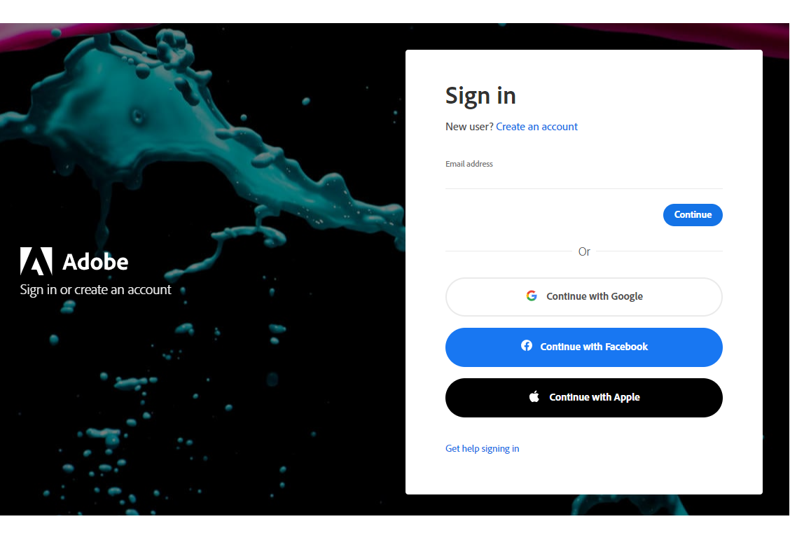
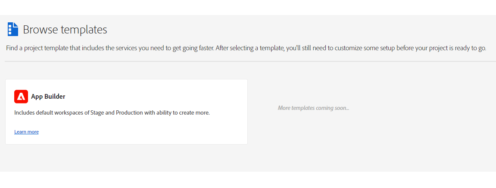
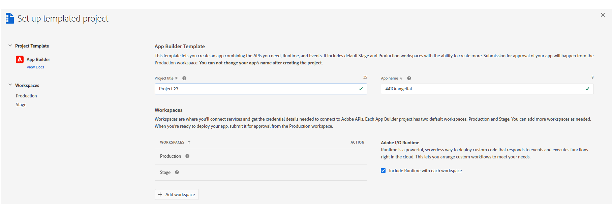
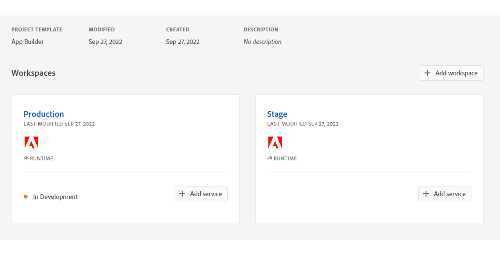
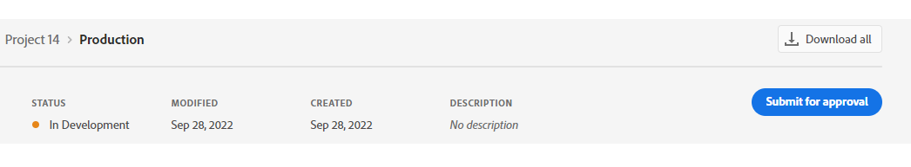
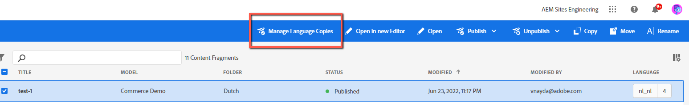

# AEM Content Fragments Console UI Extensions Development Guide

This guide includes step-by-step instructions for creating an UI (User Interface) extension for AEM (Adobe Experience Manager) Content Fragments Console using an extensibility template.

## Create a New Project in Adobe Developer Console

Adobe Developer Console gives you access to APIs, SDKs and developer tools to integrate, and extend Adobe products. 
In App Builder, you need access to AIO (Adobe I/O) Runtime credentials used for deploying your application, 
and access to API credentials if you want to access Adobe APIs in your application.

1. Sign in to [Adobe Developer Console](https://developer.adobe.com/console) with your Adobe ID



2. Choose your account


3. Choose your profile or organizzation


4. Make sure you are in a proper organization (a switcher in the right top corner).


5. Click "Create new project" -> "Project from template" 


and choose "App Builder"



6. Fill the project data


- `Project Title` is used to identify your project within [Adobe Developer Console](https://developer.adobe.com/console) and in [CLI](https://github.com/adobe/aio-cli).
- `App Name` will be used as a unique identifier for your application and this value cannot be changed after project creating.

After creating, you should see a new project generated with 2 default Workspaces.
Each App Builder project has two default workspaces: `Production` and `Stage`. You can add more workspaces as needed. 
The `Production` workspace is special, as it is used for the submission and distribution flow.



## Install the AIO CLI

Run the following command to install the latest version of AIO CLI if not installed.

> Important Notes:
> - You need to have at least version 9.1.0 of AIO CLI to use the available templates.

```shell
npm install -g @adobe/aio-cli
```

## Initialize the UI Extension Project using AIO CLI

> Important Notes:
> - You need to be connected to VPN to resolve dependency on a private package `@adobe/uix-guest` if you are outside Adobe’s offices.
> - You’ll also need to set up an NPM configuration in your machine to authenticate with the Adobe's Artifactory repos.
> - Please refer to `https://wiki.corp.adobe.com/display/Artifactory/NPM` and get your API key from `https://artifactory.corp.adobe.com/`

Run the following commands to set up the required NPM configuration if this is your first time.

```shell
curl -u<USERNAME>:<API_KEY> https://artifactory.corp.adobe.com/artifactory/api/npm/auth >> ~/.npmrc
npm config set registry "https://artifactory.corp.adobe.com/artifactory/api/npm/npm-adobe-platform-release/"
```

To bootstrap the project code, create a directory and run the following commands from that directory:

1. First, select the appropriate organization.

    ```shell
    ➜  demo-extension-project % aio app init
    ? Select Org:
      Alpha Org
    ❯ Adobe Org
      Beta Org 
      Delta Org
    ```

2. Then, select your project from within that organization.

    You can either select the project by scrolling or you can filter the list of projects by beginning to type the name of the project.

    ```shell
    ➜  demo-extension-project % aio app init
    ? Select Org: Adobe Org
    ? Select a Project, or press + to create new:
      service-account-test
    ❯ aem-cf-admin-ui-extension-demo
      new-cli-test-project
    ```

3. Select one of the search options to specify the templates that you are interested in.

    ```shell
    ➜  demo-extension-project % aio app init
    ? Select Org: Adobe Org
    ? Select a Project, or press + to create new: aem-cf-admin-ui-extension-demo
    ? What templates do you want to search for?
    ❯ All Templates 
      All Extension Points 
      Only Templates Supported By My Org
    ```

4. Select the template named @adobe/aem-cf-admin-ui-ext-tpl (Extensibility Template for AEM Content Fragment Console)

    ```shell
    ➜  demo-extension-project % aio app init
    ? Select Org: Adobe Org
    ? Select a Project, or press + to create new: aem-cf-admin-ui-extension-demo
    ? What templates do you want to search for? All Templates
    ✔ Downloaded the list of templates
    ? Choose the template(s) to install:
    |    | Template                             | Description                                                | Extension Point           | Categories           |
    |----|--------------------------------------|------------------------------------------------------------|---------------------------|----------------------|
    | ❯◉ | @adobe/aem-cf-admin-ui-ext-tpl *     | Extensibility Template for AEM Content Fragment Console    | aem/cf-console-admin/1    | action, ui           |
    |  ◯ | @adobe/generator-app-api-mesh *      | Extensibility template for Adobe API Mesh, for App Builder | N/A                       | action, graphql-mesh |
    |  ◯ | @adobe/generator-app-excshell *      | Extensibility template for generator-aio-app               | dx/excshell/1             | action, ui           |
    |  - | @adobe/generator-app-asset-compute * | Extensibility template for generator-aio-app               | dx/asset-compute/worker/1 | action               |
    
    * = recommended by Adobe; to learn more about the templates, go to https://adobe.ly/templates
    Bootstrapping code in: /Users/akayastha/Developer/Work/Projects/demos/demo-project
      create package.json
      create README.md
      create jest.setup.js
      create .env
      create .gitignore

    Changes to package.json were detected.
    Skipping package manager install.

      create .github/workflows/deploy_prod.yml
      create .github/workflows/deploy_stage.yml
      create .github/workflows/pr_test.yml
    ℹ Installing template @adobe/aem-cf-admin-ui-ext-tpl
    ℹ Installing npm package @adobe/aem-cf-admin-ui-ext-tpl
    
    found 0 vulnerabilities
    ✔ Installed npm package @adobe/aem-cf-admin-ui-ext-tpl
    ℹ Running template @adobe/aem-cf-admin-ui-ext-tpl

    AEM Content Fragment Admin UI Template Overview:

      * You have the option to generate boilerplate code for your extensible buttons.
      * You can get help regarding documentation at any time from the menu.
      * You can check out a sample demo project.
      * An App Builder project will be created with Node.js packages pre-configured.
    ```

5. Answer the prompts related to extension metadata.

    ```shell
    ? What do you want to name your extension? CF Admin Console Demo UI Extension
    ? Please provide a short description of your extension: Demo UI Extension for AEM Content Fragment Console
    ? What version would you like to start with? 0.0.1
    ```

6. The next prompt is implemented as a menu system and is designed to help you generate boilerplate code for your specific needs. When you are ready to complete the project creation, please select `I'm done`.

    ```shell
    ? What would you like to do next? (Use arrow keys)
      ──────────────
      Add a custom button to Action Bar 
      Add a custom button to Header Menu 
      Add server-side handler 
      ──────────────
    ❯ I'm done 
      I don't know 
    ```

7. Wait for the installation of project's package dependencies to complete.

    ```shell
    ? What would you like to do next? I'm done

    Extension Manifest for Code Pre-generation
    ------------------------------------------
    {
      "name": "CF Admin Console Demo UI Extension",
      "id": "cf-admin-console-demo-ui-extension",
      "description": "Demo UI Extension for AEM Content Fragment Console",
      "version": "0.0.1"
    }
        force package.json
      create app.config.yaml
      create src/aem/cf-console-admin-1/ext.config.yaml
      create src/aem/cf-console-admin-1/web-src/index.html
      create src/aem/cf-console-admin-1/web-src/src/config.json
      create src/aem/cf-console-admin-1/web-src/src/exc-runtime.js
      create src/aem/cf-console-admin-1/web-src/src/index.css
      create src/aem/cf-console-admin-1/web-src/src/index.js
      create src/aem/cf-console-admin-1/web-src/src/utils.js
      create src/aem/cf-console-admin-1/web-src/src/components/Constants.js
      create src/aem/cf-console-admin-1/web-src/src/components/Spinner.js
      create src/aem/cf-console-admin-1/web-src/src/components/App.js
      create src/aem/cf-console-admin-1/web-src/src/components/ExtensionRegistration.js
      create .babelrc
    ...
    found 0 vulnerabilities

    Sample code files have been generated.

    Next steps:
    1) Populate your local environment variables in the ".env" file
    2) You can use `aio app run` or `aio app deploy` to see the sample code files in action


    ✔ Finished running template @adobe/aem-cf-admin-ui-ext-tpl
    ✔ Installed template @adobe/aem-cf-admin-ui-ext-tpl
    Project initialized for Workspace Stage, you can run 'aio app use -w <workspace>' to switch workspace.
    ✔ App initialization finished!
    > Tip: you can add more actions, web-assets and events to your project via the 'aio app add' commands
    ```

## Test on Local Environment
From the same directory, begin by running the following command:

```shell
aio app run
```

This command will create an action in Adobe I/O Runtime. 
    
```shell
➜  demo-extension-project % aio app run
  create .vscode/launch.json

No change to package.json was detected. No package manager install will be executed.

To view your local application:
  -> https://localhost:9080
To view your deployed application in the Experience Cloud shell:
  -> https://experience.adobe.com/?devMode=true#/custom-apps/?localDevUrl=https://localhost:9080
press CTRL+C to terminate dev environment
```

Now your UI extension is reachable by the displayed URL on the Terminal. You can test your UI extension within your AEM Content Fragment Consle by passing the following parameters to your AEM Content Fragment Console URL:
- repo (host name of AEM instance): `repo=author-p7452-e12437.adobeaemcloud.com`
- ext (extension): `ext=https://localhost:9080`
- devMode (development mode): `devMode=true`

**Sample AEM Content Fragment Console URL:** `https://experience.adobe.com/?cq-aem-headless-ui-admin_version=PR-444-df883867ebbbc09c49b2df86018c4bce901c746a&ext=https://localhost:9080&devMode=true&repo=author-p7452-e12437.adobeaemcloud.com#/@sitesinternal/aem/cf/admin/`

## Deploy on Production

After deploying to `Stage` workgroup and testing, we are ready to deploy our application to `Production`.

The process is the same as for deploying to `Stage`, but first you need to switch the workgroup to `Production`.
From the same directory, run the following command.

```shell
aio app use -w Production
```

After switching the workgroup, we can build and deploy the UI extension with the following command.

```shell
aio app deploy
```

```shell
➜  demo-project % aio app deploy
ℹ no backend or a build already exists, skipping action build for 'aem/cf-console-admin/1'
✔ Building web assets for 'aem/cf-console-admin/1'
no backend, skipping action deploy 'aem/cf-console-admin/1'
✔ Deploying web assets for 'aem/cf-console-admin/1'
To view your deployed application:
  -> https://245265-959magentaaardwolf-stage.adobeio-static.net/index.html
To view your deployed application in the Experience Cloud shell:
  -> https://experience.adobe.com/?devMode=true#/custom-apps/?localDevUrl=https://245265-959magentaaardwolf-stage.adobeio-static.net/index.html
New Extension Point(s) in Workspace 'Stage': 'aem/cf-console-admin/1'
Successful deployment 🏄
```

To learn more about deployment, please refer to [Deploying the Application](https://developer.adobe.com/app-builder/docs/getting_started/first_app/#7-deploying-the-application) 
and [Deployment Overview](https://developer.adobe.com/app-builder/docs/guides/deployment/).

## Publish the UI Extension

When you’re ready to publish your UI extension, you will submit it for an approval from the Production workspace.



After the approval, your UI extension will be available at [Adobe Experience Cloud](https://experience.adobe.com/).

Also, data about your UI extension will be added to *Adobe App Registry* and will be reachable for Adobe Products.

This means, that the new functionality will be available in the AEM Content Fragment Console for your organization.



More details about publishing are described in [UI Extensions Management](../../../guides/publication/)
and [Additional Resources](https://developer.adobe.com/app-builder/docs/getting_started/publish_app/).


## Further Reading

<DiscoverBlock slots="heading, link, text"/>

[Local Environment Set Up](guides/dev-env)

Prepare your local environment for Content Fragments console UI extension development.

<DiscoverBlock slots="heading, link"/>

[First Extension](guides/hello-world)

Create your first AEM Content Fragments console UI extension.


<DiscoverBlock slots="heading, link"/>

[Implementation Patterns](guides/how-to)

Explore common use-cases for Content Fragments console UI extensions and how to solve them.

<DiscoverBlock slots="heading, link"/>

[Troubleshooting](guides/debug)

Resolve issue with Content Fragments console UI extension.
