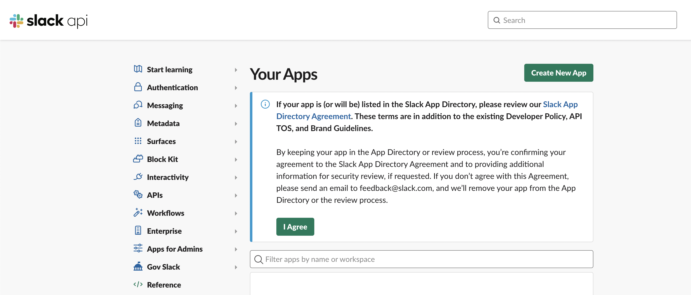
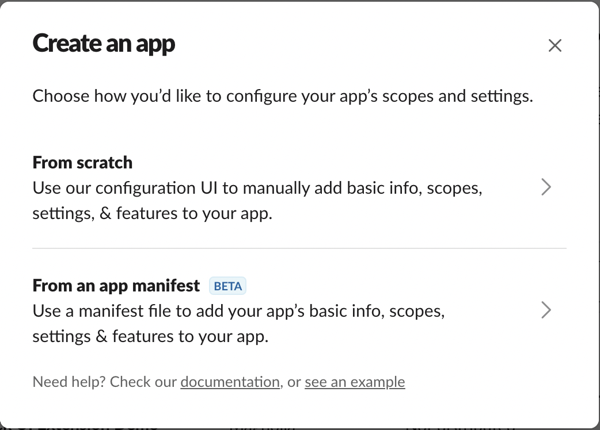
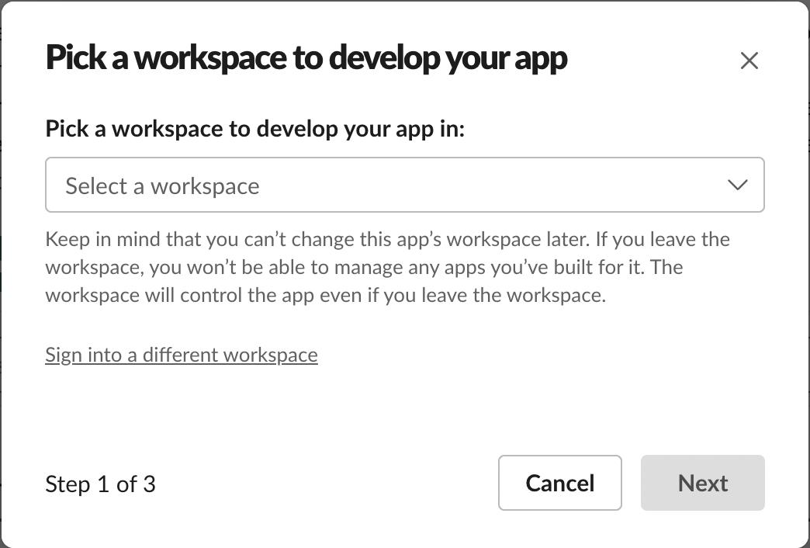
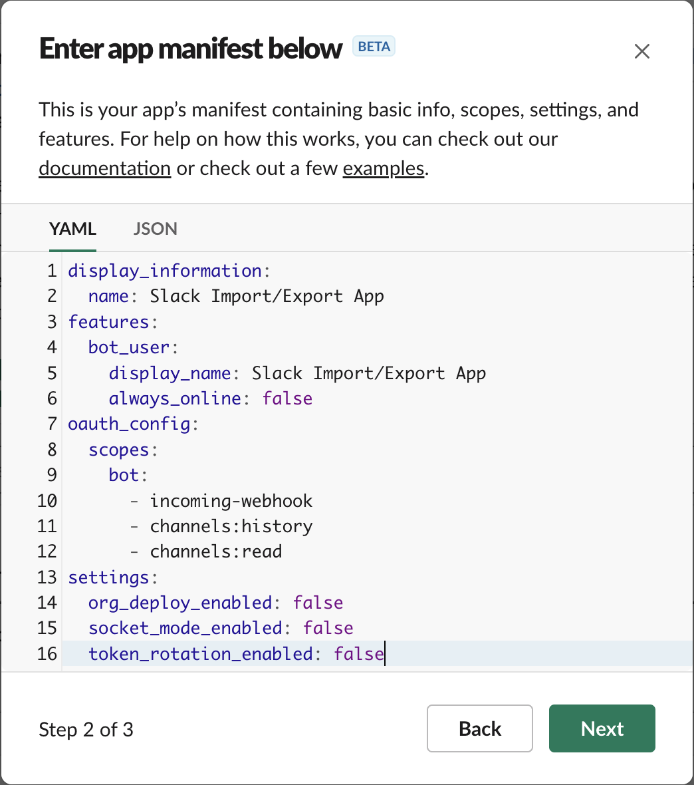
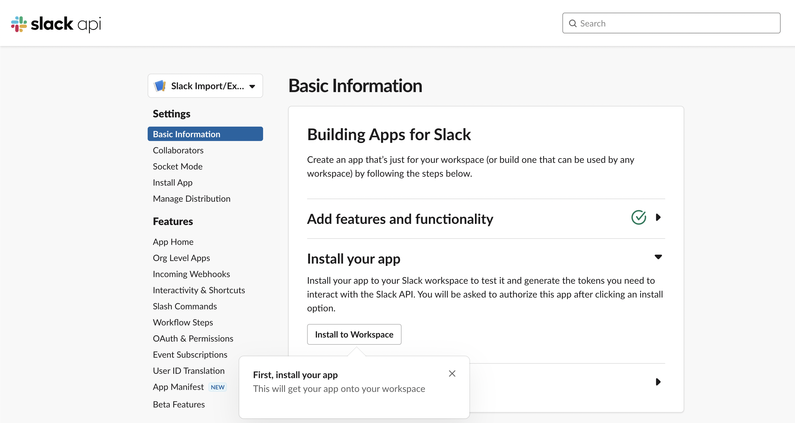
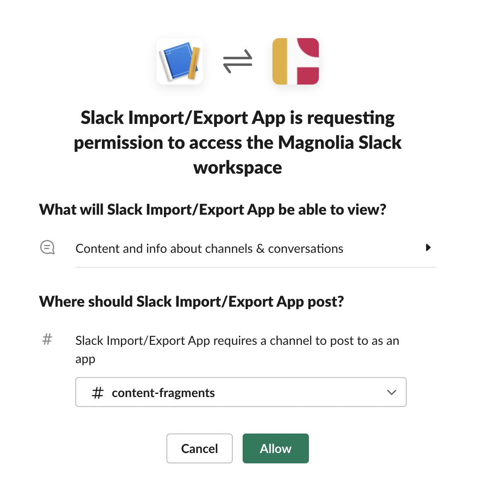
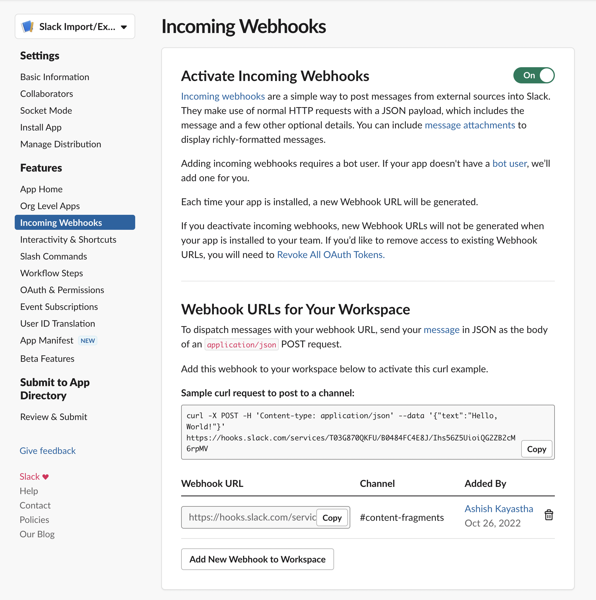
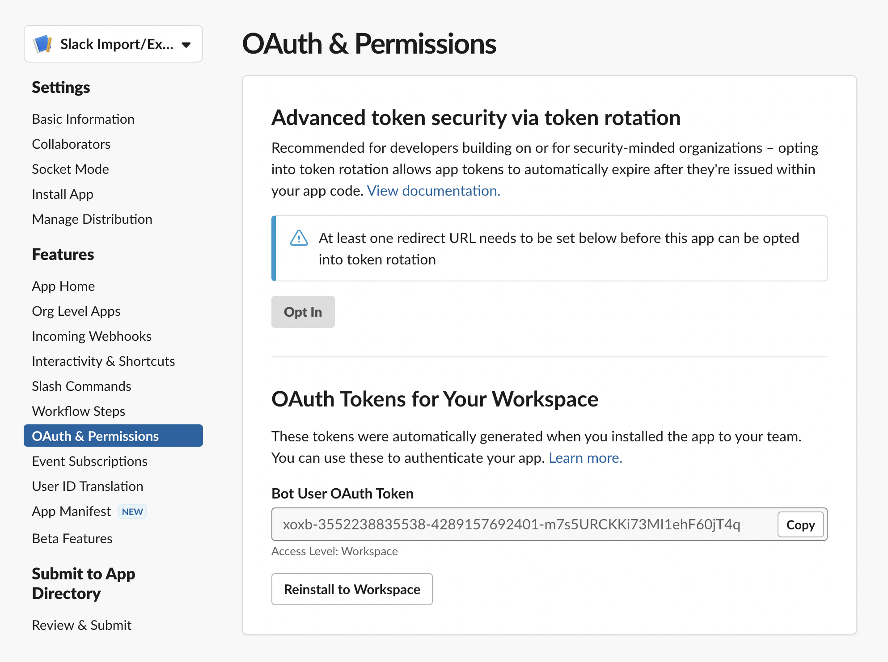
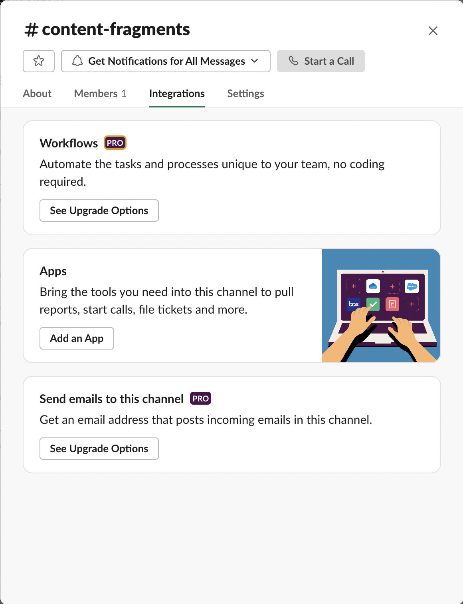

# Overview

This guide walks you through making a new Slack app using the Slack App Management UI and setting up the required scopes to allow the Slack Import/Export demo extension to interact with the Slack APIs.

By the end of this guide, your pre-generated Slack demo extension project will be ready for deployment and will have the ability to import/export the Content Fragment(s) between the Admin console and your selected Slack channel.

## Creating and Configuring a Slack App
First, you will need to sign in to your Slack account at `https://api.slack.com/apps`. 

1. Once signed in, create a new Slack app by clicking `Create New App` .



2. You will see a setup wizard modal dialog like the one below.
Choose how you would like to configure your app's scopes and settings. To make things simple, choose `From an app manifest`.



3. Next, you are prompted to pick a workspace to develop your app in. Select the one that you are interested in.



4. Next, you need to enter an app manifest either in YAML or JSON. The app's manifest contains basic info, scopes, settings, and features. Simply copy and paste the YAML below:
    ```
    display_information:
      name: Slack Import/Export App
    features:
      bot_user:
        display_name: Slack Import/Export App
        always_online: false
    oauth_config:
      scopes:
        bot:
          - incoming-webhook
          - channels:history
          - channels:read
    settings:
      org_deploy_enabled: false
      socket_mode_enabled: false
      token_rotation_enabled: false
    ```



5. Review the configuration of your Slack app and click `Create`.


6. Next, you need to install the newly created Slack app to your selected workspace by clicking the `Install to Workspace` button. This will also generate the tokens you need to interact with the Slack APIs.



7. Next, your Slack app needs permission to access the selected workspace. Choose the channel where you would like the Slack app to post and click `Allow`.



## Finding the Slack Configuration

Your Slack app should now be set up with the correct permissions and requested scopes. The incoming webhoook URL and OAuth token should also be generated.

1. You can find your Slack webhook URL by clicking `Incoming Webhooks` subsection under the `Features` section. You need to copy the shown URL and configure it in your App Builder extension project's `.env` file.



2. Similarly, you can find your Slack app's OAuth token by clicking `OAuth & Permissions` subsection under the `Features` section. Copy the token string called `Bot User OAuth Token` and configure it in your App Builder extension projects's `.env` file.



## Adding the Slack App to a Channel

Finally, you need to add the Slack app to your desired channel where you would like to post and read from. Open channel details by either right clicking on your desired channel (Side Bar) or click on the header of the channel. You can find the `Add an App` button in `Apps` section under the `Integrations` tab. Add your Slack app by clicking on that button.



You are now all set to deploy the Slack Import/Export demo extension in the AEM Content Fragments Admin Console.