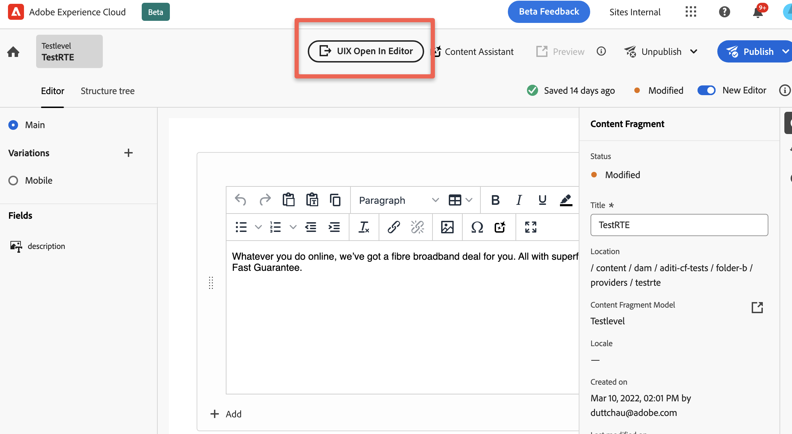

# Navigation

Describes basic methods for navigating within an extension.

## API to open Content Fragment from an extension

<InlineAlert variant="warning" slots="text" />

The Content Fragment will only open in the headless editor if the AemFeatures.ACTION_OPEN_NEW_EDITOR feature is enabled for the AEM instance.

```js
import { useEffect } from "react";
import { Text } from "@adobe/react-spectrum"
import { extensionId } from "./Constants"
import { register } from "@adobe/uix-guest";

function ExtensionRegistration() {
    useEffect(() => {
        const init = async () => {
            const registrationConfig = {
                id: extensionId,
                methods: {
                    headerMenu: {
                        getButtons() {
                            return [
                                {
                                    id: "example.open_in_editor",
                                    label: "UIX Open In Editor",
                                    icon: 'Export',
                                    variant: "primary",
                                    onClick: async () => {
                                        console.log("UIX Open In Editor has been pressed.");
                                        const contentFragment = await guestConnection.host.contentFragment.getContentFragment();
                                        // or any other content fragment path

                                        console.log(contentFragment.path);
                                        guestConnection.host.navigation.openEditor(contentFragment.path);
                                    },
                                },
                            ];
                        },
                    },
                },
            };
            const guestConnection = await register(registrationConfig);
        }
        init().catch(console.error)
    }, []);
    return <Text>IFrame for integration with Host (AEM)...</Text>
}

export default ExtensionRegistration;
```



**API Reference**

| Field                  | Type      | Required | Default | Description                                           |
|------------------------|-----------|--------|-----------|-------------------------------------------------------|
| fragmentPath           | `string`  | ✔️     |           | The path of the CF to be open.                        |
| shouldClearBreadcrumbs | `boolean` |        | `true`    | The flag to clear breadcrumbs when the CF page loads. |
