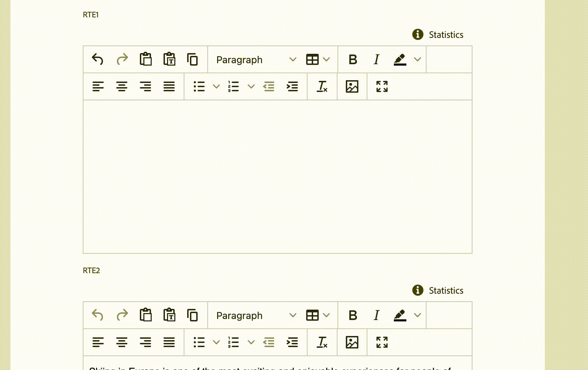

# Rich Text Editor Badges

A badge is a non-editable block inside RTE that could be styled differently and may have a custom behavior. At this point, the only custom behavior is that badges are non-editable and could be only removed as a whole item.
A badge could be added using the following API:

```js
rte: {
  getBadges: () => [
    {
      id: "variable",
      prefix: "!",
      suffix: "!",
      backgroundColor: "#D6F1FF",
      textColor: "#54719B"
    }
  ]
}
```

Where, prefix and suffix symbols define a badge boundaries in the text/html, backgroundColor and textColor define badge styling. Example:



## API Reference

### Extension API

| Field | Type | Required | Description |
| ----- | ---- | -------- | ----------- |
| id | `string` | ✔️    | **Must be unique** across all extensions. Consider adding a vendor prefix to this field. |
| prefix | `char` | ✔️   | Badge starting character |
| suffix | `char` | ✔️   | Badge ending character |
| backgroundColor | `string` | ✔️    | HEX or text CSS color code for the background |
| textColor | `string` | ✔️    | HEX or text CSS color code for the text |

### Instructions API

Widget window **MAY** call a `connection.host.rte.applyInstructions` method and provide RTE instruction to execute:

| Instruction | Value |  Description |
| ----- | ---- | ----------- |
| `replaceContent` | `string` | Replaces current editor content with a content provided in `value` property |
| `insertContent` | `string` | Inserts a content provided in `value` property in current carret position |
