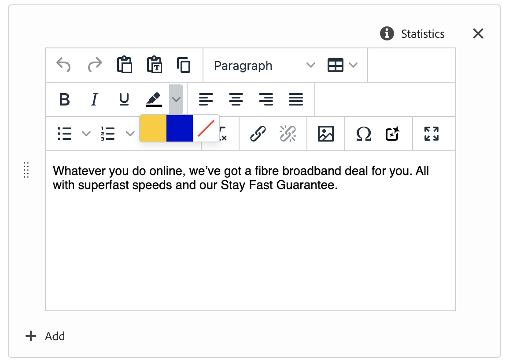
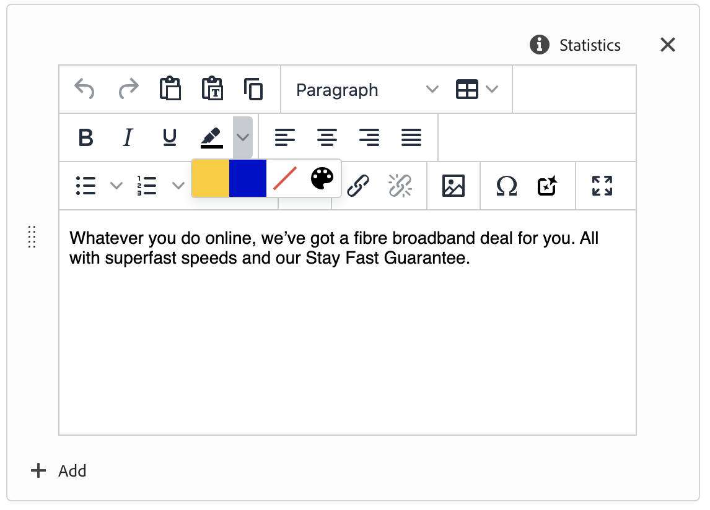

# Rich Text Editor Color Picker

The functionality allows extensions to set up predefined lists of colors for the color picker feature.

A colors could be customized using the following API:

```js
const registrationConfig = {
    id: extensionId,
    methods: {
        rte: {
            getColors() {
                return {
                    allowedColors: [
                        "FFCC00", "Yellow",
                        "0000CC", "Blue",
                    ],
                    isAllowedCustomColors: true,
                };
            },
        },
    },
};
const guestConnection = await register(registrationConfig);
```



With enabled `isAllowedCustomColors`:



## API Reference

### Extension API

| Field                 | Type       | Default | Required | Description                                                                                       |
|-----------------------|------------|---------|----------|---------------------------------------------------------------------------------------------------|
| allowedColors         | `string[]` |   -     |          | The option allows for specifying a map of the text colors that will appear in all color pickers. To add a color to the array, you need both its Hex or RGB value and the name that appears when hovered over in the color grid. Both values are necessary for each color in the color map. |
| isAllowedCustomColors | `boolean`  |         | false *  | The option allows enabling of custom colors in all color pickers within the editor.               |

The color options from different extensions will be merged together, providing a combined selection of colors. By default, if any configuration is provided for allowed colors, users will only be able to choose colors from the specified list and not from outside of it.

However, this behavior can be modified using the `isAllowedCustomColors` option. If this option is set to `true` in any of the extensions, it will enable the ability to choose colors in addition to the ones specified in the allowed colors list.
