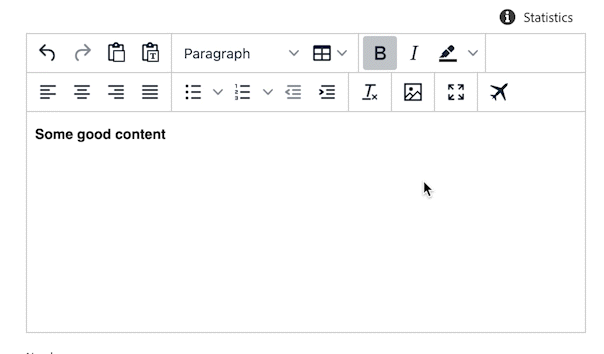

# Rich Text Editor Toolbar Custom Buttons

A Rich Text Editor is a core part of content editing software. With toolbar extensions you can add new custom buttons which modify the content:

```js
{
  rte: {
    getButtons: () => ([{
      id: "test-id",
      text: "Test button", //optional text near button
      tooltip: "Button alt text",
      icon: 'Airplane',
      onClick: (state) => {
        return [{
          type: "replaceContent",
          value: state.html + "<p> some new HTML </p>"
        }]
      }
    }])
  }
}
```



## API Reference

**Extension API**

| Field | Type | Required | Description |
| ----- | ---- | -------- | ----------- |
| id | `string` | ✔️    | **Must be unique** across all extensions. Consider adding a vendor prefix to this field. |
| text | `string` |     | A button text |
| tooltip | `string` | ✔️    | A text that will be rendered on mouse over event |
| icon | `string` |     | An icon field accepts workflow icon code from @spectrum-icons library - https://spectrum.adobe.com/page/icons/ |
| onClick | `callback(state): Instruction[]` |  ✔️  |  A callback for a button `onClick` event. The callback receives the editor `state` object as an argument and may return a list of instructions |

**`onClick` `state` argument API**

| Field | Type |  Description |
| ----- | ---- | ----------- |
| html | `string` | HTML representation of editor's content |
| text | `string` | Text representation of editor's content |
| selectedHtml | `string` | HTML representation of selected editor's content. Empty when there is no selection |
| selectedText | `string` | Text representation of selected editor's content. Empty when there is no selection |

**`onClick` instructions API**

`onClick` method **MUST** return a list of the following instructions (could be an empty list):

| Instruction | Value |  Description |
| ----- | ---- | ----------- |
| `replaceContent` | `string` | Replaces current editor content with a content provided in `value` property |

# Rich Text Editor Toolbar Standard Buttons

You can also add or remove standard Rich Text Editor buttons using a following contract:

```js
rte: {
  getCoreButtons: () => [
    {
      id: "h4",
      toolbarGroup: 3
    }
  ],
  removeButtons: () => [
    {
      id: "redo",
    },
    {
      id: "undo",
    }
  ],
}
```

## API Reference

**Extension API**

| Field | Type | Required | Description |
| ----- | ---- | -------- | ----------- |
| id | `button-id` | ✔️    | The `id` of a button. See avaialble button ids in a section below |
| toolbarGroup | `number` |     | An optional index of tabgroup to work with |

<details>
  <summary>Available button ids</summary>

`aligncenter` |  `alignjustify` |  `alignleft` |  `alignnone` |  `alignright` |  `blockquote` |  `backcolor` |  `bold` |  `copy` |  `cut` |  `fontselect` |  `fontsizeselect` |  `forecolor` |  `formatselect` |  `h1` |  `h2` |  `h3` |  `h4` |  `h5` |  `h6` |  `indent` |  `italic` |  `language` |  `lineheight` |  `newdocument` |  `outdent` |  `paste` |  `redo` |  `remove` |  `removeformat` |  `selectall` |  `strikethrough` |  `styleselect` |  `subscript` |  `superscript` |  `underline` |  `undo` |  `visualaid` |  `pastetext` |  `link` |  `openlink` |  `unlink` |  `table` |  `tablecellprops` |  `tablecopyrow` |  `tablecutrow` |  `tabledelete` |  `tabledeletecol` |  `tabledeleterow` |  `tableinsertdialog` |  `tableinsertcolafter` |  `tableinsertcolbefore` |  `tableinsertrowafter` |  `tableinsertrowbefore` |  `tablemergecells` |  `tablepasterowafter` |  `tablepasterowbefore` |  `tableprops` |  `tablerowprops` |  `tablesplitcells` |  `tableclass` |  `tablecellclass` |  `tablecellvalign` |  `tablecellborderwidth` |  `tablecellborderstyle` |  `tablecaption` |  `tablecellbackgroundcolor` |  `tablecellbordercolor` |  `tablerowheader` |  `tablecolheader` |  `code` |  `fullscreen` |  `bullist` |  `numlist` |  `charmap` |  `preview` |  `searchreplace` |  `visualblocks` |  `insertdatetime` |  `media` |  `anchor` |
</details>
