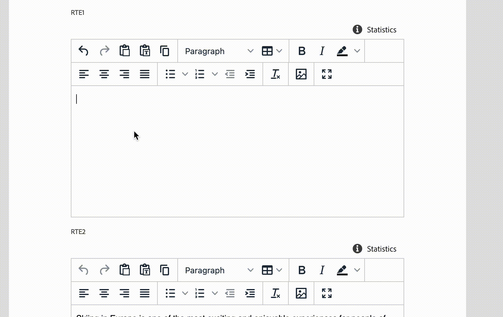

# Rich Text Editor Widgets

Widgets functionality provides a way to add UI of any complexity and seamlessly integrate these UIs in Rich Text Editor experiences. The widget could be introduced by the following code:

```js
rte: {
  getWidgets: () => [
    {
      id: "variable-list-widget",
      label: "My Variables",
      url: "/index.html#/variables",
    },
  ]
}
```

The code above will add a new `My Variables` context menu option to the dialog that could be triggered by pressing `{` key. This option will open a popup window with the content provided by specified `url`. This URL is relative to the extension, so if your extension is hosted on `abc.com` domain the result URL will be `abc.com/index.html#/variables`. On this URL your extension may render the UI of any complexity using the JS framework of your choice.



## API Reference

### Extension API

| Field | Type | Required | Description |
| ----- | ---- | -------- | ----------- |
| id | `string` | ✔️    | **Must be unique** across all extensions. Consider adding a vendor prefix to this field. |
| label | `string` | ✔️   | Widget name that will be listed in context menu |
| url | `string` | ✔️    | Relative URL to the widget content |

### Instructions API

Widget window **MAY** call a `connection.host.rte.applyInstructions` method and provide RTE instruction to execute:

| Instruction | Value |  Description |
| ----- | ---- | ----------- |
| `replaceContent` | `string` | Replaces current editor content with a content provided in `value` property |
| `insertContent` | `string` | Inserts a content provided in `value` property in current carret position |
