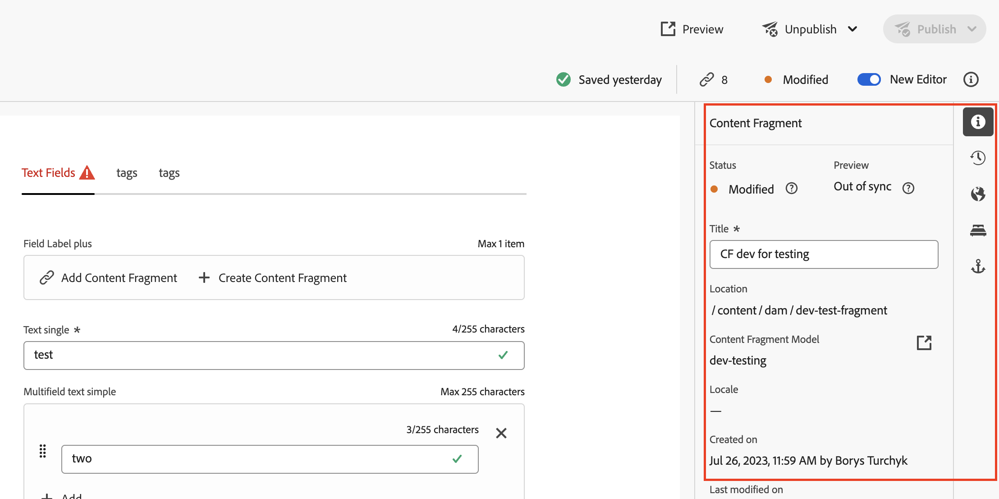

# Properties Rail

The properties rail is always present along the right side of Universal Editor. 
The extensibility feature allows adding new panels to it, ensuring seamless integration.



## Example of adding custom rail panels
This code snippets demonstrate how to create a custom panel using UIX SDK library and add it to the properties rail of the editor, 
enabling users to access and interact with the custom functionality seamlessly.

```js
// App.js

import { HashRouter as Router, Routes, Route } from "react-router-dom"
import ExtensionRegistration from "./ExtensionRegistration"
import RailContent from "./RailContent";

// ...

function App() {
    return (
        <Router>
            <ErrorBoundary onError={onError} FallbackComponent={fallbackComponent}>
                <Routes>
                    <Route index element={<ExtensionRegistration />} />
                    <Route
                        exact
                        path="index.html"
                        element={<ExtensionRegistration />}
                    />
                    <Route
                        exact path="rail/:railId"
                        element={<RailContent />}
                    />
                </Routes>
            </ErrorBoundary>
        </Router>
    )
    // ...
}

```
```js
// ExtensionRegistration.js

import { register } from "@adobe/uix-guest";

// ...

function ExtensionRegistration() {
    useEffect(() => {
        const init = async () => {
            const registrationConfig = {
                id: extensionId,
                methods: {
                    rightPanel: {
                        addRails() {
                            return [
                                {
                                    id: "my.company.panel_1",
                                    header: "Last Changes",
                                    url: '/#/rail/1',
                                    icon: 'Export',
                                },
                                {
                                    id: "my.company.panel_2",
                                    header: "Workflow",
                                    url: '/#/rail/2',
                                    hotkey: "w",
                                    icon: 'Import',
                                },
                            ];
                        },
                    },
                },
            };
            const guestConnection = await register(registrationConfig);
        }
        init().catch(console.error)
    }, []);
    return <Text>IFrame for integration with Host...</Text>
}
```
```js
// RailContent.js

import { attach } from "@adobe/uix-guest";

// ...

export default () => {
    const { railId } = useParams();
    if (!railId) {
        console.error('Rail id parameter is missed');
        return;
    }

    // If you need to interact with an AEM instance
     const connection = await attach({ id: extensionId });

    return (
        <Provider theme={lightTheme} colorScheme="light">
            Content generate by the extension Rail#{railId}
        </Provider>
    );
};

```

## API Reference
```ts
type RailExtensionApi = {
  rightPanel: {
    addRails(): ExtensionRail[];
  };
};

type ExtensionRail = {
  id: string;
  header: string;
  url: string;
  icon: string;
};

```
| Property        | Type       | Required | Description                                                                                                                                                                                                                                                                              |
|-----------------|------------|----------|------------------------------------------------------------------------------------------------------------------------------------------------------------------------------------------------------------------------------------------------------------------------------------------|
| `id`            | `string`   | ✔        | Rail panel identification                                                                                                                                                                                                                                                                |
| `header`        | `string`   | ✔        | Aria label for the rail button.                                                                                                                                                                                                                                                          |
| `url`           | `string`   | ✔        | Name of a [React-Spectrum workflow icon](https://react-spectrum.adobe.com/react-spectrum/workflow-icons.html#available-icons)                                                                                                                                                            |
| `icon`          | `string`   | ✔        | A number of pixels, a CSS value, or the string `auto`. The `auto` keyword will grow or shrink the modal to the width of the document in the iframe every time the guest document resizes, to a minimum of 20% and a maximum of 75% of window width. In fullscreen mode, this is ignored. |

### Limitation

Each click on the icon corresponding to the panel will result in the re-rendering of that panel. The panel content is not cached and will be re-rendered.
