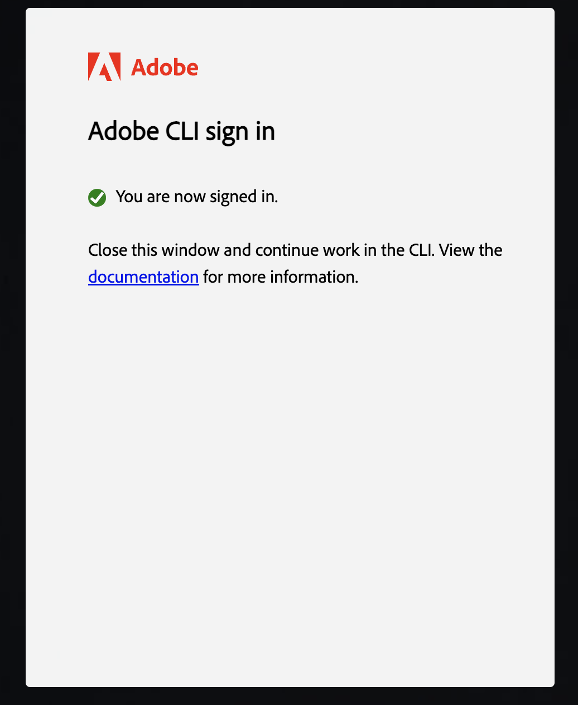

# Code Generation for AEM Content Fragments Editor Extension

The [AEM Content Fragment Editor Extension Template](https://github.com/adobe/aem-cf-editor-ui-ext-tpl) help developers to bootstrap their App Builder apps when using the [AIO CLI](https://github.com/adobe/aio-cli) and generates basic extension structure and all required code.

Template is optional to use, but we highly recommend it in order to save time and has less knowledge regarding internal UI Extensions structure.

The extension template generation tool allows you to generate stubs for all existing extension points, ensuring that all the necessary files are included.

Additionally, you can generate a demo project to observe and understand extensibility functionality in general.

## Check Requirements

Before starting, ensure that you have followed all the necessary requirements:

- Ensure that you have access to the [Adobe Developer Console](https://developer.adobe.com/developer-console/docs/guides/). If not, refer to the [How to Get Access](../../../guides/get-access) guide for instructions.
- Verify that you have already created an App Builder Project within your IMS Organization. If not, follow the steps outlined in the [Creating a Project in the Adobe Developer Console](../../../guides/creating-project-in-dev-console) guide.
- Make sure your local environment is properly set up and up to date. For instructions on setting up your local environment, refer to the [Local Environment Setup](../../../guides/local-environment).

## Launch code generation

<InlineAlert slots="text" />

You need to have latest AIO CLI version to use the  all available templates. Please refer to [Local Environment Set Up](../../../guides/local-environment).

### 1. Initialize a project

Create a project directory and execute the following commands from it.

```shell
demo-extension-project % aio app init
```

During the first run, a browser window will open, prompting you to log in to your organization. Once you have successfully logged in, you will see the desired result in the browser. You can then switch back to the command-line interface (CLI).



### 2. Select the appropriate organization and project

```shell
demo-extension-project % aio app init
? Select Org: (Use arrow keys or type to search)
    ❯ Alpha Org
      Beta Org 
```

You can either select the project by scrolling or you can filter the list of projects by beginning to type the name of the project.

Please make sure that the project is created within the selected organization, as mentioned in the requirements list at the beginning.

```shell
% aio app init
? Select Org: Alpha Org
? Select a Project, or press + to create new: (Use arrow keys or type to search)
❯ AEM CF Editor demo project 
  AEM CF Admin demo roject
  AEM Headless APIs and Events
```

### 3. Select the template

Select one of the search options to specify the templates that you are interested in (we recommend to use `All Extension Points`).

```shell
aio app init
? Select Org: Alpha Org
? Select a Project, or press + to create new: AEM CF Editor demo project
? What templates do you want to search for? 
  All Templates 
❯ All Extension Points 
  Only Templates Supported By My Org 
```

Using the `<Up and Down>` keys, please navigate and select the template named `@adobe/aem-cf-admin-ui-ext-tpl` (Extensibility template for AEM Content Fragment Editor) by pressing the `<Space>` key.

```shell
aio app init
? Select Org: Alpha Org
? Select a Project, or press + to create new: AEM CF Editor demo project
? What templates do you want to search for? All Extension Points
✔ Downloaded the list of templates
? Choose the template(s) to install: (Press <space> to select, <Up and Down> to move rows)
┌──────┬──────────────────────────────────────────────────────────────┬──────────────────────────────────────────────────────────────┬────────────────────────────────────────┬────────────────────────────────────────┐
│      │ Template                                                     │ Description                                                  │ Extension Point                        │ Categories                             │
├──────┼──────────────────────────────────────────────────────────────┼──────────────────────────────────────────────────────────────┼────────────────────────────────────────┼────────────────────────────────────────┤
? Choose the template(s) to install: (Press <space> to select, <Up and Down> to move rows)
┌──────┬──────────────────────────────────────────────────────────────┬──────────────────────────────────────────────────────────────┬────────────────────────────────────────┬────────────────────────────────────────┐
│      │ Template                                                     │ Description                                                  │ Extension Point                        │ Categories                             │
├──────┼──────────────────────────────────────────────────────────────┼──────────────────────────────────────────────────────────────┼────────────────────────────────────────┼────────────────────────────────────────┤
? Choose the template(s) to install: (Press <space> to select, <Up and Down> to move rows)
┌──────┬──────────────────────────────────────────────────────────────┬──────────────────────────────────────────────────────────────┬────────────────────────────────────────┬────────────────────────────────────────┐
│      │ Template                                                     │ Description                                                  │ Extension Point                        │ Categories                             │
├──────┼──────────────────────────────────────────────────────────────┼──────────────────────────────────────────────────────────────┼────────────────────────────────────────┼────────────────────────────────────────┤
│ ❯◉   │ @adobe/aem-cf-editor-ui-ext-tpl *                            │ Extensibility template for AEM Content Fragment Editor       │ aem/cf-editor/1                        │ action, ui                             │
├──────┼──────────────────────────────────────────────────────────────┼──────────────────────────────────────────────────────────────┼────────────────────────────────────────┼────────────────────────────────────────┤
│  ◯   │ @adobe/aem-cf-admin-ui-ext-tpl *                             │ Extensibility template for AEM Content Fragment Admin        │ aem/cf-console-admin/1                 │ action, ui                             │
│      │                                                              │ Console                                                      │                                        │                                        │
├──────┼──────────────────────────────────────────────────────────────┼──────────────────────────────────────────────────────────────┼────────────────────────────────────────┼────────────────────────────────────────┤
│  ◯   │ @adobe/generator-app-excshell *                              │ Extensibility template for generator-aio-app                 │ dx/excshell/1                          │ action, ui                             │
├──────┼──────────────────────────────────────────────────────────────┼──────────────────────────────────────────────────────────────┼────────────────────────────────────────┼────────────────────────────────────────┤
│  -   │ @adobe/generator-app-asset-compute *                         │ Extensibility template for generator-aio-app                 │ dx/asset-compute/worker/1              │ action                                 │
└──────┴──────────────────────────────────────────────────────────────┴──────────────────────────────────────────────────────────────┴────────────────────────────────────────┴────────────────────────────────────────┘

* = recommended by Adobe; to learn more about the templates, go to https://adobe.ly/templates
```

<InlineAlert slots="text" />

After choosing the template using the `<Up>` and `<Down>` keys, please remember to press the `<Space>` key to select it.

### 4. Fill in the extension name, description, and version

Please provide the necessary information for the extension metadata, including the human-readable name, description, and version. This data will be utilized during the generation process.

```shell
...
✔ Installed npm package @adobe/aem-cf-editor-ui-ext-tpl
ℹ Running template @adobe/aem-cf-editor-ui-ext-tpl

AEM Content Fragment Editor Template Overview:

  * You have the option to generate boilerplate code for your extension.
  * You can get help regarding documentation at any time from the menu.
  * You can check out a sample demo project.
  * An App Builder project will be created with Node.js packages pre-configured.

? What do you want to name your extension? myorg-cf-editor-test-extension
? Please provide a short description of your extension: A test extension for experimenting with functionalities
? What version would you like to start with? 0.0.1
? What would you like to do next? (Use arrow keys)
 ──────────────
❯ Add a custom button to Header Menu 
  Add Rich Text Editor (RTE) Toolbar Button 
  Add Rich Text Editor (RTE) Toolbar Widget 
  Add Rich Text Editor (RTE) Toolbar Badge 
  ──────────────
  I'm done
  I don't know
  ──────────────  
(Move up and down to reveal more choices)  
```

## Available generation options

You can generate code `stubs` for any combination of the following functionalities. Detailed information about each extension point can be found in the related section.

- Add [a custom button to Header Menu](../api/header-menu)
- Add [Rich Text Editor (RTE) Toolbar Button](../api/rte-toolbar)
- Add [Rich Text Editor (RTE) Toolbar Widget](../api/rte-widgets)
- Add [Rich Text Editor (RTE) Toolbar Badge](../api/rte-badges)

After generation, all necessary files for utilizing the chosen extension points will be created, and placeholders will be added in the generated texts to indicate where you can add your custom logic.

### Example: Header Menu Button and RTE Toolbar Widget generation

#### 1. Add a custom button to Header Menu

In the previous CLI dialog, please select `Add a custom button to Header Menu` and provide the desired button label. Additionally, you have the option to specify that a UI Modal should appear when the button is clicked. The UI Modal can contain custom UI elements.

In our example, we specified that the UI Modal functionality is required and should be included in the generated code. However, if you do not need any UI visualization during the button's onClick processing, you can skip this option.

```shell
? What do you want to name your extension? myorg-cf-editor-test-extension
? Please provide a short description of your extension: A test extension for experimenting with functionalities
? What version would you like to start with? 0.0.1
? What would you like to do next? Add a custom button to Header Menu
? Please provide label name for the button: Export data
? Do you need to show a modal for the button? y
```

#### 2. Add Rich Text Editor (RTE) Toolbar Widget

Afterwards, choose the `Add Rich Text Editor (RTE) Toolbar Widget` option and provide the desired label for the button.

As a final result, you will see the output in the CLI:

```shell
...
? What do you want to name your extension? myorg-cf-editor-test-extension
? Please provide a short description of your extension: A test extension for experimenting with functionalities
? What version would you like to start with? 0.0.1
? What would you like to do next? Add a custom button to Header Menu
? Please provide label name for the button: Export data
? Do you need to show a modal for the button? y
? What would you like to do next? Add Rich Text Editor (RTE) Toolbar Widget
? Please provide label name for the widget: RTE Widget Custom Functionallity
? What would you like to do next? 
  Add Rich Text Editor (RTE) Toolbar Widget 
  Add Rich Text Editor (RTE) Toolbar Badge 
  ──────────────
❯ I'm done 
  I don't know 
  ──────────────
```

#### 3. Generate final result

Now, you can select `I'm done` to initiate the generation process, which will include code generation and installation of project dependencies.

```shell
Sample code files have been generated.

Next Steps:
-----------
1) Populate your local environment variables in the ".env" file.
2) You can use `aio app run` or `aio app deploy` to see the sample code files in action.

✔ Finished running template @adobe/aem-cf-editor-ui-ext-tpl
✔ Installed template @adobe/aem-cf-editor-ui-ext-tpl
Project initialized for Workspace Stage, you can run 'aio app use -w <workspace>' to switch workspace.
✔ App initialization finished!
> Tip: you can add more actions, web-assets and events to your project via the 'aio app add' commands
```


<InlineAlert slots="text" />

The `extension-manifest.json` file is a system file that stores all of your choices made during the iteration prompts in the CLI. It allows you to generate new code without losing any previously generated code or configurations. In other words, you can run the generation process whenever you need it, and the `extension-manifest.json` file ensures that your previous choices are retained.

You can find the next steps, such as running the project locally and performing testing, in the "How to Run Locally" section.

## Demo project

If you are just starting to explore UI Extensibility and are unsure about certain options, don't hesitate to choose `I don't know.` option.

```shell
...
AEM Content Fragment Editor Template Overview:

  * You have the option to generate boilerplate code for your extension.
  * You can get help regarding documentation at any time from the menu.
  * You can check out a sample demo project.
  * An App Builder project will be created with Node.js packages pre-configured.

? What do you want to name your extension? myorg-cf-editor-test-extension
? Please provide a short description of your extension: A test extension for experimenting with functionalities
? What version would you like to start with? 0.0.1
? What would you like to do next? 
  Add Rich Text Editor (RTE) Toolbar Badge 
  ──────────────
  I'm done 
❯ I don't know 
  ──────────────
```

A couple of options will be proposed to you:

```shell
...
? What do you want to name your extension? myorg-cf-editor-test-extension
? Please provide a short description of your extension: A test extension for experimenting with functionalities
? What version would you like to start with? 0.0.1
? What would you like to do next? I don't know
? What about this then? (Use arrow keys)
  ──────────────
❯ Try a demo project based on React (ChatGPT support for Rich Text Editor) 
  Find some help 
  ──────────────
  Go back 

```

- `Try demo project` generates ready-to-use a sample extension that adds ChatGPT (an advanced language model developed by OpenAI) support to Rich Text Editor in Content Fragments Editor.
- `Find some help` displays list of useful links.

Please select the first option. It will generate a sample extension that adds a few custom buttons to the Rich Text Editor. Interacting with these buttons allows you to iterate with ChatGPT and make improvements to your text.

<InlineAlert slots="text" />

If you are using the same folder as in the previous example and want to retain the existing generated code, please keep the `extension-manifest.json` file. This file stores all of your choices made during the iteration prompts in the CLI. If you want to generate a new project without the previous examples, please remove the `extension-manifest.json` file before starting the demo project generation process.

CLI result of generations:

```shell
✔ Finished running template @adobe/aem-cf-editor-ui-ext-tpl
✔ Installed template @adobe/aem-cf-editor-ui-ext-tpl
Project initialized for Workspace Stage, you can run 'aio app use -w <workspace>' to switch workspace.
✔ App initialization finished!
> Tip: you can add more actions, web-assets and events to your project via the 'aio app add' commands
```

#### Populate local environment variables

The example project utilizes the OpenAI platform to facilitate interaction with ChatGPT, an advanced language model developed by OpenAI. It requires you to provide the necessary API keys for authentication. These API keys enable the project to communicate with the OpenAI services and access the functionalities provided by the platform.

You can obtain the OpenAI API keys by following these steps:

1. Go to the OpenAI website and log in to [your account](https://platform.openai.com/account/).
2. For the `OPENAI_API_KEY`, navigate to the API Keys page: https://platform.openai.com/account/api-keys.
3. For the `OPENAI_ORG`, go to the Organization Settings page: https://platform.openai.com/account/org-settings.
4. Once you have obtained the `OPENAI_API_KEY` and `OPENAI_ORG`, add them to the end of your `.env` file located in the project's root folder.

```bash
# project-folder/.env
...
OPENAI_API_KEY=[YOUR_OPENAI_API_KEY]
OPENAI_ORG=[YOUR_OPENAI_ORG]
```

<InlineAlert variant="warning" slots="text" />

Remember to keep your API key secure and avoid sharing it publicly. This file should not be committed to Git or other version control systems.

## Running UI Extension locally

Whether it's an extension with generated implementation of extension points or a demo extension, you can run the extension locally and verify the generated result.

From the extension project directory, begin by running the following command:

```shell
aio app run
```

This will deploy the actions to Adobe I/O Runtime, while running the UI part on the local machine.

```shell
➜  demo-extension-project % aio app run
  create .vscode/launch.json

No change to package.json was detected. No package manager install will be executed.

To view your local application:
  -> https://localhost:9080
To view your deployed application in the Experience Cloud shell:
  -> https://experience.adobe.com/?devMode=true#/custom-apps/?localDevUrl=https://localhost:9080
press CTRL+C to terminate dev environment
```

#### Accepting the certificate (First time users)

If you are using this application for the first time, you will see a message similar to

```shell
success: generated certificate
A self signed development certificate has been generated, you will need to accept it in your browser in order to use it.
Waiting for the certificate to be accepted.... timed out
```

This message pops up because we use a development SSL certificate for secure communication. Understand more about the purpose of this certificate [here](https://letsencrypt.org/docs/certificates-for-localhost/).

If you see this message, please navigate to `https://localhost:9080`, you should see a screen similar to this.


Click on `Advanced`, the nex screen may vary from browser to browser, but you should see a screen like this, where you can click on `Proceed to localhost (unsafe)` to accept the certificate.


### Previewing UI Extension with additional parameters in URL

As mentioned before, you should have access to an AEM instance. For example, your URL should be structured like this:

```termminal
https://experience.adobe.com/?repo=<CURTOMER_AEM_HOST>#/@<CUSTOMER_IMS_ORG>/aem/cf/admin/
```

- repo (host name of AEM instance): `repo=<CURTOMER_AEM_HOST>`

For previewing and testing, you don't need to [publish the extension](../../../guides/publication). Instead, you can add extra parameters in the URL:

- ext (extension): `ext=https://localhost:9080`
- devMode (development mode): `devMode=true` (required to allow access to resources on `production` env from localhost)

The final URL for local preview will look like:

```terminal
https://experience.adobe.com/?ext=https://localhost:9080&repo=<CURTOMER_AEM_HOST>#/@<CUSTOMER_IMS_ORG>/aem/cf/editor/editor/<PATH_TO_CONTENT_FRAGMENT>
```

The system will process these parameters, making it work as if the extension was published.

<InlineAlert slots="text" />

Please note that for testing purposes, we will be operating with an already created Content Fragment located at `PATH_TO_CONTENT_FRAGMENT`, which in this case is `/content/dam/dev-test-fragment`.

The result of the UI Extension's work:


## Short overview of generated components

### Routing

The component `src/aem-cf-editor-1/web-src/src/components/App.js` contains the routing of our application. We always have this generated file.

Our extension is responsible for rendering several things:

- The logic of registering our extension (it's the second required part of the extension).
- Any partial UI components that may render inside the host app, for example as the content of a pop-up when a button is clicked (optional).

If you need additional functionality, you can add new entry points and specify them in the routing after a generation.

### Extension registration

The component `src/aem-cf-editor-1/web-src/src/components/ExtensionRegistration.js` registers our extension with the host AEM instance as soon as it loads, so they can share data and communicate with each other.

Also, it contains the declaration of "what exactly and how we want" to customize the AEM Content Fragment Editor service. You can add your own custom customization declaration here.

### Pop-up content

- `src/aem-cf-editor-1/web-src/src/components/*Modal.js`
- `src/aem-cf-editor-1/web-src/src/components/*Widget.js`
- 
These components are optional and will be generated if you chose "adding UI" during project generation. They contain logic related to the UI and interaction with the user when certain buttons are clicked.

<InlineAlert variant="warning" slots="text" />

For further information regarding the common concepts in creating extensions, you can refer to the [Common Concepts in Creating Extensions](../api/commons).

## Known limitations

The current behavior is that if you generate extension point implementations and later add custom code, then run the generation process again to add new functionality, the custom code will be overwritten, while the data added during the generation CLI dialog (including previous and the latest) will be retained.

In future versions, a more intelligent mechanism will be introduced to merge the generated functionality with manually added code, allowing for a smoother integration of customizations.

## Related resources

<DiscoverBlock slots="link, text"/>

[AEM Content Fragment Editor](../)

Read about AEM Content Fragments Editor Extensibility

<DiscoverBlock slots="link, text"/>

[Common Concepts in Creating Extensions](../api/commons)

Learn about common concepts, extension registration, and methods that can be used in any extension

<DiscoverBlock slots="link, text"/>

[UI Extensions Development Flow](../../../guides/development-flow)

Learn how to implement, test and deploy your own UI Extensions with Adobe App Builder
