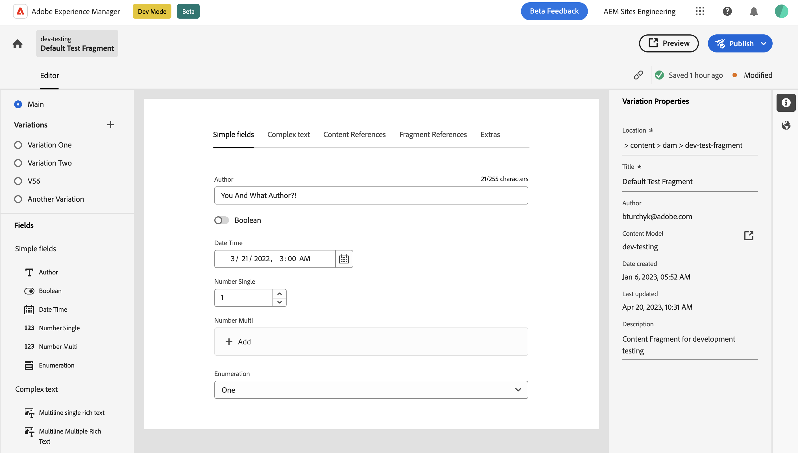

# AEM Content Fragment Editor

The [AEM](https://experienceleague.adobe.com/docs/experience-manager.html) Headless Content Fragment and Model Editor is a  UI service that provides a user-friendly way to edit Content Fragments and Models within Adobe Experience Manager (AEM). 

In this section, you will find the available extension points and examples of how to utilize them.

