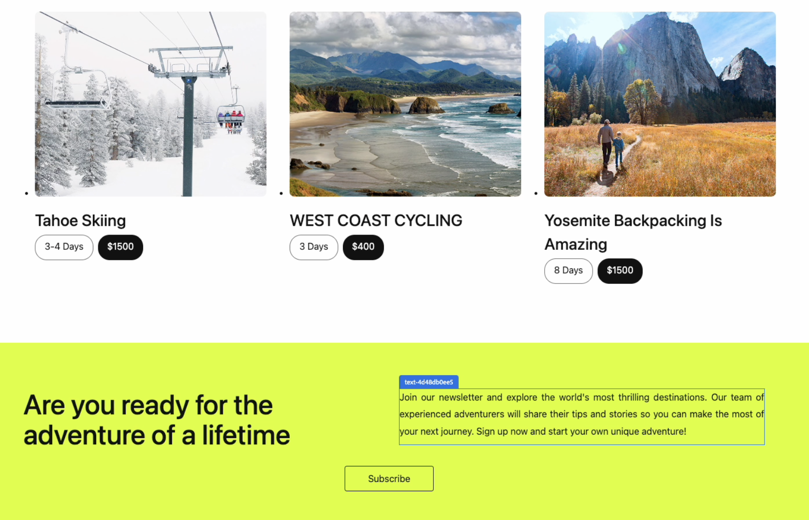

# Actions that can be performed from extensions

Understand the fundamentals required to develop an extension for the Universal Editor.

## List of actions:

### Navigate To

Universal Editor provides `navigateTo` action, enables switching the URL to the editor content page from the extension.
To execute this action, an extension developer can call the navigateTo method on connection.host.editorActions and provide the new content URL as a parameter.

#### API
Method: `navigateTo`

| Param      | Type     | Description                                                                                                                                                                                                                        |
|------------|----------|------------------------------------------------------------------------------------------------------------------------------------------------------------------------------------------------------------------------------------|
| href       | `string` | Path to the content page                                                                                                                                                                                                           |


Example: 
```ts
guestConnection.host.editorActions.navigateTo(href: string);

```

### Select Editables
The `selectEditables` action allows an extension developer to select an editable block for editing. An editable block refers to the portion of content that can be modified within the Universal Editor.

Editable block example:


The extension developer can retrieve the list of all editable blocks from the [editor state](https://developer.adobe.com/uix/docs/services/aem-universal-editor/api/data/#editor-state). This can be achieved by using `await guestConnection.host.editorState.get()` api.

#### API

Method: `selectEditables`

| Param      | Type                | Description                     |
|------------|---------------------|---------------------------------|
| editables       | `Array` | The list of Editables to select |

Example: `guestConnection.host.editorActions.selectEditables(editables: Editable[]);`

### Update

The update action enables an extension developer to modify the data within a specific editable block.

At present, only a single field can be updated per call, and only the replace operation is supported. If the provided patch does not adhere to these rules, an error will be triggered.


#### API

Method: `update`

| Param      | Type     | Description                                          |
|------------|----------|------------------------------------------------------|
| target       | `Object` | The editable to update                               |
| patch       | `Arrap`  | The path to the specific edirable property to update |

Example:
`guestConnection.host.editorActions.update({ target: Target, patch: JSONPatch });`

Example for updating a field with the name title:
`update({ target: { editable }, patch: [{ op: "replace", path: "/title", value: "New title" }] })`


