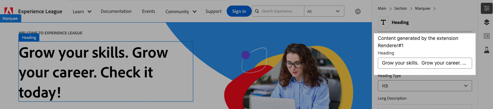

# Custom element rendering for properties rail by data-type

This feature allows third-party developer to build custom input UI for specific data types in the Universal Editor. 
The custom UI is rendered in an iframe and replaces the standard UI for the field in the [properties rail](https://experienceleague.adobe.com/en/docs/experience-manager-cloud-service/content/sites/authoring/universal-editor/authoring#properties-rail).



## Define override rules

An UIX extension can define a custom renderer to replace the standard UI  with an iframe, which then renders the custom UI provided by the extension.
Check this document to learn about available [data types for universal editor](https://experienceleague.adobe.com/en/docs/experience-manager-cloud-service/content/implementing/developing/universal-editor/attributes-types#item-types). 
```js
function ExtensionRegistration() {
  const init = async () => {
    const guestConnection = await register({
      id: extensionId,
      methods: {
        canvas: {
          getRenderers() {
            return [
              {
                dataType: "text",
                url: '/#/renderer/1'
              },
              {
                dataType: "custom-type",
                url: '/#/renderer/2',
              },
            ];
          },
        },
      },
    });
  };
  init().catch(console.error);

  return <Text>IFrame for integration with Host (AEM)...</Text>;
}
```

## Implement custom rendering logic

1. Define the router in the extension application to handle the custom rendering of the field.
```js
function App() {
  return (
    <Router>
      <ErrorBoundary onError={onError} FallbackComponent={fallbackComponent}>
        <Routes>
            <Route index element={<ExtensionRegistration />} />
            <Route
                exact
                path="index.html"
                element={<ExtensionRegistration />}
            />
            <Route
                exact path="renderer/:rendererId"
                element={<TypeRenderer />}
            />
        </Routes>
      </ErrorBoundary>
    </Router>
  )

  // Methods

  // error handler on UI rendering failure
  function onError(e, componentStack) {}

  // component to show if UI fails rendering
  function fallbackComponent({ componentStack, error }) {
    ...
}

export default App
```

2. Implement custom field renderer

```js
export default () => {
    const [isLoading, setIsLoading] = useState(true);
    const [connection, setConnection] = useState();
    const [model, setModel] = useState();
    const [value, setValue] = useState();
    const [error, setError] = useState();
    const [validationState, setValidationState] = useState();

    const { rendererId } = useParams();
    if (!rendererId) {
        console.error('Renderer id parameter is missed');
        return;
    }

    useEffect(() => {
        const init = async () => {
            // connect to the host 
            const connection = await attach({ id: extensionId });
            setConnection(connection);
            // get model
            setModel(await connection.host.field.getModel());
            // get field value
            setValue(await connection.host.field.getValue());
            // get field error
            setError(await connection.host.field.getError());
            // get field validation state
            setValidationState(await connection.host.field.getValidationState());
            setIsLoading(false);
        };
        init().catch((e) =>
            console.log("Extension got the error during initialization:", e)
        );
    }, []);

    const onChangeHandler = (v) => {
        console.log("onChange on extension side", v);
        connection.host.field.onChange(v);
    };

    return (
        <Provider theme={lightTheme} colorScheme="light">
            {!isLoading ? (
                <>
                    Content generated by the extension Renderer#{rendererId}
                    <Flex direction="column" gap="size-65" marginBottom="size-100">
                        <TextField
                            validationState={error ? "invalid" : validationState}
                            label={model.multi ? null : model.label}
                            aria-label={model.label || model.name}
                            defaultValue={value}
                            maxLength={model.validation.maxLength}
                            isReadOnly={model.readOnly}
                            isDisabled={model.readOnly}
                            isRequired={model.required}
                            errorMessage={error}
                            onChange={onChangeHandler}
                            width="100%"
                        />
                    </Flex>
                </>
                ) : (
                <View width="97%" height="100%">
                    <Spinner />
                </View>
                )}
        </Provider>
    );
};

```

## Extension Registration Reference

| Field       | Type     | Required | Description                                                                                                                                                               |
|-------------|----------|---------|---------------------------------------------------------------------------------------------------------------------------------------------------------------------------|
| url         | `string` |  ✔️     | URL of the page to load in the iframe that will replace the original field. The URL must have the same origin as the extension declaring the rules for field replacement. |
| dataType    | `string` |  ✔️     | Value of `data-aue-type`                                                                                                                                                                 |
| icon        | `string`  |         | Icons to be displayed in the properties rail if data type is matched.                                                                                                     |
## Field Reference

```js
{
    await connection.host.field
}
```
| Methods  | Description                                                                                                                                                               |
|----------|---------------------------------------------------------------------------------------------------------------------------------------------------------------------------|
| `getModel`  | Returns the model of the field.                                                                                                                                           |
| `getValue`  | Returns the value of the field.                                                                                                                                           |
| `getError`  | Returns the error of the field.                                                                                                                                           |
| `getValidationState` | Returns the validation state of the field.                                                                                                                                           |
| `onChange`  | Sets the value of the field.                                                                                                                                           |
| `setHeight` | Sets the height of the field.                                                                                                                                           |