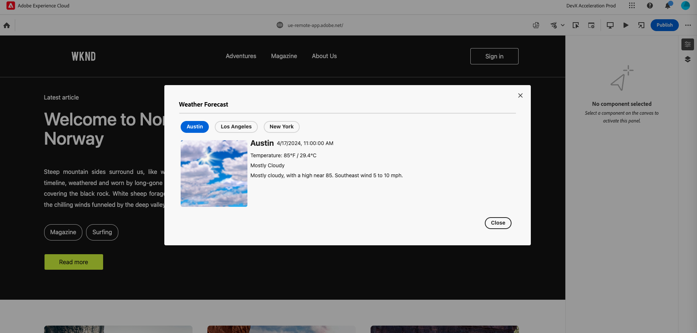

# Modal dialogs

Describes basic methods for using modals dialogs within an extension.

The Universal Editor (host instance) provides an API for showing modal dialogs with custom UI defined by an extension. These modals can be triggered by a click on the button or other events. Modal API is defined in the `modal` namespace.

Content of the modal is rendered in an iframe with source defined by extension. Before showing modal you should create a page which renders Modal UI. This UI should use Adobe Spectrum UI library to provide consistent experience to the user.

## An example of opening and closing a modal

In order to display modal dialog extension must call `showUrl` method in `modal` namespace.

```js
import { useEffect } from "react";
import { Text } from "@adobe/react-spectrum"
import { extensionId } from "./Constants"
import { register } from "@adobe/uix-guest";

function ExtensionRegistration() {
  useEffect(() => {
    const init = async () => {
      const guestConnection = await register({
        id: "my.company.extension-with-modal",
        methods: {
          headerMenu: {
            getButtons() {
              return [
                {
                  id: "example.button.actionWithSubItems",
                  label: "UIX Sub Items",
                  variant: "action",
                  icon: 'PublishCheck', // Spectrum workflow icon code from https://spectrum.adobe.com/page/icons/
                  subItems: [
                    {
                      id: 'modalDialog',
                      label: 'Modal Dialog',
                      icon: 'PublishSchedule',
                      onClick: async () => {
                        console.log('Button has been pressed.');
                        url: "/index.html#/modal", // absolute or relative path
                            guestConnection.host.modal.showUrl({
                              title: 'Modal Dialog: ',
                              url,
                              width: '900px',
                            });
                      },
                    },
                  ],
                }
              ]
            }
          }
        }
      });
    }
    init().catch(console.error)
  }, []);
  return <Text>IFrame for integration with Host...</Text>
}

export default ExtensionRegistration
```

Modal may be closed by `close` method

```js
import React, { useState, useEffect } from "react";
import { attach } from "@adobe/uix-guest";
import {
  Provider,
  Content,
  defaultTheme,
  Button
} from "@adobe/react-spectrum";

export default ModalComponent = () => {
  const [guestConnection, setGuestConnection] = useState(null);


  useEffect(() => {
    (async () => {
      const guestConnection = await attach({ id: "my.company.extension-with-modal" });

      setGuestConnection(guestConnection);
    })();
  }, []);

...
  const onCloseHandler = () => {
    guestConnection.host.modal.close();
  };
  ...
    return (
        <Provider theme={defaultTheme} colorScheme="light">
            <Content width="100%">
            ...
                <Button variant="primary" onPress={onCloseHandler} position="fixed" bottom="0px" right="8px">
                    Close
                 </Button>
            </Content>
        </Provider>
    );
 }
    
  
```


## API Reference

### Modal API Request Object

The `modal.showUrl` and `modalInstance.set` methods accept a `ModalRequest` object.

| Property  | Type                                     | Required | Default | Description                                                                                                                                                                                                                                                                                                                                                                                                                                                                                                                                                                         |
|-----------|------------------------------------------|----------|---------|-------------------------------------------------------------------------------------------------------------------------------------------------------------------------------------------------------------------------------------------------------------------------------------------------------------------------------------------------------------------------------------------------------------------------------------------------------------------------------------------------------------------------------------------------------------------------------------|
| `url`     | `string`                                 | ✔️       |         | URL of the page to load in the dialog frame. The URL must have the same origin as the extension making the modal request.                                                                                                                                                                                                                                                                                                                                                                                                                                                           |
| `title`   | `string`                                 | ✔️       |         | Title of the modal to display.                                                                                                                                                                                                                                                                                                                                                                                                                                                                                                                                                      |
| `height`  | `string` <br /> `number` <br /> `"auto"` |          | `auto`  | A number of pixels, a CSS value, or the string `auto`. The `auto` keyword will grow or shrink the modal to the height of the document in the iframe every time the guest document resizes, to a minimum of 20% and a maximum of 75% of window height. In fullscreen mode, this is ignored.                                                                                                                                                                                                                                                                                          |
| `width`   | `string` <br /> `number` <br /> `"auto"` |          | `auto`  | A number of pixels, a CSS value, or the string `auto`. The `auto` keyword will grow or shrink the modal to the width of the document in the iframe every time the guest document resizes, to a minimum of 20% and a maximum of 75% of window width. In fullscreen mode, this is ignored.                                                                                                                                                                                                                                                                                            |
| `fullscreen` | `boolean`                             |          | `false` | Display the dialog as large as possible. It will overlay most of the application, leaving small borders to indicate overlay. If true, any "width" and "height" parameters will be ignored.                                                                                                                                                                                                                                                                                                                                                                                          |
| `isDismissable` | `boolean`                          |          | `true`  | Show the dismiss button, so a user can close the modal no matter what state it is in. If an extension disables this, it must provide its own UI control which calls `modal.close()`.                                                                                                                                                                                                                                                                                                                                                                                                |
| `loading` | `boolean`                                |          | `false` | Preserve the progress spinner that displays before the modal contents load. When `false` or unset, the modal will show a progress spinner until the guest in the iframe is connected, and then display the frame contents. If the `modal.showUrl()` call sets `{ loading: true }`, the spinner will continue displaying after the guest has connected, until the guest calls `modal.set({ loading: false })`. A modal which needs to do data fetching or layout adjustment after connecting should set `{ loading: true }` and then dismiss it from the modal when its UI is ready. |

### Modal API

The modal API is available to all extensions at the host.modal property.

#### `modal.showUrl(request: ModalRequest): Promise<ModalInstanceApi>`

Any guest's GuestServer may call `modal.showUrl` to open a modal dialog. The provided `ModalRequest` object must have a `url` of the page to be displayed inside the modal. Typically this is another page or route in the calling extension app.

If another modal is displaying and it belongs to a different extension, it rejects.

#### `modal.close(): Promise<void>`

Close the current modal. If the current modal doesn't belong to the calling extension, it rejects.

### Modal Instance API

This API is returned to the GuestServer and also shared with the modal that loads inside the frame. A GuestServer loaded in a modal must call `set` instead of `showUrl`.

#### `modal.set(request: ModalRequest): Promise<void>`

Modify the currently displaying modal. GuestUI frames running inside the modal may call this method to change their dimensions, or to change other parameters.

#### `modal.close(): Promise<void>`

Close the modal.

### Resizing

When `height` and/or `width` are set to `"auto"`, the modal will attempt to resize whenever the displayed page changes size. This is to make the content of the iframe behave, as much as possible, like they're part of the content flow of the host application.

- ⚠️ Resizes are detected every 100ms.
- ⚠️ Height is limited to between 20% and 75% of page height, and width is similarly limited.
- ⚠️ **If the page sets certain kinds of relative dimensions on its body elements, such as `99vh` or `101vmin`, it can cause slow expansion or contraction of the displayed frame.** Those measurements change as the outer document resizes the inner document, which triggers a loop. Remedy this by using other units to define the outside of your app.
