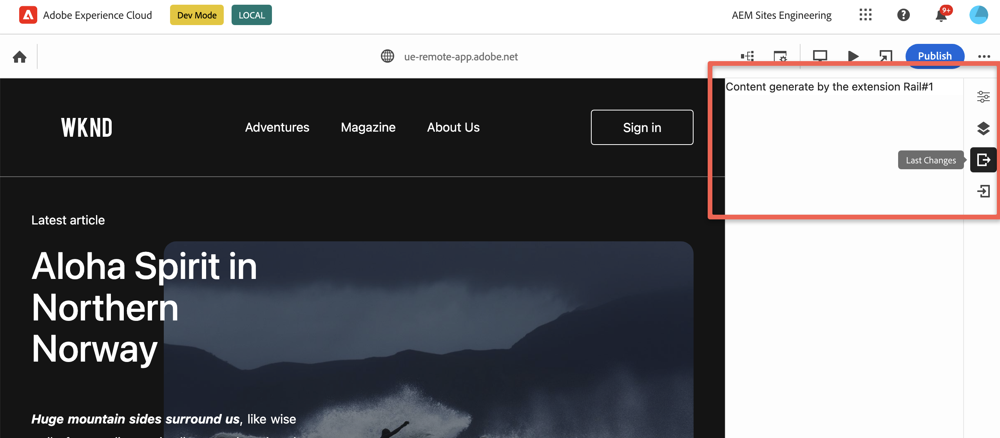

# Properties Rail

The [properties rail](https://experienceleague.adobe.com/en/docs/experience-manager-cloud-service/content/sites/authoring/universal-editor/authoring#properties-rail) is always present along the right side of [Universal Editor](../../). The extensibility feature allows adding new panels to it, ensuring seamless integration.


## Example of adding custom panels

This code snippets demonstrate how to create a custom panel using [UIX SDK](https://github.com/adobe/uix-sdk) library and add it to the properties rail of the editor, enabling users to access and interact with the custom functionality seamlessly.

```js
// App.js

import { HashRouter as Router, Routes, Route } from "react-router-dom"
import ExtensionRegistration from "./ExtensionRegistration"
import RailContent from "./RailContent";

// ...

function App() {
    return (
        <Router>
            <ErrorBoundary onError={onError} FallbackComponent={fallbackComponent}>
                <Routes>
                    <Route index element={<ExtensionRegistration />} />
                    <Route
                        exact
                        path="index.html"
                        element={<ExtensionRegistration />}
                    />
                    <Route
                        exact path="rail/:railId"
                        element={<RailContent />}
                    />
                </Routes>
            </ErrorBoundary>
        </Router>
    )
    // ...
}
```

```js
// ExtensionRegistration.js

import { register } from "@adobe/uix-guest";

// ...

function ExtensionRegistration() {
    useEffect(() => {
        const init = async () => {
            const registrationConfig = {
                id: extensionId,
                methods: {
                    rightPanel: {
                        addRails() {
                            return [
                                {
                                    id: "my.company.panel_1",
                                    header: "Last Changes",
                                    url: '/#/rail/1',
                                    icon: 'Export',
                                },
                                {
                                    id: "my.company.panel_2",
                                    header: "Workflow",
                                    url: '/#/rail/2',
                                    hotkey: "w",
                                    icon: 'Import',
                                },
                            ];
                        },
                    },
                },
            };
            const guestConnection = await register(registrationConfig);
        }
        init().catch(console.error)
    }, []);
    return <Text>IFrame for integration with Host...</Text>
}
```

```js
// RailContent.js

import { attach } from "@adobe/uix-guest";

// ...

export default () => {
    const { railId } = useParams();
    if (!railId) {
        console.error('Rail id parameter is missed');
        return;
    }

    // If you need to interact with an AEM instance
     const connection = await attach({ id: extensionId });

    return (
        <Provider theme={lightTheme} colorScheme="light">
            Content generate by the extension Rail#{railId}
        </Provider>
    );
};

```



## API Reference

### Extension registration API

The interface available for use from the extension side can be described using the following TypeScript types (although TypeScript usage is not mandatory):

```js
type RailExtensionApi = {
  rightPanel: {
    addRails(): ExtensionRail[];
  };
};

type ExtensionRail = {
  id: string;
  header: string;
  url: string;
  icon: string;
  hotkey?: `${ModifierType}${KeyType}`;
};
```

| Field     | Type                                                                        | Required | Description                                                                                                                                                  |
|-----------|-----------------------------------------------------------------------------|----------|--------------------------------------------------------------------------------------------------------------------------------------------------------------|
| id        | `string`                                                                    | ✔️       | **Must be unique** across all extensions. Consider adding a vendor prefix to this field                                                                      |
| header    | `string`                                                                    | ✔️       | The tooltip that appears when hovering over the tool icon and the header of the panel                                                                        |
| url       | `string`                                                                    | ✔️       | The URL of the page to be loaded into the iframe, serving as the content source for the panel.                                                               |
| icon      | `string`                                                                    | ✔️       | Name of a [React-Spectrum workflow icon](https://react-spectrum.adobe.com/react-spectrum/workflow-icons.html#available-icons)                                |
| hotkey    | `string`                                                                    |          | The hotkey field allows you to define keyboard shortcuts or hotkeys. Ensure uniqueness and avoid conflicts with system-wide functions when defining hotkeys. |

#### hotkey

You can combine modifiers like `shift`, `ctrl`, `alt`, or `cmd` with alphanumeric keys (A-Z, 0-9) or special keys such as `minus`, `equal`, or arrow keys. Ensure uniqueness and avoid conflicts with system-wide functions when defining hotkeys.

ModifierType could be combinations of: `shift+`, `ctrl+`, `alt+`, `cmd+`, `shift+ctrl+`, `shift+alt+`, `shift+cmd+`, `ctrl+alt+`, `ctrl+cmd+`, `alt+cmd+`, `shift+ctrl+alt+`, `shift+ctrl+cmd+`, `shift+alt+cmd+`, `ctrl+alt+cmd+`, `shift+ctrl+alt+cmd+`, ``.

KeyType could be: Alphanumeric keys `(A-Z, 0-9)`, `minus`, `equal`, `bracketleft`, `bracketright`, `backslash`, `semicolon`, `quote`, `comma`, `period`, `slash`, `backquote`, `enter`, `escape`, `backspace`, `tab`, `insert`, `home`, `end`, `pageup`, `pagedown`, `delete`, `arrowup`, `arrowdown`, `arrowleft`, `arrowright`.

Examples: `ctrl+k`, `ctrl+shift+s`, `shift+arrowup`, `c.`

## Limitation

Each click on the icon corresponding to the panel will result in the re-rendering of that panel. The panel content is not cached and will be re-rendered
