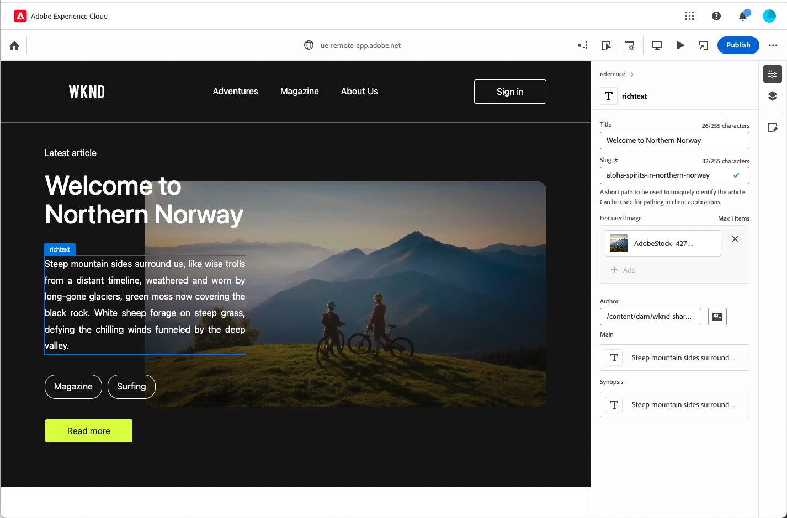

# Universal Editor

The [Universal Editor](https://experienceleague.adobe.com/en/docs/experience-manager-cloud-service/content/implementing/developing/universal-editor/introduction)  is a versatile visual editor that is part of Adobe Experience Manager Sites. It enables authors to do what-you-see-is-what-you-get (WYSIWYG) editing of any headless or headful experience. Understand how it can help content authors deliver exceptional experiences and how it offers unparalleled freedom for developers.

In this section, you will find the available extension points and examples of how to utilize them.
