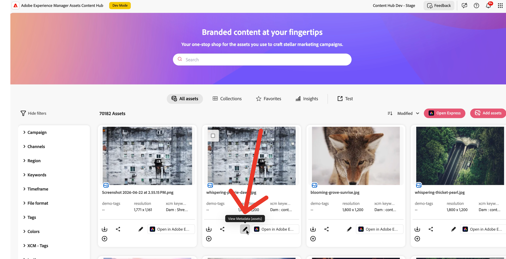

# Asset Card Actions

Content Hub lets extensions add custom action buttons to the **asset card menu** .


Asset card actions appear wherever asset cards or collection tiles are rendered. The `card` namespace is shared by both surfaces; use the `context` value to differentiate:

| `context` value | Surface |
|---|---|
| `'assets'` | Main Assets browse grid |
| `'collection'` | Asset card inside an open collection |
| `'collections'` | Collection tile on the Collections grid |
| `'share'` | Asset card in a link-share view |

Extensions use the `aem/assets/contenthub/1` extension point and implement the `card` namespace inside a single `register()` call.

## Extension API Reference

### `card` namespace

#### `card.getActionButtons(actionContext)`

**Description:** Returns the list of custom buttons to add to the card menu for the given context.

**Parameters:**
- `actionContext` (`object`):
  - `context` (`string`): The surface where the card is rendered — `'assets'`, `'collection'`, `'collections'`, or `'share'`.

**Returns** (`array`): An array of button descriptor objects. Each object contains:
- `id` (`string`): Unique identifier for the button within the extension.
- `label` (`string`): Button label shown in the menu.
- `icon` (`string`): [React Spectrum workflow icon](https://react-spectrum.adobe.com/react-spectrum/workflow-icons.html#available-icons) name.

Return an empty array if no buttons should be shown for the given context.

#### `card.onActionClick(resourceType, buttonId, resourceId, actionContext)`

**Description:** Called by Content Hub when the user clicks a custom card button.

**Parameters:**
- `resourceType` (`string`): `'asset'` for asset cards; `'collection'` for collection tiles.
- `buttonId` (`string`): The `id` of the button that was clicked.
- `resourceId` (`string`): The URN or ID of the asset or collection the card represents.
- `actionContext` (`object`): Same context object passed to `getActionButtons`.

## Example

This example adds a **Custom Export** button to asset cards in the main Assets grid and inside collections.

### `App.js` — routing

```js
import React from 'react';
import { ErrorBoundary } from 'react-error-boundary';
import { HashRouter as Router, Routes, Route } from 'react-router-dom';
import ExtensionRegistration from './ExtensionRegistration';
import CardActionModal from './CardActionModal';

function App() {
  return (
    <Router>
      <ErrorBoundary onError={onError} FallbackComponent={fallbackComponent}>
        <Routes>
          <Route index element={<ExtensionRegistration />} />
          <Route path="index.html" element={<ExtensionRegistration />} />
          <Route path="card-action-modal" element={<CardActionModal />} />
        </Routes>
      </ErrorBoundary>
    </Router>
  );

  function onError(e, componentStack) {}
  function fallbackComponent({ componentStack, error }) {
    return (
      <React.Fragment>
        <h1 style={{ textAlign: 'center', marginTop: '20px' }}>Extension rendering error</h1>
        <pre>{componentStack + '\n' + error.message}</pre>
      </React.Fragment>
    );
  }
}

export default App;
```

### `ExtensionRegistration.js` — registration

```js
import React from 'react';
import { Text } from '@adobe/react-spectrum';
import { register } from '@adobe/uix-guest';
import { extensionId } from './Constants';

function ExtensionRegistration() {
  const init = async () => {
    let guestConnection = await register({
      id: extensionId,
      methods: {
        card: {
          getActionButtons(actionContext) {
            const { context } = actionContext || {};
            // Show button only on the main assets grid and inside collections
            if (context !== 'assets' && context !== 'collection') {
              return [];
            }
            return [
              {
                id: 'custom-export',
                label: 'Custom Export',
                icon: 'Export',
              },
            ];
          },
          async onActionClick(resourceType, buttonId, resourceId, actionContext) {
            if (buttonId === 'custom-export') {
              await guestConnection.host.modal.openDialog({
                title: 'Custom Export',
                contentUrl: `/#card-action-modal?resourceId=${encodeURIComponent(resourceId)}&resourceType=${encodeURIComponent(resourceType)}`,
                type: 'modal',
                size: 'M',
              });
            }
          },
        },
      },
    });
  };

  init().catch(console.error);
  return <Text>IFrame for integration with Host (Content Hub)...</Text>;
}

export default ExtensionRegistration;
```

### `CardActionModal.js` — dialog content

```js
import React, { useState, useEffect } from 'react';
import { attach } from '@adobe/uix-guest';
import {
  Provider,
  defaultTheme,
  View,
  Heading,
  Text,
  Button,
  ButtonGroup,
  Divider,
  ProgressCircle,
} from '@adobe/react-spectrum';
import { extensionId } from './Constants';

export default function CardActionModal() {
  const [guestConnection, setGuestConnection] = useState(null);
  const [payload, setPayload] = useState(null);

  useEffect(() => {
    (async () => {
      const connection = await attach({ id: extensionId });
      setGuestConnection(connection);

      // Read data passed via URL query parameters
      const params = new URLSearchParams(window.location.hash.split('?')[1] || '');
      setPayload({
        resourceId: params.get('resourceId'),
        resourceType: params.get('resourceType'),
      });
    })();
  }, []);

  if (!payload) {
    return (
      <Provider theme={defaultTheme}>
        <View padding="size-400" height="100vh"
          UNSAFE_style={{ display: 'flex', justifyContent: 'center', alignItems: 'center' }}>
          <ProgressCircle aria-label="Loading..." isIndeterminate />
        </View>
      </Provider>
    );
  }

  const handleExport = async () => {
    // Add your export logic here
    await guestConnection?.host.toast.display({
      variant: 'positive',
      message: `Exported ${payload.resourceType}: ${payload.resourceId}`,
    });
    guestConnection?.host.modal.closeDialog();
  };

  return (
    <Provider theme={defaultTheme}>
      <View padding="size-400">
        <Heading level={3}>Custom Export</Heading>
        <Divider marginY="size-200" />
        <View marginBottom="size-300">
          <Text><strong>Type:</strong> {payload.resourceType}</Text>
          <View marginTop="size-100" padding="size-100" backgroundColor="gray-100" borderRadius="regular">
            <Text UNSAFE_style={{ fontFamily: 'monospace', fontSize: '12px', wordBreak: 'break-all' }}>
              {payload.resourceId}
            </Text>
          </View>
        </View>
        <ButtonGroup>
          <Button variant="accent" onPress={handleExport}>Export</Button>
          <Button variant="secondary" onPress={() => guestConnection?.host.modal.closeDialog()}>Cancel</Button>
        </ButtonGroup>
      </View>
    </Provider>
  );
}
```

## Additional resources

- [Common Concepts](../commons/index.md)
- [Collection Card Actions](../collection-card/index.md)
- [Step-by-step Extension Development](../../extension-development/index.md)
- [Troubleshooting](../../debug/index.md)
